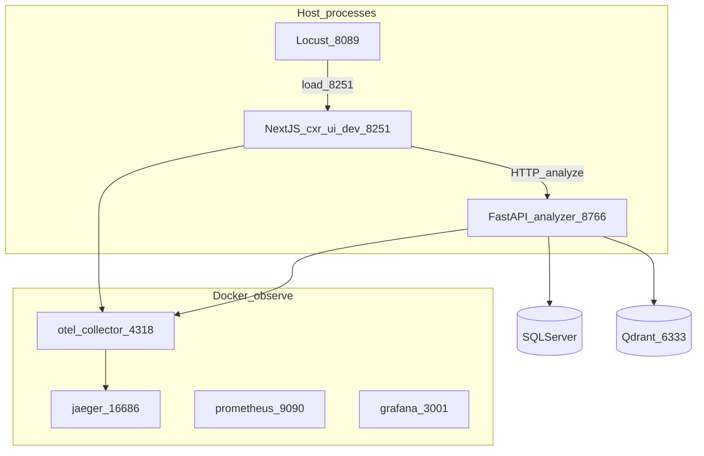

# C4 — Containers (local dev)

## Containers / processes

| Name | Technology | Notes |
|------|------------|-------|
| Claim Studio UI | Next.js 16 | Rehearsal/dev tree on **8251** |
| Analyzer service | FastAPI + uvicorn | Warm worker on **8766** |
| OTel Collector | Docker | Receives OTLP, exports to Jaeger |
| Jaeger | Docker | Trace UI |
| Locust | Python venv | Load generator UI **8089** |

## Optional bootcamp labs (Docker only)

Kafka, ELK, Redis, GraphQL, gRPC, Vault, Langfuse — started via `cxr lab up <name>`. See [bootcamp-labs.md](../archive/learning-notes/bootcamp-labs.md).
