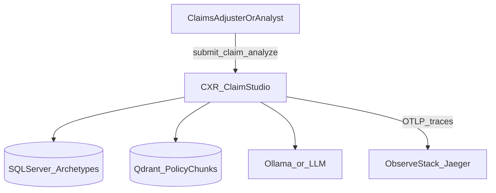

# C4 — System context

## Context

**CXR** helps examine healthcare claims against archetype-driven rules, policy retrieval, and optional LLM-backed recommendations. In this portfolio, CXR runs as a **local engineering stack** for development, load testing, and trace-driven performance work—not as a multi-tenant SaaS deployment.

## External dependencies

| System | Role |
|--------|------|
| SQL Server | Archetype catalog, thresholds, MUE/PTP checks |
| Qdrant | Vector retrieval for policy/context (optional if down) |
| LLM (Ollama/API) | Policy recommendation when not Compliant |
| Jaeger / OTel | Trace storage and visualization |
