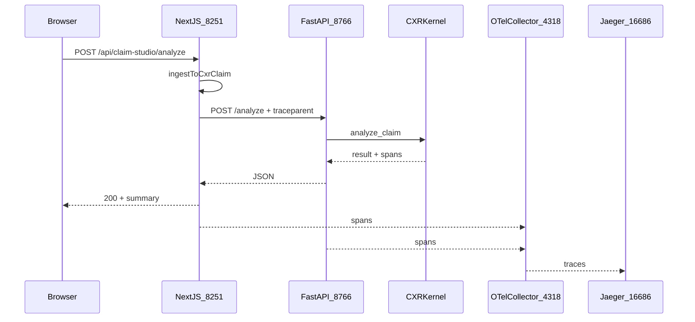

# Request flow — Claim Studio analyze (warm path)

## End-to-end path (current)

## Layers

| Step | Component | Responsibility |
|------|-----------|----------------|
| 1 | **Claim Studio UI** (`:8251`) | Collect claim JSON / FHIR text; `fetch` analyze API |
| 2 | **Next.js route** | Validate body, ingest adapters, propagate W3C trace context |
| 3 | **Analyzer service** (`:8766`) | Warm Python process; `get_or_create_corrector()` once at startup |
| 4 | **CXR kernel** | Archetypes, retrieval, context, fusion, optional LLM |
| 5 | **Observability** | OTLP → collector → Jaeger |

## Legacy path (subprocess — documented for comparison)

Previously, Next.js **`spawn`ed** `python3 analyze_sample.py` per request. That paid **import + kernel init** on every POST (~10–12s Locust p95). See [INC-003](../reliability/incidents/INC-003-python-import-bottleneck/postmortem.md).

## Ports (local dev)

| Port | Service |
|------|---------|
| 8251 | Next.js Claim Studio |
| 8766 | FastAPI analyzer |
| 4318 | OTLP HTTP |
| 16686 | Jaeger UI |
| 8089 | Locust web UI |
