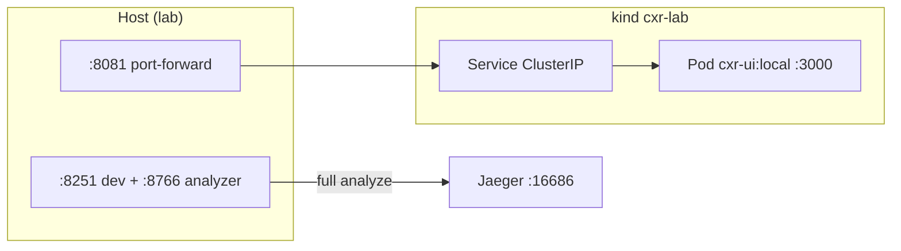
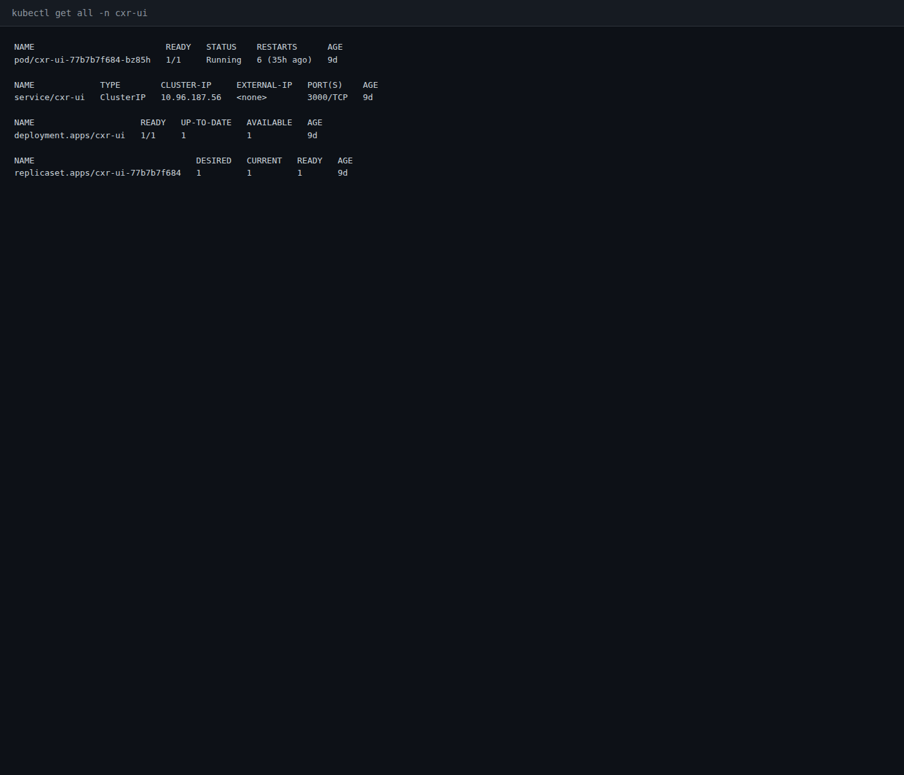
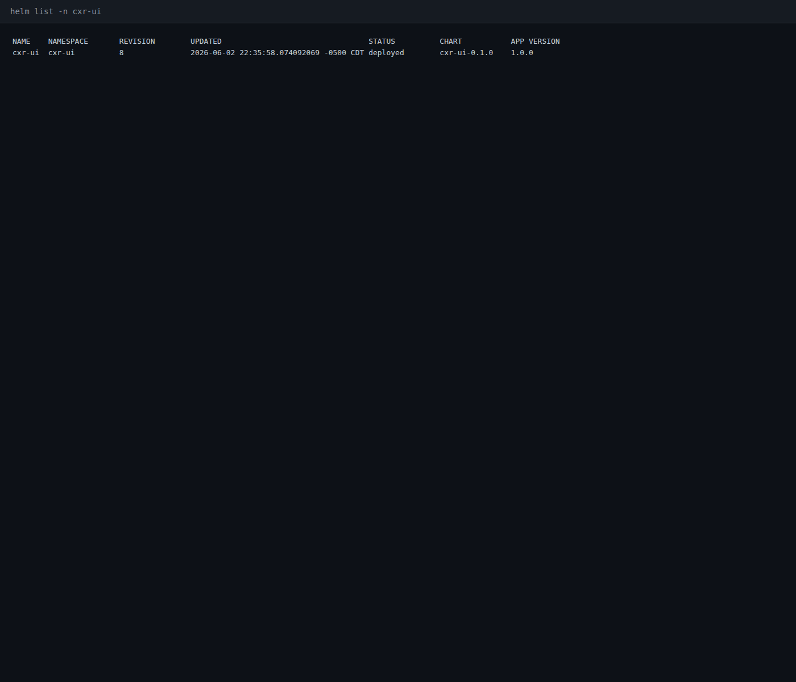
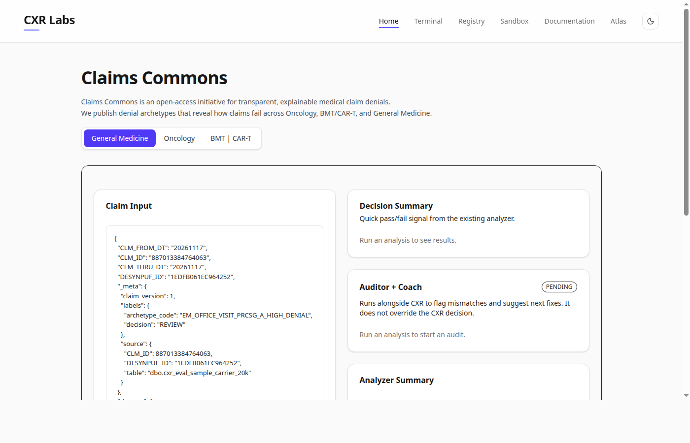

# Kubernetes deploy (K8-001)

| | |
|---|---|
| **Status** | Complete |
| **ID** | K8-001 |
| **Component** | **`kind`** cluster **`cxr-lab`** · Helm chart **`helm/cxr-ui`** · UI pod **:8081** forward |
| **Tools** | kind · kubectl · Helm · **`cxr-ops-lab`** scripts |
| **Environment** | Local lab only — not **`cxrlabs-dev/platform/infra`** production |
| **Related** | [ci-pipeline/](../ci-pipeline/) · [gitops-deploy/](../gitops-deploy/) (GITOPS-001) · [LOAD-001](../single-analyzer-capacity/) · [operations/ci-cd.md](../../operations/ci-cd.md) |

---

## Question

Can the CXR rehearsal UI run on **local Kubernetes** with a **repeatable deploy path** (cluster + image + Helm release + health check on **:8081**)?

## Hypothesis

**`cxr-ops-lab/scripts/03-k8-up.sh`** (or **`12-k8-ensure.sh`**) produces a **Running** Deployment in namespace **`cxr-ui`**, image **`cxr-ui:local`**, and **`curl http://127.0.0.1:8081`** returns **HTTP 200**. Full Claim Studio analyze remains on **:8251** / Compose **:3000** until analyzer/Qdrant are in-cluster (bootcamp M4.8 scope).

## Method

1. Install tools (once): **`cxr-ops-lab/scripts/00-install-tools.sh`** (kind, kubectl, helm)
2. Deploy:

```bash
cd ~/staging/cxr-ops-lab
export PATH="$PWD/bin:$PATH"
./scripts/03-k8-up.sh
# or ensure existing cluster:
./scripts/12-k8-ensure.sh
```

3. Access UI (if forward not already running):

```bash
kubectl port-forward -n cxr-ui svc/cxr-ui 8081:3000 --address=127.0.0.1
curl -s -o /dev/null -w "%{http_code}\n" http://127.0.0.1:8081/
```

4. Verify: **`kubectl get all -n cxr-ui`**, **`helm list -n cxr-ui`**

Persistent forward: **`systemctl --user enable --now cxr-k8-forward`** (see **`cxr-ops-lab/docs/PERSISTENT-PORTS.md`**).

---

## Architecture (bootcamp scope)

### Port map (do not confuse)

| Port | Runtime | Full analyze? |
|------|---------|---------------|
| **8251** | Rehearsal **`npm run dev:rehearsal`** + **`ANALYZER_URL` → :8766** | **Yes** — daily dev + all Phase 1 investigations |
| **3000** | Docker Compose SW.2 (`cxr-ui:compose`, analyzer mounts) | **Yes** — lab stack |
| **8081** | Host **`kubectl port-forward`** → K8 Service **:3000** | **UI shell only** — SW.1 image, no in-pod analyzer |

Pod listens on **3000 inside the cluster**; **8081** is a **lab convenience** on the host.

### Layered deploy (syllabus)

| Step | Script / path | Syllabus |
|------|----------------|----------|
| Cluster | `01-kind-cluster.sh` → **`kind-cxr-lab`** | SW.3 |
| Image load | `02-build-and-load.sh` → **`cxr-ui:local`** | SW.1 → SW.3 |
| **Canonical deploy** | `05-helm-install.sh` · chart **`helm/cxr-ui/`** | SW.4 |
| Raw YAML (study) | `03-deploy.sh --raw` · **`k8s/`** | SW.3 only |
| Repro cluster | `terraform/` | SW.5 |
| GitOps | `13-argo-install.sh` | SW.8 (CD follow-up) |

**Git source:** https://github.com/UdonsiKalu/cxr-ops-lab

### Relationship to LOAD-001 capacity

[LOAD-001](../single-analyzer-capacity/) found a **single warm analyzer** handles **~15** concurrent users with p95 **~1.5s**; [LOAD-002](../analyzer-saturation/) knee at **~225** users / RPS **~15–16** on one process.

K8-001 is **not** a second load test. It answers: *“How would we **package and run** the UI tier in orchestration?”* Scaling analyzer replicas + HPA is [planned/autoscaling.md](../planned/autoscaling.md) (Phase 2).



### Out-of-cluster dependencies (M4.8)

SQL Server, Qdrant, Ollama, and the Python analyzer service are **not** in this Helm chart. See **`cxr-ops-lab/docs/K8-M48-DEPENDENCIES.md`**. Honest portfolio scope: K8 proves **deploy topology**, not end-to-end claim analysis in the pod.

---

## Results (2026-06-07 snapshot)

Cluster verified live on **`kind-cxr-lab`**:

| Resource | Value |
|----------|-------|
| **Pod** | `cxr-ui-77b7b7f684-bz85h` — **1/1 Running** |
| **Service** | `cxr-ui` ClusterIP **10.96.187.56:3000** |
| **Deployment** | **1/1** ready, **1** replica |
| **Image** | **`cxr-ui:local`** |
| **Helm** | **`cxr-ui`** rev **8**, chart **`cxr-ui-0.1.0`**, status **deployed** |
| **HTTP :8081** | **200** |

Full terminal capture: [`results/k8-cluster-snapshot-2026-06-07.txt`](./results/k8-cluster-snapshot-2026-06-07.txt)

### Sample `kubectl get all -n cxr-ui`

```
NAME                          READY   STATUS    RESTARTS      AGE
pod/cxr-ui-77b7b7f684-bz85h   1/1     Running   6 (35h ago)   9d

NAME             TYPE        CLUSTER-IP     EXTERNAL-IP   PORT(S)    AGE
service/cxr-ui   ClusterIP   10.96.187.56   <none>        3000/TCP   9d

NAME                     READY   UP-TO-DATE   AVAILABLE   AGE
deployment.apps/cxr-ui   1/1     1            1           9d
```

### Helm release

```
NAME  	NAMESPACE	REVISION	STATUS  	CHART       	APP VERSION
cxr-ui	cxr-ui   	8       	deployed	cxr-ui-0.1.0	1.0.0
```

Prior bootcamp evidence: **`cxr-ops-lab/evidence/SW3-k8-evidence.md`**, **`SW4-helm-verify-2026-05-28.md`**, **`SW8-e2e-stack-2026-05-28.md`** (Terraform + Argo full stack).

### Evidence screenshots







Re-capture: [`scripts/capture-ci-k8-screenshots.sh`](../../scripts/capture-ci-k8-screenshots.sh) (requires **`cxr-k8-forward`** or manual port-forward on **:8081**).

---

## Findings

1. **Deploy path works** — kind + Helm yields stable **1-replica** UI on **:8081** (**200**).
2. **Helm is canonical** — raw **`k8s/`** manifests are for study; **`05-helm-install.sh`** / **`12-k8-ensure.sh`** are the operator entrypoints.
3. **Not a substitute for :8251** — Phase 1 reliability/load/otel investigations stay on warm analyzer **:8766**; K8 pod is UI-only until multi-service chart work.
4. **CI builds image; K8 runs image** — [CI-001](../ci-pipeline/) produces **`cxr-ui:ci`** on GitHub; local K8 uses **`cxr-ui:local`** via **`02-build-and-load.sh`** — same Dockerfile family, different tags/contexts.
5. **GitOps optional** — SW.8 Argo (**:8083**) syncs Helm from git; document separately as **CD**, not part of K8-001 minimum.

---

## Decision

- **Canonical local K8 (UI-only bootcamp):** **`03-k8-up.sh`** or **`12-k8-ensure.sh`** + **`cxr-k8-forward`** for **:8081**
- **Full stack + HPA (implemented in `cxr-ops-lab`):** **`03-k8-stack-up.sh`** — UI + analyzer + metrics-server + HPA — see **`cxr-ops-lab/docs/K8-STACK-DEPLOY.md`**
- **Phase 2 validation:** Locust against **8081** + `kubectl get hpa -w` to prove scale-out
- Link portfolio readers to **`cxr-ops-lab/docs/K8-DEPLOY.md`** and **`K8-STACK-DEPLOY.md`**

---

## Stack deploy with HPA (code)

Implemented in **`cxr-ops-lab`** (run locally; not yet a separate portfolio investigation folder):

| Component | Path |
|-----------|------|
| One-shot deploy | `scripts/03-k8-stack-up.sh` |
| Analyzer image | `Dockerfile.analyzer` + `02-build-analyzer-and-load.sh` |
| Analyzer chart + HPA | `helm/cxr-analyzer/` (min **1**, max **4**, CPU **70%**) |
| UI chart + HPA + `ANALYZER_URL` | `helm/cxr-ui/` (min **1**, max **3**, CPU **80%**) |
| metrics-server | `scripts/09-metrics-server-install.sh` |
| Host SQL/Qdrant from pods | `kind/cxr-lab.yaml` → **host.docker.internal** |

```bash
cd ~/staging/cxr-ops-lab && export PATH="$PWD/bin:$PATH"
./scripts/03-k8-stack-up.sh
kubectl get hpa -n cxr-ui -w
```

**Note:** First analyzer Docker build is slow (CPU torch/faiss). Existing **kind** clusters may need recreate for **host.docker.internal**.

---

## Reproduce

```bash
cd ~/staging/cxr-ops-lab
export PATH="$PWD/bin:$PATH"

# One-shot (cluster + build/load + Helm)
./scripts/03-k8-up.sh

# Or refresh release on existing cluster
./scripts/12-k8-ensure.sh

kubectl get all -n cxr-ui
helm list -n cxr-ui
curl -s -o /dev/null -w "8081 HTTP %{http_code}\n" http://127.0.0.1:8081/

# Teardown (optional)
./scripts/03-k8-down.sh   # if present, or kind delete cluster
```

---

## Follow-up

- **CD-001 / SW.8:** Argo CD sync — **`13-argo-install.sh`**, **:8083** UI
- **PLATFORM-002:** Multi-service chart (UI + analyzer API + Qdrant sidecar or external refs)
- **LOAD + K8:** HPA only after [planned/autoscaling.md](../planned/autoscaling.md) hypothesis
- Screenshot checklist: [`screenshots/README.md`](./screenshots/README.md)
