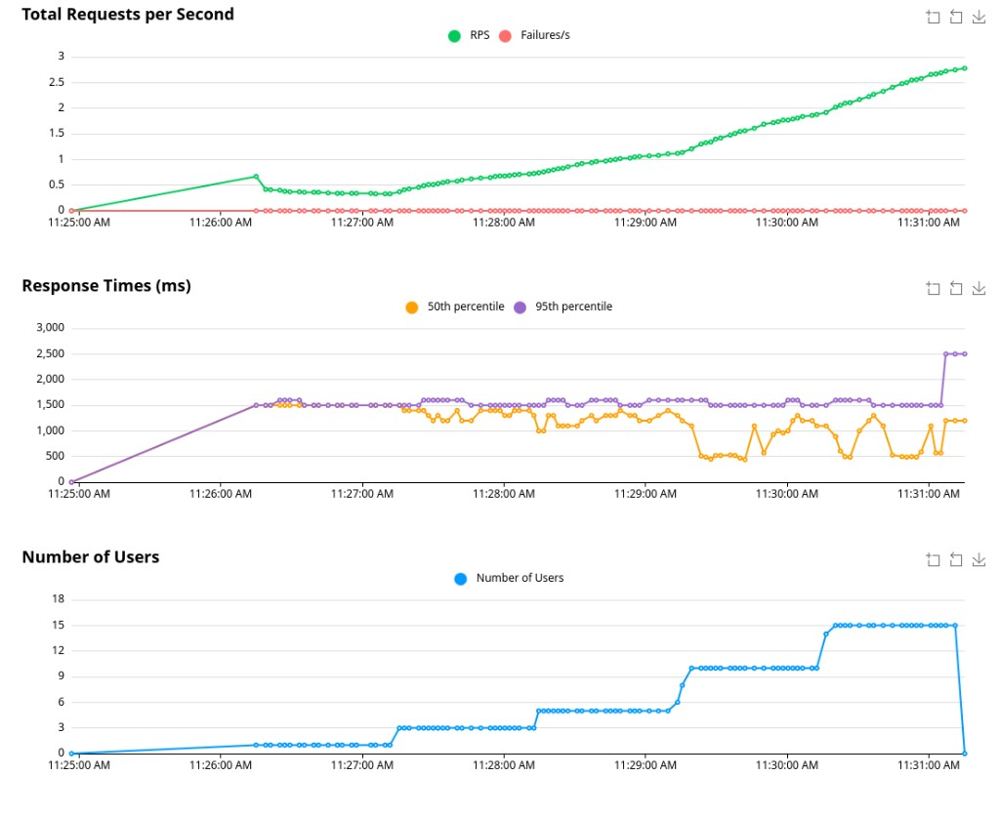
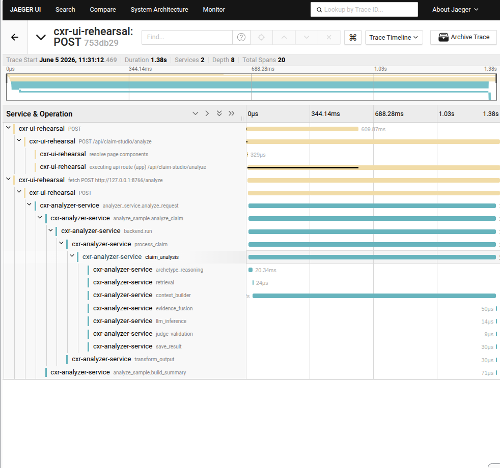

# LOAD-001 — Staged Capacity Testing Template

**CXR DevOps Portfolio · Single warm analyzer · Locust + Jaeger**

| | |
|---|---|
| **Investigation** | Single analyzer capacity (LOAD-001) |
| **Date** | 2026-06-05 |
| **Stack** | `cxr up` — analyzer `:8766`, rehearsal `:8251`, Locust, Jaeger `:16686` |
| **Repo path** | `investigations/single-analyzer-capacity/` |

---

## 1. Why this template exists

Most Locust tutorials stop at “enter 10 users, click Start.” That gives **one** concurrency level and mixed GET/POST traffic. For **capacity** of a warm ML analyzer you need:

1. **POST-only** workload (no page-navigation noise)
2. **Staged ramp** (1 → 3 → 5 → 10 → 15 users) on a schedule
3. **Two lenses**: Locust aggregates (p95, RPS, failures) + Jaeger single traces
4. **Repeatability** without rewriting tests each run

This folder packages that as a **reusable template**: copy the Locust `LoadTestShape`, adjust env vars, run headless or GUI.

---

## 2. Architecture under test

```text
Locust (:8089 or :8090)
  -> POST /api/claim-studio/analyze
Next.js rehearsal (:8251)     [OTEL -> Jaeger :16686]
  -> ANALYZER_URL from .env.local
Warm FastAPI analyzer (:8766)
  -> analyzer_service.analyze_request (~1.3-1.6s)
CXR kernel (claim_analysis, context_builder, ...)
```

**Warm path:** import cost (~7s) paid **once at boot** (`analyzer_service.startup`), not per request. See PERF-004 cold-vs-warm investigation.

## 3. What makes the GUI approach unique

### Default Locust GUI limitation

- You set **Number of users** manually
- You must **Stop**, change count, **Start** again for each tier
- Default `cxr` locustfile mixes **GET /claim-studio** (75%) and **POST analyze** (25%)

### This template’s innovation: `LoadTestShape` + one Start click

File: **`locustfile-staged-gui.py`**

- Defines **`CapacityRampShape(LoadTestShape)`** with cumulative stages
- Default tiers: **1, 3, 5, 10, 15** users × **60 seconds** each (~5 min total)
- **`AnalyzeOnlyUser`** — only `POST /api/claim-studio/analyze`
- Launcher: **`run-capacity-locust-gui.sh`** — opens Locust web UI with the shape loaded

**Operator experience:** open UI → click **Start swarming once** → watch Charts step up automatically.

### Environment overrides (no code edits)

| Variable | Default | Purpose |
|----------|---------|---------|
| `CXR_CAPACITY_USERS` | `1 3 5 10 15` | User counts per stage |
| `CXR_CAPACITY_STAGE_SECONDS` | `60` | Hold time per stage |
| `CXR_CAPACITY_SPAWN_RATE` | `1` | Users spawned per second |
| `CXR_LOCUST_WEB_PORT` | `8089` | Use `8090` if `cxr up` already owns 8089 |

---

## 4. Core code — LoadTestShape

```python
class CapacityRampShape(LoadTestShape):
    stages = _build_stages()  # cumulative duration per tier

    def tick(self):
        run_time = self.get_run_time()
        for stage in self.stages:
            if run_time < stage["duration"]:
                return (stage["users"], stage["spawn_rate"])
        return None
```

Stages are built from env:

```python
_USER_COUNTS = [1, 3, 5, 10, 15]  # default
_STAGE_SECONDS = 60
# Stage 1: 0–60s @ 1 user
# Stage 2: 60–120s @ 3 users
# … through 15 users
```

---

## 5. How to run

### Option A — GUI (visual evidence)

```bash
cxr up
curl -s http://127.0.0.1:8766/health   # "warmed":"true"

CXR_LOCUST_WEB_PORT=8090 \
  ./investigations/single-analyzer-capacity/run-capacity-locust-gui.sh
```

1. Open http://127.0.0.1:8090
2. Click **Start swarming** once
3. Screenshot **Charts** tab

### Option B — Headless (CSV table)

```bash
./investigations/single-analyzer-capacity/run-capacity-sweep.sh
```

Output: `results/capacity-sweep.csv`

---

## 6. Results — headless sweep (2026-06-05)

| Users | Failures | Median (ms) | p95 (ms) | RPS |
|------:|---------:|------------:|---------:|----:|
| 1 | 0 | 1500 | 1700 | 0.33 |
| 3 | 0 | 1300 | 1500 | 1.12 |
| 5 | 0 | 1100 | 1500 | 1.88 |
| 10 | 0 | 620 | 1500 | 4.13 |
| 15 | 0 | 990 | 1600 | 5.64 |

---

## 7. Results — staged GUI run (2026-06-05)

Evidence: user-run with `run-capacity-locust-gui.sh`



| Observation | Value |
|-------------|-------|
| User ramp | 1 → 3 → 5 → 10 → 15 (step chart) |
| Failures | **0%** entire run |
| p95 (50th vs 95th) | 95th ~**1.5–1.6s** at 10 users; brief spike ~**2.5s** at 15 users |
| Peak RPS | ~**2.8** |
| Duration | ~6.5 minutes |

### 50th vs 95th percentile

- **50th (median):** middle request — bouncy under concurrency (overlapping waits)
- **95th:** slow tail — **lead metric** for capacity; ~1.5s matches warm analyze budget
- **Jaeger single trace ~1.3s** ≈ p95 minus Next.js hop and queueing

---

## 8. Jaeger — verify under load

During 10–15 user tier, open http://127.0.0.1:16686

**Search:** Service `cxr-analyzer-service`, Operation `analyzer_service.analyze_request`, Lookback 15 minutes


10 traces at **11:31:12**, durations **1.24s – 1.38s** — aligns with Locust p95.

**E2E trace** (Service `cxr-ui-rehearsal`, linked to analyzer):



Trace `753db29`: **1.38s**, **20 spans**, `fetch POST :8766/analyze` → `analyzer_service.analyze_request` → `claim_analysis` → `context_builder`.

---

## 9. Findings

1. One warm analyzer sustained **15 concurrent** analyze users with **0% failures**
2. p95 stayed ~**1.5–1.6s** — not subprocess-era **10–12s**
3. No saturation knee at 15 users on this hardware
4. Locust aggregates + Jaeger traces **tell the same story**

---

## 10. Reuse this template elsewhere

1. Copy **`locustfile-staged-gui.py`** and **`run-capacity-locust-gui.sh`**
2. Change `_ANALYZE_BODY` or tasks for your HTTP endpoint
3. Set `CXR_CAPACITY_USERS` and `CXR_CAPACITY_STAGE_SECONDS`
4. Pair with OpenTelemetry + Jaeger for trace validation
5. Report **p95 + failures + RPS** (not median alone)

---

## 11. Files in this investigation

| File | Role |
|------|------|
| `locustfile-staged-gui.py` | LoadTestShape staged ramp for GUI |
| `run-capacity-locust-gui.sh` | Start Locust UI with shape |
| `locustfile-analyze-only.py` | POST-only user (headless) |
| `run-capacity-sweep.sh` | Headless tier loop → CSV |
| `README.md` | Investigation report |
| `screenshots/` | Locust + Jaeger evidence |
| `results/capacity-sweep.csv` | Headless numeric summary |

---

*CXR DevOps Portfolio · synthetic dev data · local stack only*
