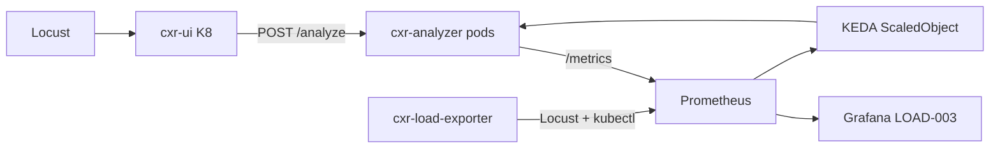

# PERF-008 — Queue depth, in-flight requests, and backpressure autoscaling

| | |
|---|---|
| **Status** | **A/B complete** (2026-06-21 / 2026-06-22) — recommendation below; branches `feature/perf-008-queue-backpressure` |
| **Depends on** | [OBS-002](https://github.com/UdonsiKalu/cxr-portfolio/issues/2) (replica truth in Grafana/CSV) |
| **Builds on** | [GATE-002 KEDA + Helm grid](GATE-002-keda-helm-grid-study.md) (candidate 4 baseline) · [OBS-001 run](../investigations/kubernetes-analyzer-saturation/evidence/load-observe/RUN-2026-06-17.md) |
| **Ops branch** | `cxr-ops-lab` → `feature/perf-008-queue-backpressure` |
| **Analyzer branch** | `claim_analysis_tools` → `feature/perf-008-analyzer-metrics` |

---

## Goal

Determine whether **analyzer in-flight / backpressure** is a **better KEDA autoscaling signal** than **E2E Locust p95 latency + CPU**.

**Naming (important):**

| Term | Meaning in PERF-008 |
|------|---------------------|
| **Backpressure / in-flight** | Active `/analyze` work pressure — default Experiment B signal |
| **Queue / wait time** | Histogram of time before handler starts — diagnostic, not KEDA trigger |
| **Queue depth** | Only with explicit semaphore (`CXR_ANALYZER_MAX_CONCURRENT > 0`) — optional sub-study |

Do **not** call Experiment B “queue-depth scaling” unless a bounded queue/semaphore is enabled.

**Not in scope:** redesigning the platform, changing `k8-load-gate.sh` or `k8-load-tuner.sh`.

---

## Experiment framing (A vs B)

| | Experiment A | Experiment B |
|---|--------------|--------------|
| **Name** | **Symptom scaling** | **Internal pressure scaling** |
| **KEDA signal** | User-visible **E2E Locust p95** + CPU | **In-flight per analyzer pod** + CPU |
| **Question** | How does today’s KEDA behave with honest metrics? | Does internal pressure rise **early enough** to scale smoother than waiting for p95? |

**Experiment A:** scale on user-visible symptom — E2E p95 latency.

**Experiment B:** scale on internal pressure — `sum(inflight) / ready_replicas` (not total inflight alone).

**Core question:** Does internal pressure rise before E2E p95 — and does scaling on it reduce tail latency, failures, or replica thrash?

---

## Problem statement

During LOAD-003 observe runs (June 2026):

1. **E2E p95** (Locust) rises under load while **node CPU stays low** — latency is queueing + per-request work, not host saturation ([OBS-001](../investigations/kubernetes-analyzer-saturation/evidence/load-observe/RUN-2026-06-17.md)).
2. **OBS-002:** After KEDA replaced legacy analyzer HPA, Grafana/CSV showed **`analyzer_replicas = 0`** while pods scaled — exporter read removed HPA objects, not Deployment/ScaledObject truth.
3. KEDA Experiment A uses **`cxr_locust_p95_ms`** (client E2E) + CPU — may lag analyzer-side backlog visible in Jaeger as **queue wait before `context_builder`**.

PERF-008 instruments analyzer-side signals and runs a controlled A/B test.

---

## Architecture (signals)



| Layer | Signal | Source |
|-------|--------|--------|
| E2E latency | `cxr_locust_p95_ms` | cxr-load-exporter → Locust |
| Analyzer backpressure | `cxr_analyzer_inflight_requests` | analyzer `/metrics` |
| Wait before handler | `cxr_analyzer_queue_wait_seconds` | analyzer histogram |
| Bounded queue (optional) | `cxr_analyzer_queue_depth` | only if `CXR_ANALYZER_MAX_CONCURRENT > 0` |
| Replica truth (OBS-002) | `cxr_analyzer_replicas` | Deployment readyReplicas (+ ScaledObject) |

**Important:** Without an explicit concurrency limiter/semaphore, **`queue_depth` is not a Kafka-style backlog**. Default lab config uses **in-flight + wait time** as backpressure. Enable depth only for semaphore experiments (`CXR_ANALYZER_MAX_CONCURRENT`).

---

## Metric definitions

| Metric | Type | Definition |
|--------|------|------------|
| `cxr_analyzer_inflight_requests` | Gauge | Active `/analyze` handlers on the pod (summed in Prometheus) |
| `cxr_analyzer_queue_wait_seconds` | Histogram | Time from concurrency gate entry to handler start |
| `cxr_analyzer_queue_depth` | Gauge | Threads blocked on semaphore when limiter enabled; else 0 |
| `cxr_analyzer_backpressure_inflight` | Recording rule | `sum(cxr_analyzer_inflight_requests)` — total active work |
| `cxr_analyzer_inflight_per_pod` | Recording rule | `sum(inflight) / clamp_min(cxr_analyzer_replicas, 1)` — **Experiment B KEDA signal** |
| `cxr_analyzer_queue_wait_p50` / `_p95` | Recording rules | Histogram quantiles over 1m rate |
| `cxr_analyzer_replicas` | Gauge | **Deployment readyReplicas** (OBS-002 fix; not legacy HPA) |
| `cxr_analyzer_replica_changes_5m` | Recording rule | `changes(cxr_analyzer_replicas[5m])` — oscillation proxy |

Implementation: `claim_analysis_tools/analyzer_metrics.py` + `analyzer_service_app.py` (`GET /metrics`).

---

## OBS-002 fix (prerequisite)

**Root cause:** `load_metrics_poll.py` read `kubectl get hpa cxr-analyzer`; KEDA removes that HPA.

**Fix:** Read **Deployment `status.readyReplicas`** (and ScaledObject `currentReplicas` when present). When HPA absent, compute **synthetic analyzer CPU %** from `kubectl top pods` / request (500m default).

Files: `cxr-ops-lab/scripts/lib/load_metrics_poll.py`, Grafana panel *Scaling signals + replica count*.

---

## Grafana — Analyzer Backpressure & Queueing

Dashboard: `cxr-hpa-load-003` (port **3001**)

New section panels:

1. Analyzer in-flight requests (+ queue depth if limiter on)
2. Queue / wait p50 / p95
3. Backpressure vs E2E p95
4. KEDA replicas vs backpressure
5. Replica oscillation (5m changes)

Start stack:

```bash
cd ~/staging/cxr-ops-lab
./scripts/23-k8-load-observe-up.sh   # per-pod analyzer forwards :8767, :8768, …
```

Verify Prometheus targets: `cxr-load-exporter`, `kube-state-metrics`, **`cxr-analyzer`** (one target per ready pod).

PERF-008 panels are in a **single landscape row** (four charts); scrape health stays at the bottom. Queue/wait panel uses **milliseconds** + optional **queue depth** (right axis).

**Screenshots** (portfolio repo):

| Run | Load row | Backpressure row |
|-----|----------|------------------|
| Experiment A (PASS) | [load-full](../investigations/kubernetes-analyzer-saturation/evidence/perf008/grafana-perf008-exp-a-load-full.png) | [backpressure](../investigations/kubernetes-analyzer-saturation/evidence/perf008/grafana-perf008-exp-a-backpressure.png) |
| Experiment B (FAIL) | [load + failures](../investigations/kubernetes-analyzer-saturation/evidence/perf008/grafana-perf008-exp-b-load.png) | [KEDA staircase](../investigations/kubernetes-analyzer-saturation/evidence/perf008/grafana-perf008-exp-b-backpressure.png) |
| First A attempt (no `/metrics`) | — | [empty panels](../investigations/kubernetes-analyzer-saturation/evidence/perf008/grafana-perf008-exp-a-backpressure-nodata.png) |

Full index: [evidence/perf008/README.md](../investigations/kubernetes-analyzer-saturation/evidence/perf008/README.md).

---

## Build notes (faiss_gpu1 + K8 image)

| Environment | Python | GPU? | Notes |
|-------------|--------|------|-------|
| **Local `:8766`** | `staging/cxrlabs/faiss_gpu1` via `source scripts/use_faiss_venv.sh` | **CUDA torch** available on host; **faiss-cpu** in venv | `start_analyzer_service.sh` installs `prometheus-client` into venv |
| **K8 `cxr-analyzer:perf008`** | Container Python 3.11 | **No** — CPU torch + `faiss-cpu` | Layer on `perf003`; adds `/metrics` only (~1 min build) |

```bash
# Local verify (faiss_gpu1)
cd ~/staging/cxrlabs-dev/claim_analysis_tools
source scripts/use_faiss_venv.sh
pip install -q prometheus-client   # or via analyzer_service_requirements.txt on start
./scripts/start_analyzer_service.sh
curl -s http://127.0.0.1:8766/metrics | grep cxr_analyzer_inflight

# K8 layer build (no full torch reinstall)
cd ~/staging/cxr-ops-lab
./scripts/02-build-analyzer-perf008-layer.sh   # tags cxr-analyzer:perf008
```

---

## KEDA configurations (experiments)

**Shared (identical across A and B):**

| Parameter | Value |
|-----------|--------|
| Locust profile | GATE-002 cumulative analyze-only (15→200 users) |
| Image tag | `perf008` — layer on CPU `perf003` base (`02-build-analyzer-perf008-layer.sh`) |
| Lab limiter | `CXR_ANALYZER_MAX_CONCURRENT=4` on both A and B (semaphore + queue/wait visibility) |
| Metrics scrape | Per-pod port-forward `8767+` → `analyzer_targets.json` (sum inflight = whole deployment) |
| Helm caps | Winner c4: analyzer max 8 min 1, UI max 4 |
| `pollingInterval` | 15s |
| `cooldownPeriod` | 120s |
| CPU trigger | 70% utilization |
| Environment | Docker Desktop K8, same workstation |

**Experiment A — symptom scaling (E2E p95 + CPU)**

Control arm — current GATE-002 KEDA. Scale on **user-visible** Locust p95.

File: `helm/cxr-analyzer/values-perf008-exp-a.yaml`

```yaml
autoscaling.keda.prometheus.mode: p95
query: cxr_locust_p95_ms
threshold: 2000
```

Lab overlay also sets `CXR_ANALYZER_MAX_CONCURRENT: "4"` for queue/wait visibility (not part of production default).

**Experiment B — in-flight/backpressure scaling + CPU**

**Not queue-depth** unless `CXR_ANALYZER_MAX_CONCURRENT > 0`. Scale on **average in-flight per ready pod**:

File: `helm/cxr-analyzer/values-perf008-exp-b.yaml`

```yaml
autoscaling.keda.prometheus.mode: backpressure
query: sum(cxr_analyzer_inflight_requests) / clamp_min(cxr_analyzer_replicas, 1)
threshold: 2   # tune after first B run; document final value
```

Same lab `MAX_CONCURRENT: "4"` as A for comparable metrics.

Uses `cxr_analyzer_replicas` (OBS-002 deployment truth) in the denominator — same series as Grafana/CSV.

**Run order:** A first → capture dashboard → B with **identical** load profile.

**Completed runs:**

| Run | Stamp | Evidence | Gate |
|-----|-------|----------|------|
| A | `20260621-184452` | `cxr-ops-lab/evidence/perf008/exp-a-20260621-184452/` | **PASS** (all checkpoints) |
| B | `20260622-034010` | `cxr-ops-lab/evidence/perf008/exp-b-20260622-034010/` | **FAIL** @ 200 users (`failures/s` collapse) |

Apply (re-run):

```bash
./scripts/perf008-run-experiment.sh a   # or b
```

Gate/tuner scripts are **not** modified. Summarize:

```bash
python3 scripts/lib/perf008_summarize_run.py --experiment a --dir evidence/perf008/exp-a-*
```

---

## Research questions

| # | Question |
|---|----------|
| 1 | Does backpressure (in-flight / wait) rise **before** E2E p95? |
| 2 | Does backpressure-based KEDA scale **earlier** than p95-based? |
| 3 | Lower tail latency (max p95)? |
| 4 | Fewer failures/s? |
| 5 | More or fewer replicas for same load? |
| 6 | Less oscillation (replica collapses / 5m changes)? |

---

## Research questions (answers from A/B runs)

| # | Question | Finding |
|---|----------|---------|
| 1 | Does backpressure rise **before** E2E p95? | **Partially** — brief inflight spikes (~03:45) precede p95 climb; once scaled out, inflight stays low while p95 still rises. |
| 2 | Does backpressure KEDA scale **earlier** than p95? | **No clear win** — both reached **8 replicas** on similar staircase timing; B did not scale meaningfully earlier. |
| 3 | Lower tail latency (max p95)? | **No** — A **790 ms** vs B **820 ms** at 200 users. |
| 4 | Fewer failures/s? | **A wins** — A **0** failures/s; B **115.8** failures/s at 200 (`status 0` connection drops, not 500s). |
| 5 | More or fewer replicas for same load? | **Same ceiling** — both **max 8** ready replicas (OBS-002 CSV + KEDA panel). |
| 6 | Less oscillation? | **A slightly better** — replica changes/5m max **3** (A) vs **4** (B); UI HPA thrash on both runs (separate issue). |

---

## Comparison table (A/B results)

| Metric | Experiment A (symptom: p95 + CPU) | Experiment B (pressure: inflight/pod + CPU) |
|--------|-----------------------------------|---------------------------------------------|
| **Gate @ 200 users** | **PASS** | **FAIL** (`failures/s` > 0.5) |
| **max p95 (ms)** | **790** | 820 |
| **p95 slope (ms / sample)** | 2.06 | 2.26 |
| **max failures/s** | **0.0** | 115.8 |
| **max in-flight (total)** | ~2 early spike (Grafana); post-run Prom query null | ~2 early spike (Grafana); post-run Prom query null |
| **max in-flight per pod** | Below KEDA threshold 2 after scale-out | Same pattern |
| **queue/wait p95 (s)** | ~0.00095 (~1 ms) | ~0.00096 (~1 ms) |
| **time: backpressure ↑ → first replica ↑ (s)** | Not auto-measured — visual: scale follows p95 ramp | Not auto-measured — similar staircase 2→8 |
| **replica oscillation (5m changes max)** | **3** | 4 |
| **replica collapses (gate)** | **0** | 0 |
| **max replicas (CSV)** | **8** | **8** |
| **RPS @ 200 users** | 101.1 | 115.8 (before collapse) |
| **Grafana evidence** | [exp-a screenshots](../investigations/kubernetes-analyzer-saturation/evidence/perf008/README.md) · `cxr-ops-lab/evidence/perf008/exp-a-20260621-184452/` | [exp-b screenshots](../investigations/kubernetes-analyzer-saturation/evidence/perf008/README.md) · `cxr-ops-lab/evidence/perf008/exp-b-20260622-034010/` |

**Checkpoint detail (gate scorer):**

| Users | A p95 | A RPS | B p95 | B RPS |
|-------|-------|-------|-------|-------|
| 50 | 170 ms | 28.1 | 150 ms | 28.1 |
| 100 | 330 ms | 55.0 | 330 ms | 53.6 |
| 150 | 530 ms | 79.3 | 500 ms | 78.5 |
| 200 | 790 ms | 101.1 | 820 ms | 115.8 |

**Ground truth check:** Both runs — `cxr_analyzer_replicas` in CSV and **KEDA replicas vs backpressure** panel reached **8** ready replicas. The top *Scaling signals* panel can show analyzer replicas flat at 1 (axis/clutter); use the PERF-008 KEDA panel or CSV for OBS-002 truth.

**B failure note:** Failures began ~**170 users** (`status 0` on Locust GET/POST — client connectivity lost). Likely UI forward saturation + UI HPA thrash under peak load, not analyzer KEDA failing to scale. Analyzer still scaled to 8 before the collapse window.

---

## Final recommendation

**Option 2 — keep Experiment A (E2E p95 + CPU) for KEDA; use in-flight / wait panels for diagnosis only.**

Rationale:

1. **A passed the gate cleanly** to 200 users; **B failed** at 200 with mass `status 0` errors despite reaching the same replica ceiling.
2. **Tail latency** was slightly **better on A** (790 vs 820 ms max p95).
3. **Backpressure scaling did work** (2→8 replicas, staircase visible) but did **not** demonstrate earlier, smoother, or more stable scaling than p95.
4. **Queue/wait** stayed ~1 ms p95 on both runs with `MAX_CONCURRENT=4` and 8 pods — limiter rarely backed up; not a practical KEDA signal at this load shape.
5. **OBS-002 fix validated** on both runs (replica truth in CSV + KEDA panel).

**Follow-ups (out of scope for PERF-008 gate):**

- Fix *Scaling signals* panel so `cxr_analyzer_replicas` is readable alongside UI CPU (separate Y scale or panel split).
- UI HPA thrash (1–5 replicas) under mixed load — track under OPS/load, not PERF-008.
- Optional: re-run B after UI forward stability fix if a clean B gate pass is needed for symmetry; current B result is still valid for “pressure signal not superior.”

Close [OBS-002](https://github.com/UdonsiKalu/cxr-portfolio/issues/2) when replica + scrape health are accepted on the merged branch.

---

## Related

- [SLO.md](../reliability/SLO.md) — replica SLI / open OBS-002 action
- [GITHUB #2 OBS-002](https://github.com/UdonsiKalu/cxr-portfolio/issues/2)
- Ops runbook: `cxr-ops-lab/docs/K8-LOAD-OBSERVE-RUNBOOK.md`
