# Failures and reverted paths

This page tells the **story of what broke** while building CXR — a claim-analysis stack (Next.js UI, long-running Python analyzer, vector retrieval) exercised with **Locust**, **Kubernetes HPA/KEDA**, and **Jaeger** on a **local lab** (Docker Desktop K8, synthetic data). It is written for someone who has never seen the repo.

Wins live in [history.md](../archive/reviewer/history.md) and [CHANGELOG.md](../CHANGELOG.md). Here we keep the mistakes — they drove the architecture you see today.

**How to read:** follow the arcs in order. Each section states the hypothesis, what the evidence showed, and what we did instead. Screenshots appear **once**, beside the claim they support. Raw CSV/JSON paths are in the [appendix](#appendix-evidence-index).

**Maintainers:** update this file on **arc milestones** only. Per-study write-ups live in `investigations/<name>/studies/` + [CHANGELOG.md](../CHANGELOG.md).

**Live tracking:** [GitHub Issues](https://github.com/UdonsiKalu/cxr-portfolio/issues) and the [CXR Portfolio DevOps](https://github.com/users/UdonsiKalu/projects) project board (set to **Public** — see [GITHUB-WORKFLOW.md](../operations/GITHUB-WORKFLOW.md#project-board)).

---

## Arc 1 — We optimized the wrong layer (subprocess era, May–Jun 2026)

**Hypothesis:** The claim kernel was inherently too slow (~10s per analyze).

**What we did:** Locust against `POST /api/claim-studio/analyze` with OpenTelemetry enabled. Jaeger waterfalls and Locust p95 both pointed the same way.

**What failed:** Every request spawned a **new Python subprocess**. Import and initialization dominated; the kernel was ~1–2s once warm.

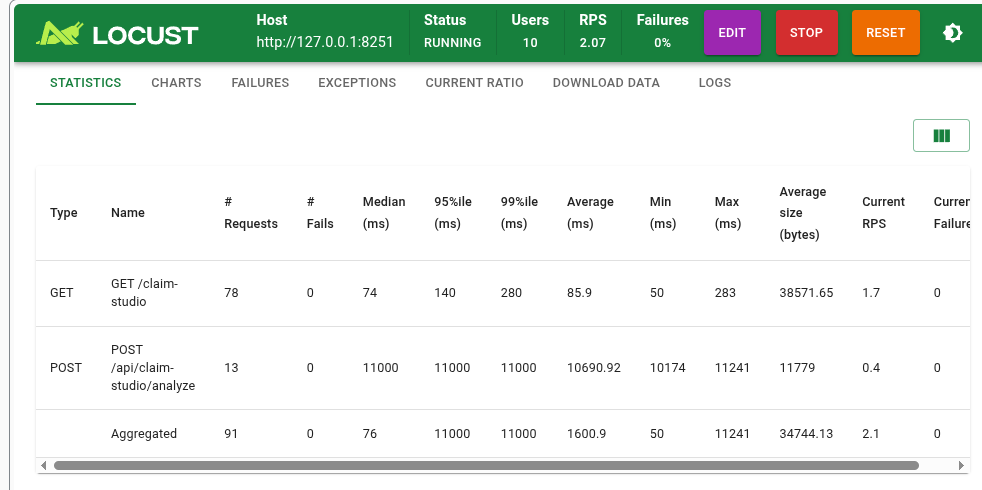

The trace told the same story: a multi-second **module import** span on every call, not slow business logic.

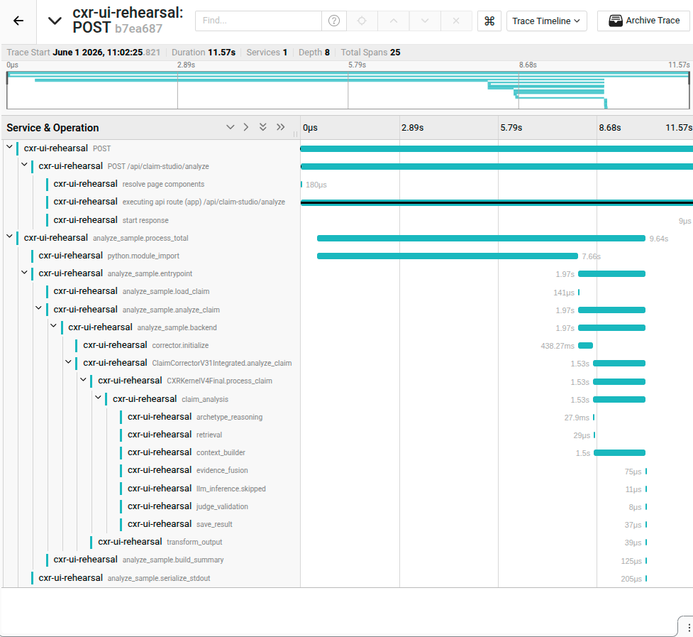

**Decision:** Reject subprocess-per-request ([ADR-003](../architecture/adrs/ADR-003-python-subprocess.md)). Ship a **warm analyzer** on port 8766 ([ADR-004](../architecture/adrs/ADR-004-long-running-analyzer.md)).

**Outcome:** Locust p95 dropped to ~1.5s on light load; warm traces fell to **154–708ms**. That unlocked real capacity work instead of fighting imports.

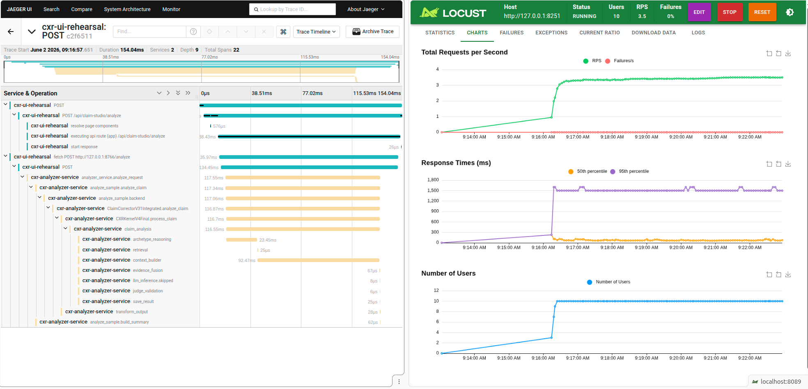

---

## Arc 2 — Kubernetes scaled before the node was the bottleneck (Jun 7–17)

**Hypothesis:** Moving to Kubernetes + HPA would raise throughput beyond single-process limits (LOAD-002 had shown ~15–16 RPS and tail latency runaway around 225 users).

**What we did:** LOAD-003 — cumulative Locust ramp to **200 users**, Grafana dashboard `cxr-hpa-load-003`, Prometheus + Jaeger (OBS-001).

**What failed:** The cluster **looked busy in Grafana** but **host CPU stayed low (~15%)**. Tail latency still reached **~9s**. Analyzer replicas **thrashed** (2↔20), pods sat **pending**, and RPS was a volatile sawtooth — classic **scheduling and HPA signal** problems, not “the machine is out of CPU.”

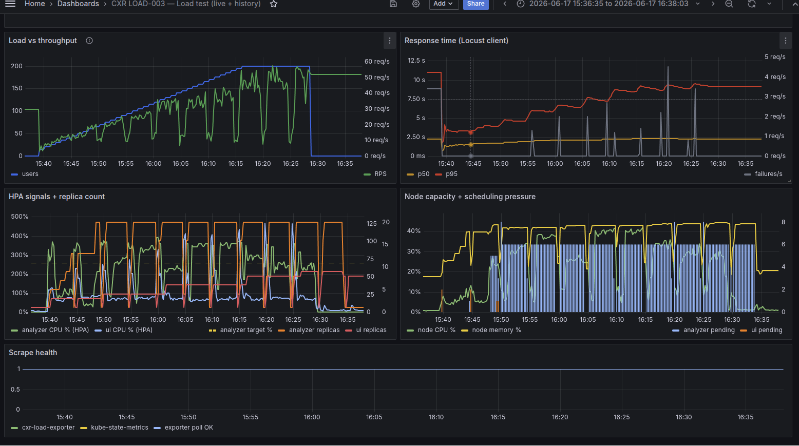

Jaeger explained *why* latency was high without high node CPU: **cold pod startup (~15–17s)** and a **`context_builder` span of 3–7s** on slow requests — SQL/context work, not LLM inference.

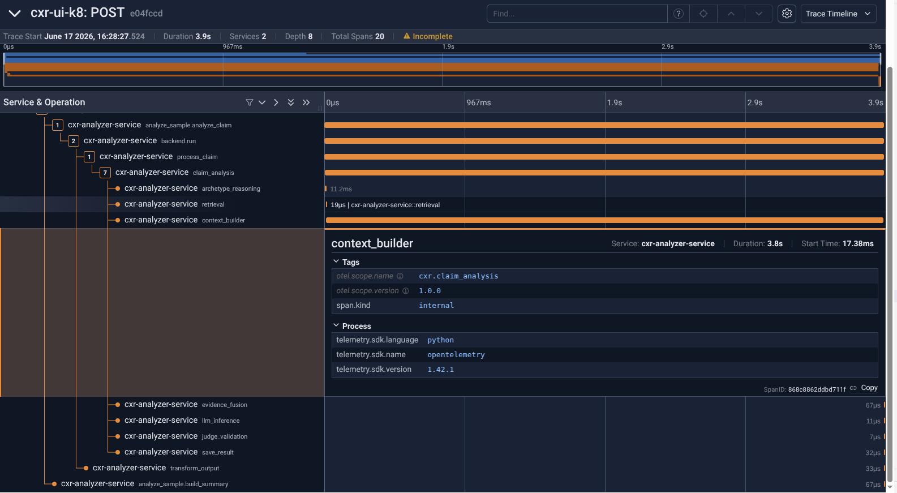

Under load, the same operation showed a wide tail (fast POSTs ~100ms vs slow ones >1s) — motivation for later PERF-009 tail attribution.

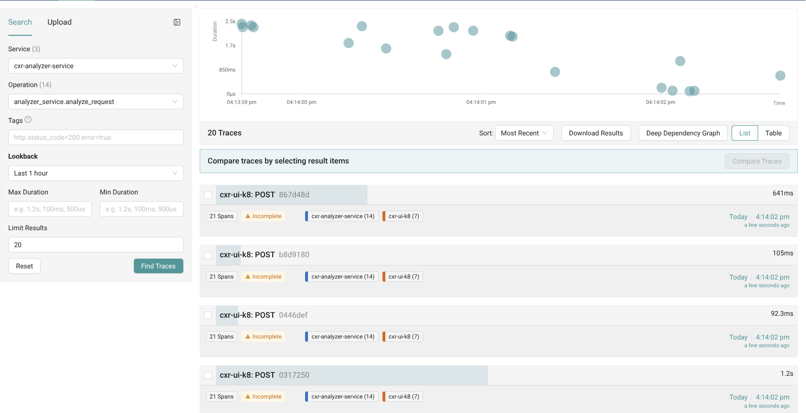

**Lessons (documented, not yet “fixed” in one PR):**

- Compare **like operations** in Jaeger (startup vs POST — mixing them invalidates conclusions). See [invalid compare](../investigations/kubernetes-analyzer-saturation/evidence/load-observe/jaeger-compare-startup-vs-post-invalid.png).
- Locust p95 and a single Jaeger trace measure different things — both are useful, not interchangeable.
- Load CSV records Locust + HPA; **span-level costs** (e.g. `context_builder`) require Jaeger unless OTLP→Prometheus is added later.

**Follow-on work:** PERF-002 (span tree), PERF-003 (context cache, image `perf003`). Full runbook: [RUN-2026-06-17](../investigations/kubernetes-analyzer-saturation/evidence/load-observe/RUN-2026-06-17.md).

---

## Arc 3 — More replicas made it worse (Jun 8–18)

**Hypothesis:** Raising `maxReplicas` would increase capacity on a single Docker Desktop node.

**What failed:**

1. **LOAD-003b (Jun 8):** Caps **20/20** produced **worse** stability than **8/5** — scheduling thrash on one node. Lesson: more pods ≠ more throughput without node capacity (`load-20260608-182451.csv` vs `load-20260608-125236.csv`).

2. **maxReplicas 20 (Jun 18 morning):** Analyzer pinned at **20 replicas**, **6 pending**, then **20→1 collapses** while node CPU remained **~8–15%** — memory requests and probe kills, not CPU saturation.

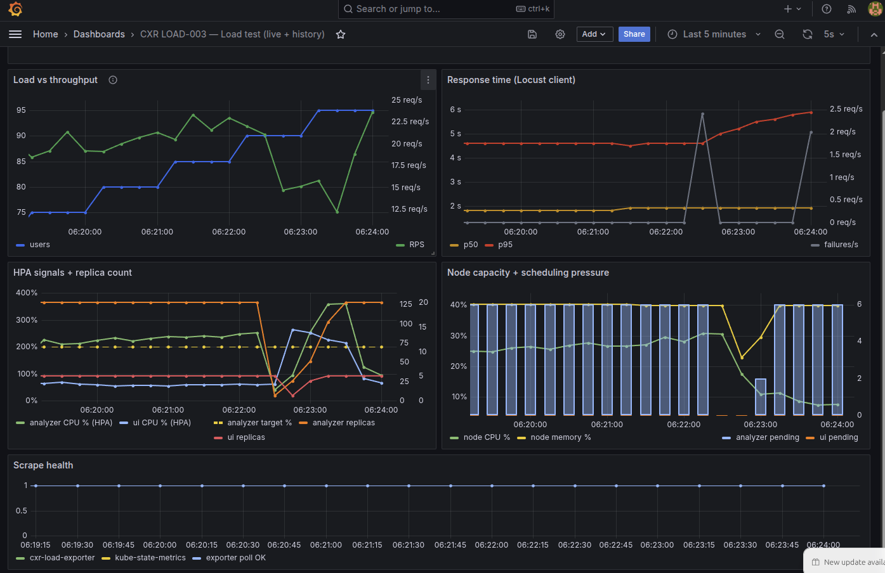

3. **After PERF-003 (Jun 18 afternoon):** Context cache helped micro-load, but a full **0→200** ramp still saw **~132 failures/s**, **18× replica collapses (8→1)**, and sawtooth RPS with UI at **5/5** replicas.

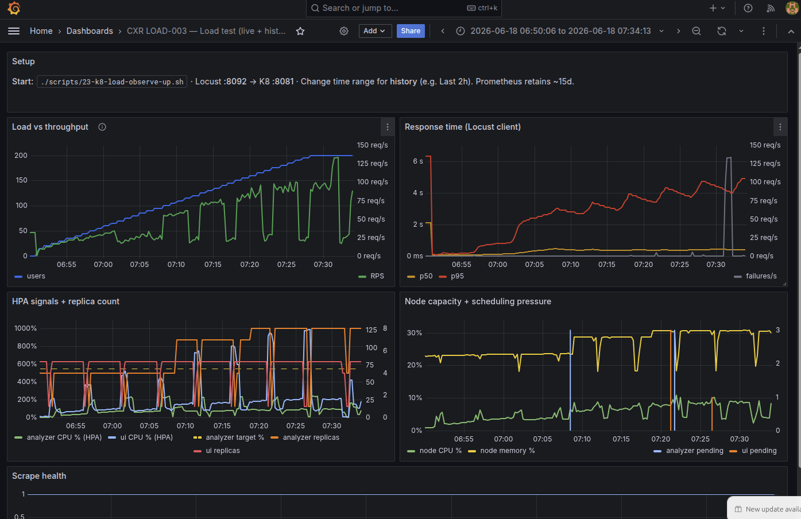

**Mitigation:** Cap analyzer at **8** and UI at **5**; reduce memory pressure. A clean **200-user gate pass** remained open until GATE-002 tuning.

**Ops footnote:** Local `helm upgrade` was **reverted within minutes** by Argo CD auto-sync from stale `main` — documented under Operations below.

---

## Arc 4 — First KEDA apply: 12-point Helm grid (GATE-002, Jun 19)

**Context:** CPU-only HPA had produced thrash and collapses (Arcs 2–3). **KEDA** was installed to scale the analyzer from **CPU + Locust E2E p95** (`cxr_locust_p95_ms` > 2000 ms) via a `ScaledObject`, replacing the legacy HPA.

**Hypothesis:** With KEDA handling *runtime* replica count, we can **grid-search deploy-time caps** — analyzer/UI `minReplicas` / `maxReplicas` — and pick a recipe that passes the same automated gate every time.

**What we did:** [GATE-002 KEDA + Helm grid study](../investigations/kubernetes-analyzer-saturation/studies/GATE-002-keda-helm-grid-study.md) — `k8-load-tuner.sh` over **12 candidates** (3×2×1×2 grid from `tuner_config.yaml`), each with KEDA enabled, cumulative ramp **15→200 users**, scored by `k8-load-gate.sh`.

| Dimension | Values searched |
|-----------|-----------------|
| Analyzer `maxReplicas` | 6, 8, 10 |
| Analyzer `minReplicas` | 1, 2 |
| KEDA p95 threshold | 2000 ms (fixed) |
| UI `maxReplicas` | 4, 5 |

**Outcome:** **11/12 passed.** **Winner: candidate 4** — analyzer max **8**, min **1**, UI max **4** — **102.1 RPS**, p95 **820 ms**, **0 failures/s** @ 200 ([summary JSON](../investigations/kubernetes-analyzer-saturation/results/tuner/tuner-summary-20260619-080505.json)).

**The one grid failure:** **Candidate 1** (UI max **5**, analyzer min **1**) — **116 failures/s** at 200 users. UI HPA pegged at cap; analyzer did not scale out; forward path saturated.

The full grid session ran multiple cumulative ramps; the same UI-thrash signature appears across candidates:

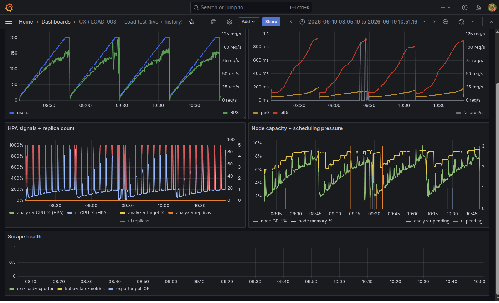

**What we kept:** Candidate 4 became the **lab baseline** for KEDA + Helm (including PERF-008 Experiment A). Promoting it to git-managed `main` is still open ([GIT-001](https://github.com/UdonsiKalu/cxr-portfolio/issues/24)).

---

## Arc 5 — Which autoscaling signal to trust (PERF-008, Jun 21–22)

**Hypothesis:** Scaling on **in-flight requests per pod** (backpressure) would scale earlier and more safely than **Locust E2E p95 + CPU**.

**Prerequisites:** (1) Helm caps from [GATE-002 KEDA grid study](../investigations/kubernetes-analyzer-saturation/studies/GATE-002-keda-helm-grid-study.md) — candidate 4. (2) **OBS-002 fix:** Grafana and gate CSV had shown **`analyzer_replicas = 0`** while pods were actually running under KEDA — the exporter read removed HPA objects, not Deployment truth. Fixed before any A/B comparison ([PERF-008 doc](../investigations/kubernetes-analyzer-saturation/studies/PERF-008-queue-depth-autoscaling.md)).

**Experiment A (p95 + CPU KEDA):** **GATE PASS @ 200** — 101 RPS, p95 **790ms**, **0 failures/s**, replicas **2→8**.

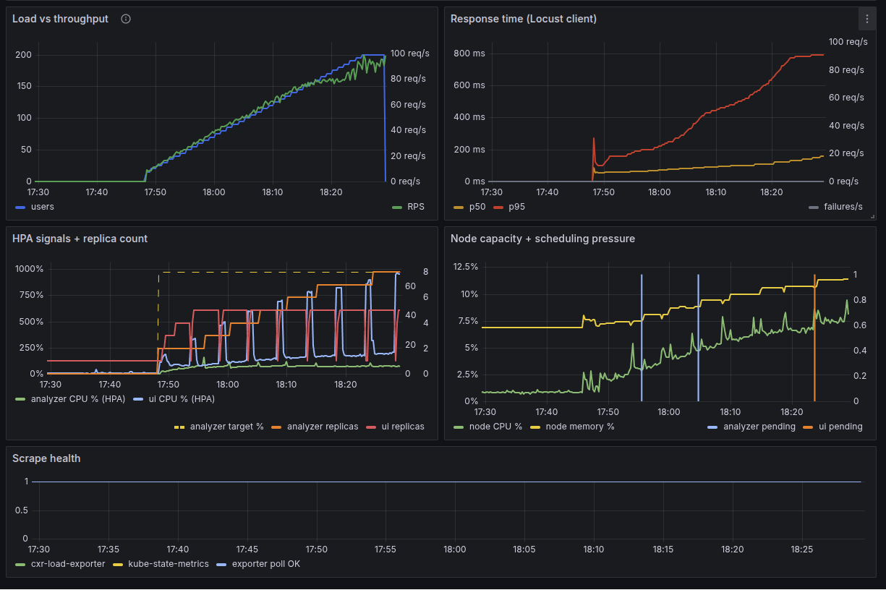

**Experiment B (inflight/pod KEDA):** Also scaled **2→8**, but **GATE FAIL** — **115.8 failures/s** (`status 0` / client connectivity) despite similar p95. UI HPA thrashed; failures began around **170 users**.

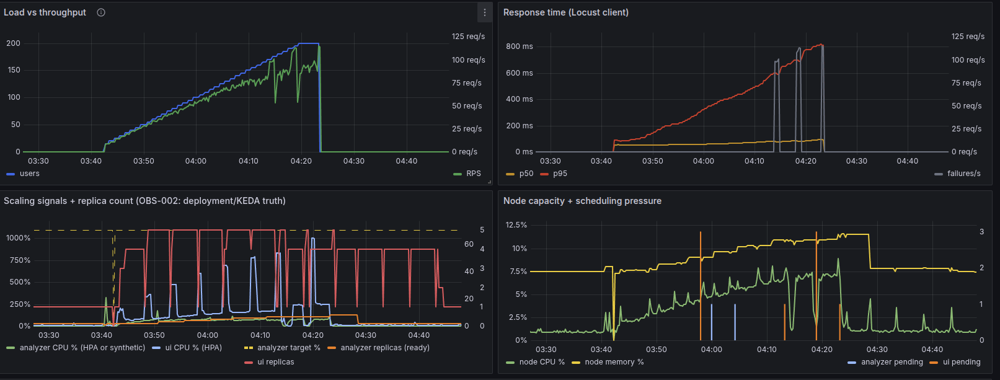

Backpressure metrics were visible but did not predict stability better than p95 for this load shape; queue wait stayed ~1ms with lab `MAX_CONCURRENT=4`.

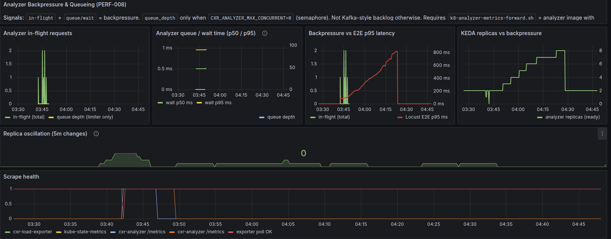

**Decision:** Keep **p95 + CPU** for KEDA; use inflight/wait panels for **diagnosis only**. First A run failed to scrape `/metrics` (pods kept cached `perf003` image) — [empty panels capture](../investigations/kubernetes-analyzer-saturation/evidence/perf008/grafana-perf008-exp-a-backpressure-nodata.png).

**Tail attribution ([PERF-009](../investigations/kubernetes-analyzer-saturation/studies/PERF-009-jaeger-tail-latency.md)):** Jaeger fast vs slow comparison @200 users — **HTTP/client wait** on UI→analyzer `fetch` accounts for most of the ~650 ms p95 tail; analyzer `context_builder` / policy are secondary. Experiment B did not change the slow-span pattern.

**Canonical pair (2026-06-22 ~11:28):** Compare `fd42f1c` (**40.7 ms** E2E, p50-ish) vs `f541546` (**824 ms**, p95-ish) — same `POST` pipeline, same second. Slow trace keeps `fetch` open **~818 ms** while `analyze_request` starts **~652 ms** late and runs only **~57 ms** → **~649 ms pre-handler wait**, not slow kernel/LLM. See [PERF-009 walkthrough](../investigations/kubernetes-analyzer-saturation/studies/PERF-009-jaeger-tail-latency.md#walkthrough--one-fast-one-slow-trace) for waterfall screenshots.

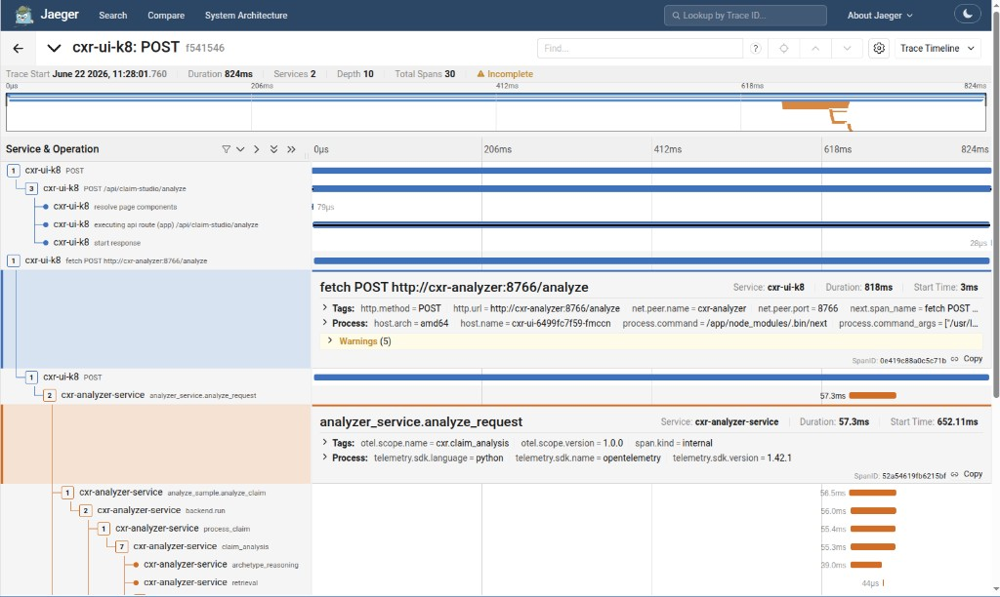

**Jaeger “2 Errors” on slow traces ([OBS-003](https://github.com/UdonsiKalu/cxr-portfolio/issues/33)):** While reviewing PERF-009 waterfalls, many ~800 ms `POST` traces showed **ERROR** on `context.7_policy` / `context.7_policy.sql` — not LLM or missing spans. **Full mechanism write-up:** [OBS-003-shared-sql-connection.md](../investigations/kubernetes-analyzer-saturation/studies/OBS-003-shared-sql-connection.md). Summary: one warm kernel per pod → one shared `pyodbc` connection; up to 4 concurrent `/analyze` threads collided on cursors → `Connection is busy with results for another command`. HTTP often still 200; Jaeger polluted and policy context could be wrong.

**Fix:** Thread-safe `_db_cursor()` lock in `ContextCollector`; image `cxr-analyzer:perf009-sql`. Post-fix: **0 policy span errors** @100 users. **Not** the p95 tail (~649 ms pre-handler wait) — see [PERF-009](investigations/kubernetes-analyzer-saturation/studies/PERF-009-jaeger-tail-latency.md).

---

## Operations and GitOps

| Failure | What happened | Status |
|---------|-----------------|--------|
| Argo overwrites local Helm | `helm upgrade` on cluster reverted by auto-sync from stale Git `main` | Mitigated via Argo parameters; [GIT-001](https://github.com/UdonsiKalu/cxr-portfolio/issues/24) tracks promoting GATE-002 winner to `main` |
| GIT-001 values drift | Winning caps exist in lab evidence but not yet on git-managed defaults | Open |

---

## Reliability notes (not all are “failures”)

| Event | Result |
|-------|--------|
| **Kill analyzer under traffic** (CHAOS-001) | ~64 requests returned **500** / `fetch failed` until cold restart (~7s) — [investigation](../investigations/kill-analyzer-under-traffic/README.md) |
| **Qdrant outage** (DEP-001) | HTTP **200** with degraded retrieval — graceful degradation, not a user-visible hard failure — [investigation](../investigations/qdrant-outage/README.md) |

---

## Appendix — evidence index

Quick lookup for reviewers who already know the arc. Files live in-repo; gate JSON/CSV for PERF-008 also in `cxr-ops-lab/evidence/perf008/`.

| Date / ID | Failure (one line) | Primary evidence |
|-----------|-------------------|------------------|
| May–Jun | Subprocess import ~7–8s | [postmortem](../investigations/postmortems/python-import-bottleneck.md), [ADR-003](../architecture/adrs/ADR-003-python-subprocess.md) |
| Jun 17 | OBS-001: p95 ~9s, low node CPU | [RUN-2026-06-17](../investigations/kubernetes-analyzer-saturation/evidence/load-observe/RUN-2026-06-17.md) |
| Jun 8 | maxReplicas 20/20 regression | `load-20260608-182451.csv` |
| Jun 18 | Replicas 20→0 collapse | [load-20260618-060419.csv](../investigations/kubernetes-analyzer-saturation/results/load-20260618-060419.csv) |
| Jun 18 | Post-PERF-003 ramp unstable | [load-20260618-064836.csv](../investigations/kubernetes-analyzer-saturation/results/load-20260618-064836.csv) |
| Jun 19 | GATE-002 **KEDA + Helm grid** (11/12 pass) | [GATE-002 study](../investigations/kubernetes-analyzer-saturation/studies/GATE-002-keda-helm-grid-study.md) · [result-c1](../investigations/kubernetes-analyzer-saturation/results/tuner/result-c1-20260619-080505.json) |
| Jun 21–22 | PERF-008 B rejected | [PERF-008 doc](../investigations/kubernetes-analyzer-saturation/studies/PERF-008-queue-depth-autoscaling.md) |
| Jun 22 | OBS-003: shared SQL connection busy (`context.7_policy` Jaeger errors) | [OBS-003 study](../investigations/kubernetes-analyzer-saturation/studies/OBS-003-shared-sql-connection.md) · [issue #33](https://github.com/UdonsiKalu/cxr-portfolio/issues/33) · [cxr-platform PR #3](https://github.com/UdonsiKalu/cxr-platform/pull/3) |
| — | Grafana screenshot catalog | [evidence/failures/](../investigations/kubernetes-analyzer-saturation/evidence/failures/README.md), [evidence/perf008/](../investigations/kubernetes-analyzer-saturation/evidence/perf008/README.md) |

---

## Related

- [archive/reviewer/history.md](../archive/reviewer/history.md) — full program arc including wins  
- [CHANGELOG.md](../CHANGELOG.md) — dated journal entries for every row above  
- [investigations/postmortems/README.md](../investigations/postmortems/README.md) — long-form incident write-ups  
- [reliability/SLO.md](../reliability/SLO.md) — lab gate vs production SLO  
- [archive/reviewer/REVIEWER-GUIDE.md](../archive/reviewer/REVIEWER-GUIDE.md) — how to evaluate this portfolio
