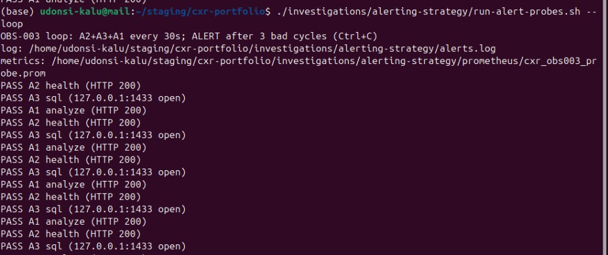

# OBS-003 — Alerting strategy

| | |
|---|---|
| **Status** | Complete (2026-07-12) — strategy + local blackbox probes |
| **ID** | OBS-003 (issue [#19](https://github.com/UdonsiKalu/cxr-portfolio/issues/19)) — **not** the K8 saturation “OBS-003” shared-SQL study |
| **Question** | What should we alert on for claim analysis, given what REL/PERF/DEP labs proved? |
| **Type** | Design + Phase-1 blackbox (A1/A2/A3) |
| **Related** | [REL-004 SQL](../database-unavailable/) · [REL-002 Ollama](../ollama-outage/) · [PERF-003 Qdrant scaling](../qdrant-retrieval-scaling/) · [DEP-001 Qdrant outage](../archive/old-investigations/qdrant-outage/) · [SLOs (local)](../../archive/investigations-supplemental/slos-and-slis.md) |

**Plain English:** [RESULTS.md](./RESULTS.md) · **Runbook:** [RUNBOOK.md](./RUNBOOK.md)

---

## Short story

From the outages and pressure labs: **page** on hard Analyze failure (SQL / analyzer down); **ticket** for soft deps (Ollama Auditor, Qdrant fallback). Local probes now check health + SQL + Analyze in a loop and raise **ALERT** after 3 bad cycles.

---

## Pictorial evidence



---

## Method

1. Inventory failure modes from completed studies (SQL, Ollama, Qdrant, load).
2. Classify each: **hard vs soft**, user-visible blast radius, recoverable vs not.
3. Propose **page / ticket / ignore** + a concrete signal for each.
4. Implement Phase-1 blackbox: [`run-alert-probes.sh`](./run-alert-probes.sh) (A2 → A3 → A1 → ALERT@3 → Prom textfile).

---

## Alert catalog (summary)

| # | Signal | Severity | Evidence study |
|---|--------|----------|----------------|
| A1 | Analyze **HTTP 5xx** rate high | **Page** | REL-004 |
| A2 | Analyzer `/health` not `warmed` / down | **Page** | CHAOS-001 / cold-vs-warm |
| A3 | SQL connectivity probe fail | **Page** (or same as A1) | REL-004 Terminal diag |
| A4 | Auditor / judge **connect fail** (Ollama) | **Ticket** | REL-002 |
| A5 | `policy_support=0` while Qdrant expected up | **Ticket** | DEP-001 |
| A6 | Warm Analyze p95 above SLO band | **Ticket** then page if sustained | LOAD-001/002 |
| A7 | Qdrant search error rate / RPS collapse | **Ticket** | PERF-003 |

Details + “do not alert” list: [RESULTS.md](./RESULTS.md)

---

## Decision

- Treat **SQL / analyzer availability** as paging class.
- Treat **Ollama (Auditor)** and **Qdrant soft fallback** as degraded-mode tickets, not 3am pages — unless product requires Auditor for every claim.
- Never page solely on Analyze wall clock when Jaeger `retrieval` is tens of ms (PERF-003 lesson).

## How to run probes

```bash
./investigations/alerting-strategy/run-alert-probes.sh          # one-shot A2+A3+A1
./investigations/alerting-strategy/run-alert-probes.sh --loop   # + ALERT after 3 fails
```

Details: [RUNBOOK.md](./RUNBOOK.md) · Prometheus draft: [prometheus/](./prometheus/)

## Evidence

- This folder: [RESULTS.md](./RESULTS.md) · [RUNBOOK.md](./RUNBOOK.md)
- Prior labs linked above · supplemental: [prometheus.md](../../archive/investigations-supplemental/prometheus.md) · [slos-and-slis.md](../../archive/investigations-supplemental/slos-and-slis.md)
