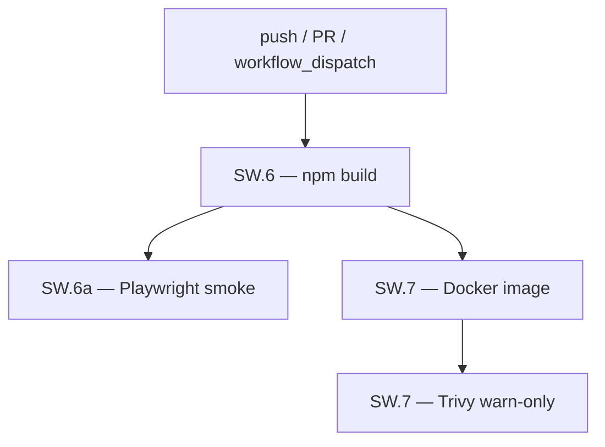
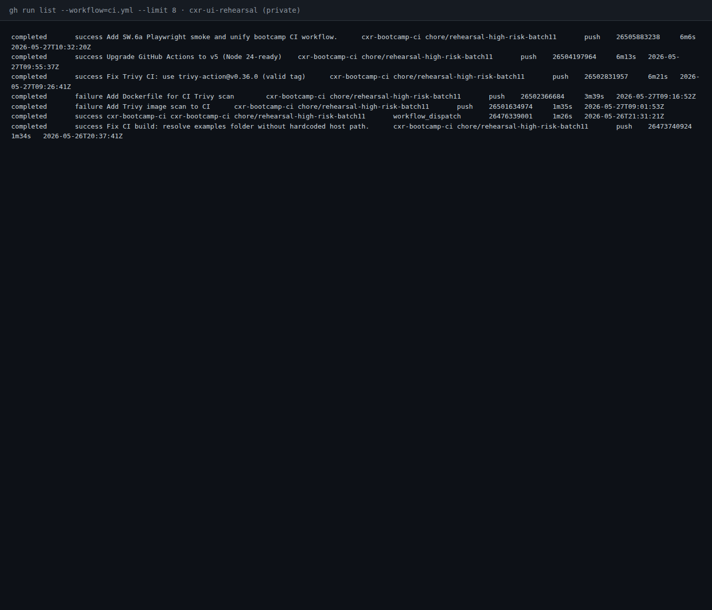
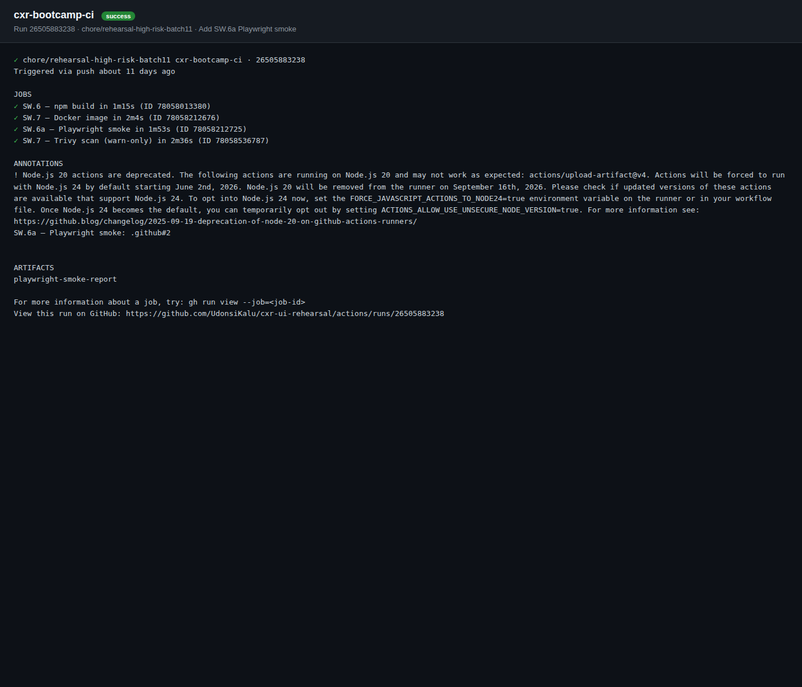

# Bootcamp CI pipeline (CI-001)

| | |
|---|---|
| **Status** | Complete |
| **ID** | CI-001 |
| **Component** | **`cxr-ui-rehearsal`** GitHub Actions — SW.6 / SW.6a / SW.7 |
| **Tools** | GitHub Actions · npm · Playwright · Docker · Trivy |
| **Environment** | Cloud runner (`ubuntu-latest`); **does not deploy** to **:8251** / **:8766** |
| **Related** | [kubernetes-deploy/](../kubernetes-deploy/) · [operations/ci-cd.md](../../operations/ci-cd.md) · [LOAD-001](../single-analyzer-capacity/) |

---

## Question

Does every push to the canonical rehearsal repo pass a **repeatable CI gate** — compile, smoke E2E, container build, and vulnerability scan — without duplicating workflows across repos?

## Hypothesis

A **single workflow** (`.github/workflows/ci.yml`) on **`cxr-ui-rehearsal`** runs four jobs on push; failures are visible in GitHub Actions; **CI validates change safety** but **CD (deploy) stays separate** — local **`cxr up`** remains the runtime evidence path for analyze/latency investigations.

## Method

1. Confirm canonical repo: **https://github.com/UdonsiKalu/cxr-ui-rehearsal**
2. Inspect workflow: `cxr-ui-prune-rehearsal/cxr-ui/.github/workflows/ci.yml` (`cxr-bootcamp-ci`)
3. Review latest green run on branch **`chore/rehearsal-high-risk-batch11`**
4. Optional local parity:

```bash
cd cxr-ui-prune-rehearsal/cxr-ui
npm ci && npm run build
npm run test:playwright:smoke
```

5. Optional fresh run: GitHub → Actions → **cxr-bootcamp-ci** → **Run workflow**

---

## Pipeline design

### CI vs CD (explicit scope)

| Term | What CXR does today |
|------|---------------------|
| **CI** (Continuous Integration) | On push/PR: build, test, scan image in GitHub Actions |
| **CD** (Continuous Delivery/Deployment) | **Not wired** — no auto-deploy to **:8251**, **:3000**, or **:8081** |
| **Local runtime** | **`cxr up`**, rehearsal dev **:8251**, analyzer **:8766** — where [PERF-004](../cold-vs-warm-analyzer/) through [OTEL-001](../trace-propagation/) were run |

This investigation documents **change safety in the pipeline**, not production rollout.

### Job graph



| Job | Syllabus | Trigger | Steps |
|-----|----------|---------|--------|
| `build` | SW.6 | push, PR, dispatch | `checkout@v5` → `setup-node@20` → `npm ci` → `npm run build` |
| `playwright` | SW.6a | after `build` | Install Chromium → `npm run test:playwright:smoke` → upload report artifact |
| `docker-build` | SW.7 | after `build`; **skipped on PR** | `docker build -f deploy/Dockerfile.rehearsal-duplicate` → `cxr-ui:ci` |
| `trivy` | SW.7 | after `docker-build`; **skipped on PR** | `trivy-action@v0.36.0`, CRITICAL+HIGH, **`exit-code: "0"`** (warn-only) |

**PR policy:** Pull requests get **build + Playwright** only — no image build/scan on every PR (saves runner minutes; full scan on merge/push to default branch).

### Playwright port note

| Context | Port | Command |
|---------|------|---------|
| Daily dev | **:8251** | `npm run dev:rehearsal` |
| CI smoke | **:8250** | `npm run build` then `next start` (via `playwright.smoke.config.ts`) |

Same application code; CI uses production-like **`next start`**, not hot-reload dev.

---

## Results (canonical green run)

Reference run captured **2026-06-07** from `gh run list`:

| Field | Value |
|-------|-------|
| **Run ID** | **26505883238** |
| **URL** | https://github.com/UdonsiKalu/cxr-ui-rehearsal/actions/runs/26505883238 |
| **Branch** | `chore/rehearsal-high-risk-batch11` |
| **Title** | Add SW.6a Playwright smoke and unify bootcamp CI workflow. |
| **Conclusion** | **success** |
| **Created** | 2026-05-27T10:32:20Z |
| **Duration** | ~**6m 6s** |

### Job outcomes

| Job | Result | Completed (UTC) |
|-----|--------|-----------------|
| SW.6 — npm build | success | 2026-05-27T10:33:38 |
| SW.6a — Playwright smoke | success | 2026-05-27T10:35:33 |
| SW.7 — Docker image | success | 2026-05-27T10:35:46 |
| SW.7 — Trivy scan (warn-only) | success | 2026-05-27T10:38:25 |

Metadata: [`results/github-actions-run-26505883238.txt`](./results/github-actions-run-26505883238.txt)

> **Screenshot note:** **`cxr-ui-rehearsal`** is a **private** repo — captures below use authenticated **`gh run list`** / **`gh run view`** output (same data as the Actions UI). Re-run [`scripts/capture-ci-k8-screenshots.sh`](../../scripts/capture-ci-k8-screenshots.sh) after a fresh green run, or replace PNGs with logged-in GitHub Actions UI screenshots.

### Run history



### Green run — four jobs



### Troubleshooting arc (how the pipeline got green)

Earlier runs on the same branch **failed** before this success — useful for portfolio “debug CI” narrative:

| Run ID | Failure | Fix |
|--------|---------|-----|
| 26501634974 | Trivy job added | Invalid/missing Dockerfile path |
| 26502366684 | docker-build | Added `deploy/Dockerfile.rehearsal-duplicate` |
| 26502831957 | trivy | **`trivy-action@0.28.0`** invalid → **`@v0.36.0`** + `scanners: vuln` |
| 26504197964 | — | Actions **v4 → v5** (Node 24-ready) |
| **26505883238** | — | **All green** — Playwright unified into same workflow |

Policy: Trivy **warn-only** (`exit-code: "0"`) — report CRITICAL/HIGH, do not block bootcamp on base-image CVE debt without triage.

---

## Findings

1. **Single source of truth** — one workflow on **`cxr-ui-rehearsal`**; **`cxr-ops-lab`** and **`staging/`** duplicate CI YAML retired per bootcamp policy.
2. **CI complements local investigations** — [LOAD-001](../single-analyzer-capacity/) / [OTEL-001](../trace-propagation/) prove **runtime** behavior; CI proves **every merge builds and smoke-tests**.
3. **No false “CD” claim** — green Actions ≠ deployed stack; reviewers should still run **`cxr up`** for Claim Studio + Jaeger.
4. **Security gate exists** — Trivy runs on built **`cxr-ui:ci`** image; local lab scans documented in **`cxr-ops-lab/evidence/SW7-trivy-verify.md`**.

---

## Decision

- Keep **canonical CI** only in **`cxr-ui-rehearsal/.github/workflows/ci.yml`**
- **PRs:** build + Playwright; **push to main/feature:** full pipeline including Trivy
- **CD / GitOps** → separate track ([kubernetes-deploy/](../kubernetes-deploy/) + optional SW.8 Argo in **`cxr-ops-lab`**)
- Portfolio stores **evidence + narrative**; workflow YAML stays in the app repo

---

## Reproduce

```bash
# List recent runs
cd cxr-ui-prune-rehearsal/cxr-ui
gh run list --workflow=ci.yml --limit 5

# Inspect a run
gh run view 26505883238

# Local parity (no Docker/Trivy unless you build locally)
npm ci && npm run build
npm run test:playwright:smoke

# Trigger fresh cloud run
gh workflow run cxr-bootcamp-ci
```

---

## Follow-up

- Merge **`chore/rehearsal-high-risk-batch11`** → default branch when ready; re-capture Actions screenshot on **`main`**
- Optional: add **`workflow_dispatch`** badge to portfolio README
- **CD-001** (SW.8 Argo): GitOps sync — see [kubernetes-deploy/](../kubernetes-deploy/) follow-up
- Screenshot checklist: [`screenshots/README.md`](./screenshots/README.md)
