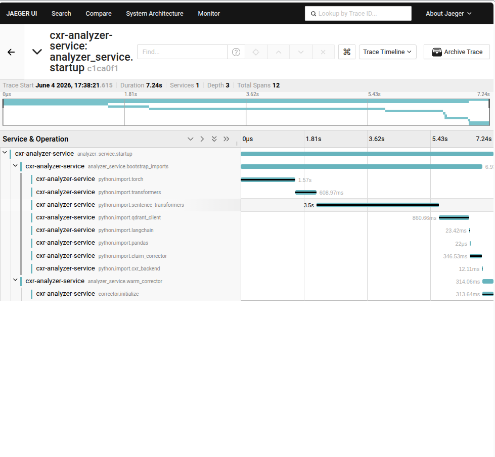
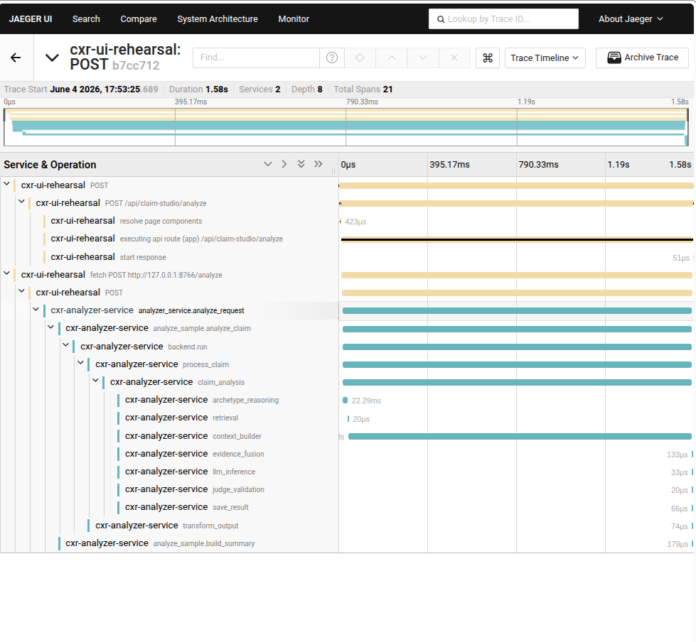
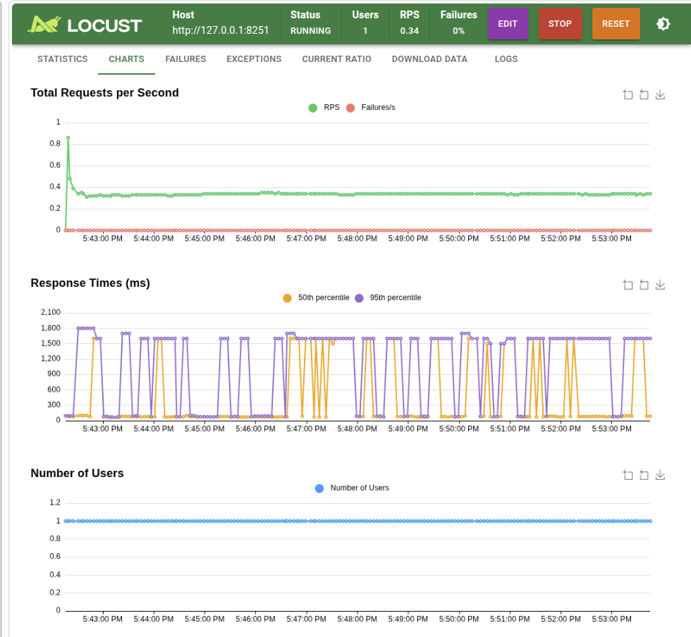

# Cold vs warm analyzer

| | |
|---|---|
| **Status** | Complete |
| **Component** | FastAPI analyzer `:8766` |
| **Tools** | Jaeger · Locust · `curl /health` |
| **Environment** | Local dev (`cxr up`) |
| **Related** | [PERF-001 latency investigation](../latency-investigation/) · [ADR-004](../../archive/decisions/adrs/ADR-004-long-running-analyzer.md) |

---

## Question

After moving analyze to a long-running analyzer, where does the ~7–8s import cost go — and what does a steady analyze request cost once the service is warm?

## Hypothesis

Import and corrector init happen **once at startup** (`analyzer_service.startup`). Steady **`analyzer_service.analyze_request`** traces stay around **~1–2s** (or lower), not ~7s per request.

## Method

1. `cxr up` — confirm `curl http://127.0.0.1:8766/health` → `"warmed":"true"`.
2. **Cold lens:** Jaeger → `cxr-analyzer-service` → **`analyzer_service.startup`** (after `cxr down && cxr up`).
3. **Warm lens:** Jaeger → `cxr-analyzer-service` → **`analyzer_service.analyze_request`** (after startup complete).
4. **Load lens:** Locust `:8089` → 1 user → `POST /api/claim-studio/analyze` on `:8251`.

> On the warm service, FastAPI **does not accept** `/analyze` until startup finishes — so ~7s appears on **`startup`**, not on every `analyze_request`. That is expected.

## Metrics

| Lens | What it measures |
|------|------------------|
| Jaeger `startup` | One-time boot cost |
| Jaeger `analyze_request` | Single warm analyze (kernel path) |
| Locust p50/p95 | Client-side aggregate (1 user) |

Separate Locust aggregates from Jaeger single-trace duration (see [investigations README](../README.md)).

---

## Results

### Cold — `analyzer_service.startup` (once per boot)

| Span | Duration | Notes |
|------|----------|-------|
| `analyzer_service.startup` | **7.24s** | 12 spans |
| `analyzer_service.bootstrap_imports` | ~6.9s | torch ~2.57s, sentence_transformers ~3.5s, qdrant_client ~860ms |
| `analyzer_service.warm_corrector` | ~314ms | `corrector.initialize` |

### Warm — `analyzer_service.analyze_request`

| Span | Duration | Notes |
|------|----------|-------|
| `analyzer_service.analyze_request` | **1.58s** | 21 spans; full pipeline (`context_builder`, `retrieval`, …) |

### Locust — 1 user (warm stack)

| Observation | Value |
|-------------|-------|
| Users | 1 |
| Typical response times | ~100ms (50th percentile valleys) |
| p95 spikes | ~1.5–1.8s |

### Comparison — subprocess era (historical)

Before ADR-004, **each** request paid import cost (~10–12s Locust with 10 users). Evidence: [load-testing](../load-testing/) and [latency-investigation](../latency-investigation/).

| Mode | Per-request cost |
|------|------------------|
| Subprocess (old) | ~10–12s Locust p95 — import **every** POST |
| Warm analyzer (now) | ~7s **once** at startup; analyze ~1–2s per trace |

---

## Findings

1. **~7s is real but moved** — it shows on **`analyzer_service.startup`**, not on every warm `analyze_request`.
2. **Warm analyze** on this run was **~1.58s** for a full pipeline trace (other warm traces in PERF-001 were as low as ~154ms on lighter paths).
3. **Locust with 1 user** shows low median with occasional ~1.5s p95 spikes — consistent with warm backend, not 7s-per-request.
4. **10 Locust users** (load-testing baseline) raises p95 to ~**1.5s** under contention — that is load, not cold startup.

## Decision

Keep warm analyzer as default dev path (`ANALYZER_URL` → `:8766`). Treat `/health` `warmed: true` as readiness. Do not reintroduce subprocess-per-request on the hot path without an ADR.

## Follow-up

Next: [single-analyzer-capacity](../single-analyzer-capacity/) — how many concurrent users one warm instance supports.
