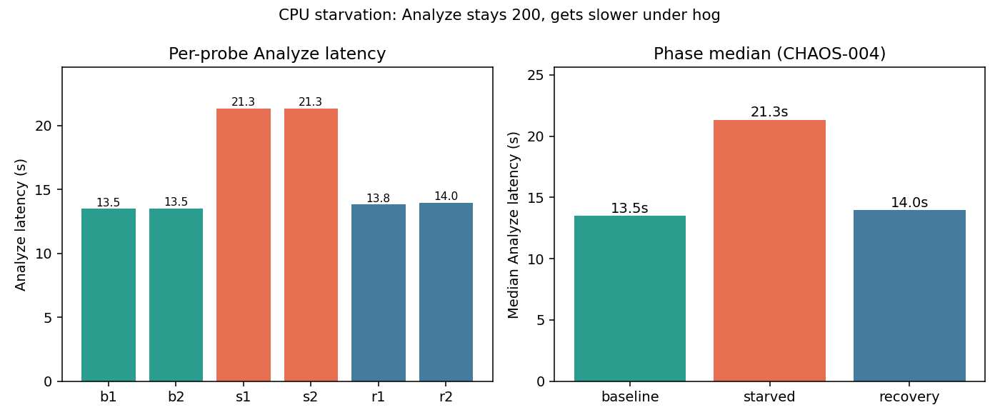

# CHAOS-004 — CPU starvation

| | |
|---|---|
| **Status** | Complete (2026-07-12) |
| **ID** | CHAOS-004 |
| **Question** | How does CPU contention on the analyzer host affect warm POST Analyze latency? |
| **Tools** | `cpu_hog.py` busy-loop workers · `run-cpu-starvation-check.sh` · `/proc/loadavg` |
| **Environment** | Local `cxr` — UI `:8251`, analyzer `:8766` |
| **Issue** | [#17](https://github.com/UdonsiKalu/cxr-portfolio/issues/17) |
| **Related** | [OBS-003 alerting](../alerting-strategy/) · [REL-004 SQL](../database-unavailable/) · [PERF-003 Qdrant](../qdrant-retrieval-scaling/) |

**Plain English story (start here):** [RESULTS.md](./RESULTS.md) · **Runbook:** [RUNBOOK.md](./RUNBOOK.md)

The latency PNG is **visual evidence only** — the full story is in RESULTS.md; exact numbers are in `results/`.

---

## Short story

| Phase | Median ms | HTTP |
|-------|-----------|------|
| Baseline | ~13500 | 200 |
| Starved (48 workers) | ~21334 | 200 |
| Recovery | ~13896 | 200 |

**~58% slower** under CPU hog; **not** a hard fail. Latency recovered after the hog stopped.

---

## Pictorial evidence



Chart from `results/cpu-starvation-probes.csv` (not the raw `analyze-*.json` bodies).

---

## Folder layout

```text
cpu-starvation/
├── README.md / RESULTS.md / RUNBOOK.md
├── run-cpu-starvation-check.sh · cpu_hog.py
├── results/          # machine evidence
└── screenshots/      # terminal + htop (add PNGs here)
```

---

## How to run

```bash
# Full lab (baseline → starved → recovery)
./investigations/cpu-starvation/run-cpu-starvation-check.sh

# Screenshot workflow (separate phases)
CXR_CPU_PROBES=2 CXR_CPU_WORKERS=48 ./investigations/cpu-starvation/run-cpu-starvation-check.sh --phase baseline
CXR_CPU_PROBES=2 CXR_CPU_WORKERS=48 ./investigations/cpu-starvation/run-cpu-starvation-check.sh --phase starved
# → screenshot htop while hog still runs
./investigations/cpu-starvation/run-cpu-starvation-check.sh --phase recovery
# or only stop hog:
./investigations/cpu-starvation/run-cpu-starvation-check.sh --phase stop-hog
```

| Env | Default | Meaning |
|-----|---------|---------|
| `CXR_CPU_WORKERS` | `nproc - 2` | Busy-loop processes (~1 per logical CPU) |
| `CXR_CPU_PROBES` | `3` | Analyze samples per phase |
| `CXR_LOAD_URL` | `http://127.0.0.1:8251` | Claim Studio base |

The runner itself POSTs Analyze (`curl`) — **Locust not required**.

Lab evidence already on disk used **`CXR_CPU_WORKERS=48`**, **`CXR_CPU_PROBES=2`** on a **64**-CPU host.

---

## Evidence

- [results/cpu-starvation-summary.txt](./results/cpu-starvation-summary.txt)
- [results/cpu-starvation-probes.csv](./results/cpu-starvation-probes.csv)
- [results/](./results/) — JSON + loadavg snapshots

---

## Contrast

| Study | Failure mode | Analyze |
|-------|--------------|---------|
| REL-004 SQL | Hard dependency | **500** |
| REL-002 Ollama | Soft (Auditor) | **200** |
| **CHAOS-004 CPU** | Resource contention | **200**, slower |
