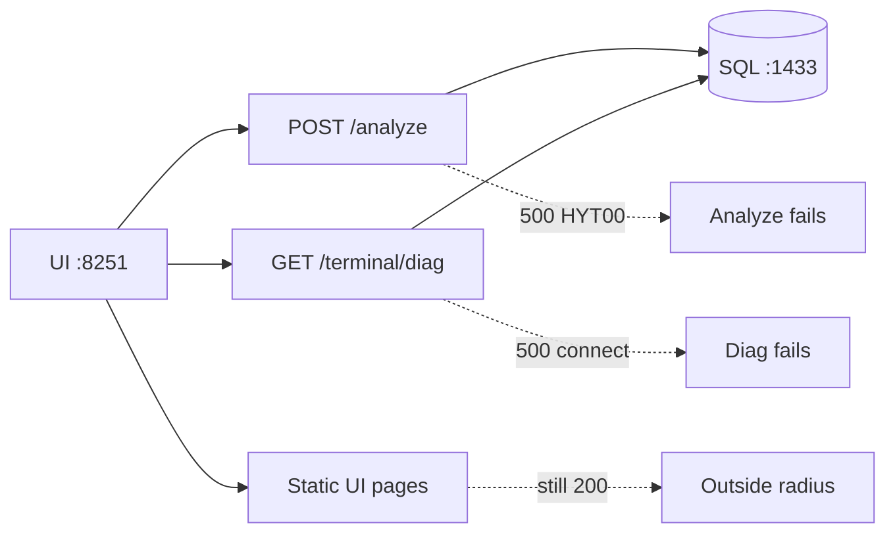
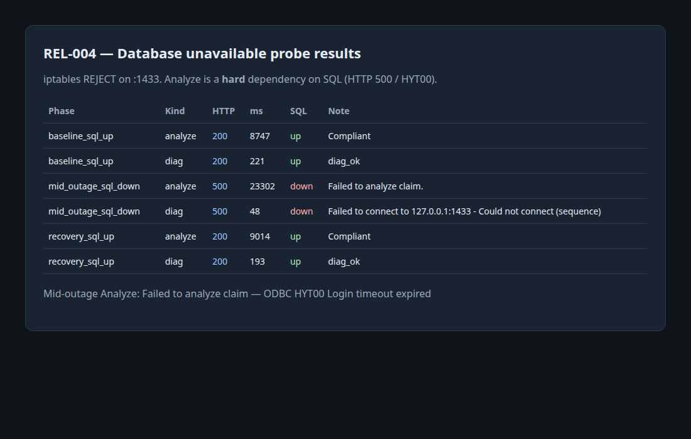

# REL-004 — Database unavailable

| | |
|---|---|
| **Status** | Complete (2026-07-12) |
| **ID** | REL-004 |
| **Question** | How does Analyze behave when SQL Server is unreachable? |
| **Tools** | `curl`, `iptables` REJECT on `:1433` (mssql stays running), Claim Studio, Terminal diag |
| **Environment** | Local `cxr` stack — UI `:8251`, analyzer `:8766`, SQL `:1433` (`mssql-server`) |
| **Issue** | [#14](https://github.com/UdonsiKalu/cxr-portfolio/issues/14) |
| **Related** | [Ollama outage (REL-002)](../ollama-outage/) · [Qdrant outage (DEP-001)](../archive/old-investigations/qdrant-outage/) |

**Plain-English results:** [RESULTS.md](./RESULTS.md) (start here if you do not want CSV/JSON).

---

## Short story

Unlike Ollama (soft for Compliant Analyze) and Qdrant (soft fallback), **SQL Server is a hard dependency** for Claim Studio Analyze in this lab:

| Dependency | Analyze (Compliant) when down |
|------------|-------------------------------|
| Qdrant | stays **200** (fallback) |
| Ollama | stays **200** (LLM skipped) |
| **SQL** | **HTTP 500** — ODBC **`HYT00` Login timeout expired** |

Terminal `/api/terminal/diag` also fails fast (**500**) when `:1433` is unreachable.

---

## Blast radius

**Failure:** SQL Server `:1433` unreachable (lab: iptables REJECT; service may still be “running”).

| In blast radius | Outside blast radius |
|-----------------|----------------------|
| **Claim Studio Analyze** — HTTP **500**, ~20s+ ODBC login timeout | Rehearsal **UI shell** (`:8251` pages still load) |
| **Terminal diag** (`/api/terminal/diag`) — HTTP **500**, fast connect error | **Ollama** / **Qdrant** (not this failure mode) |
| Other SQL-backed Terminal / rules paths that use `lib/db` or ODBC | **Jaeger / Locust** control UIs (still reachable) |
| User-visible claim analysis (no successful decision payload) | Host OS / other non-CXR apps (port block is local lab only) |



**Scope note:** This is the **local lab** blast radius (single host). Production K8 isolation is out of scope here — see [blast-radius-analysis.md](../../archive/architecture-supplemental/blast-radius-analysis.md).

**Contrast:** [REL-002 Ollama](../ollama-outage/) — Compliant Analyze stays **200** (LLM skipped); Auditor fails. SQL takes down **Analyze itself**.

---

## Pictorial evidence



More: [screenshots/](screenshots/).

---

## Method

We **did not** stop `mssql-server` (avoids long restart / broader blast radius). Instead:

```bash
# Temporary: REJECT tcp/1433 (INPUT + OUTPUT), then delete rules
./investigations/database-unavailable/run-database-unavailable-check.sh
```

Requires passwordless `sudo` for `iptables` (this host already had `sudo -n`).

Phases: baseline (SQL up) → block → mid-outage analyze + diag → unblock → recovery.

---

## Results (2026-07-12)

| Phase | Kind | SQL | HTTP | Note |
|-------|------|-----|-----:|------|
| baseline | analyze | up | **200** | Compliant (~8.7s) |
| baseline | diag | up | **200** | `diag_ok` |
| mid-outage | analyze | **down** | **500** | Failed to analyze claim (~23s) — **`HYT00` Login timeout** |
| mid-outage | diag | **down** | **500** | Could not connect to `127.0.0.1:1433` (~48ms) |
| recovery | analyze | up | **200** | Compliant again |
| recovery | diag | up | **200** | `diag_ok` |

Raw: [results/](./results/) · [database-unavailable-summary.txt](./results/database-unavailable-summary.txt)

ODBC excerpt (mid-outage):

```text
('HYT00', '[HYT00] [Microsoft][ODBC Driver 17 for SQL Server]Login timeout expired (0) (SQLDriverConnect)')
```

---

## Findings

1. **Analyze hard-fails** without SQL — not a soft dependency for this stack.
2. **Blast radius** = SQL-backed APIs (Analyze + Terminal diag); UI shell stays up — see [Blast radius](#blast-radius).
3. Failure is **user-visible** as HTTP **500** / “Failed to analyze claim,” with ODBC login timeout underneath (~20s+ wait).
4. **Diag** fails faster (~50ms) with a clear connection error — good health-check candidate.
5. Recovery is immediate after unblocking `:1433` (no analyzer restart required in this mid-outage test).

---

## Decision

- Treat SQL as **required for Analyze readiness** (unlike Ollama on Compliant traffic).
- Alert / readiness probe should include SQL connectivity (e.g. `/api/terminal/diag` or a dedicated health check) — not only analyzer `/health warmed`.
- Portfolio: contrast with [REL-002 Ollama](../ollama-outage/) (soft Analyze / hard Auditor) and Qdrant soft fallback.

---

## Follow-up (optional)

- Capture a Claim Studio UI screenshot of the 500 toast.
- Test analyzer **cold boot** with SQL already blocked (Test B).
- Wire a Live Ops / Grafana alert on SQL login failures.
