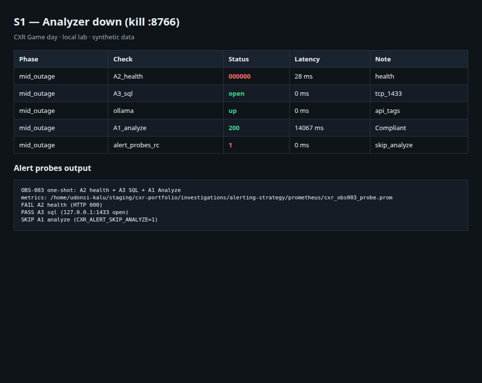
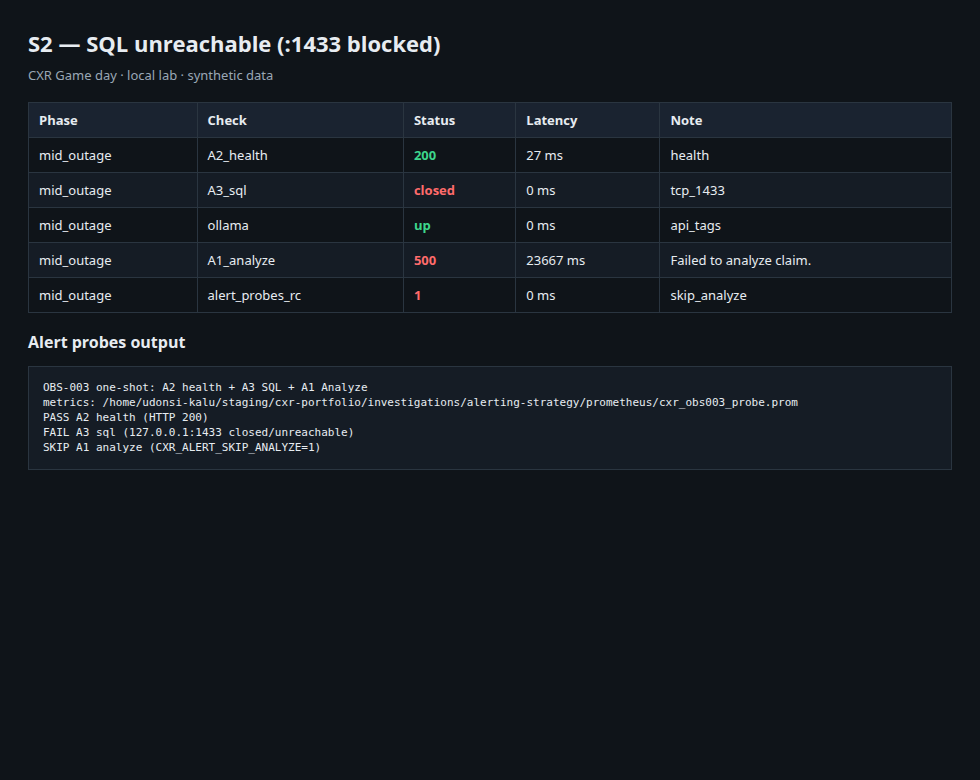
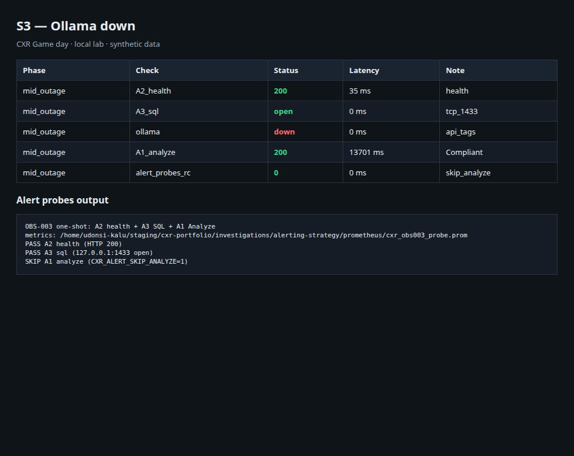
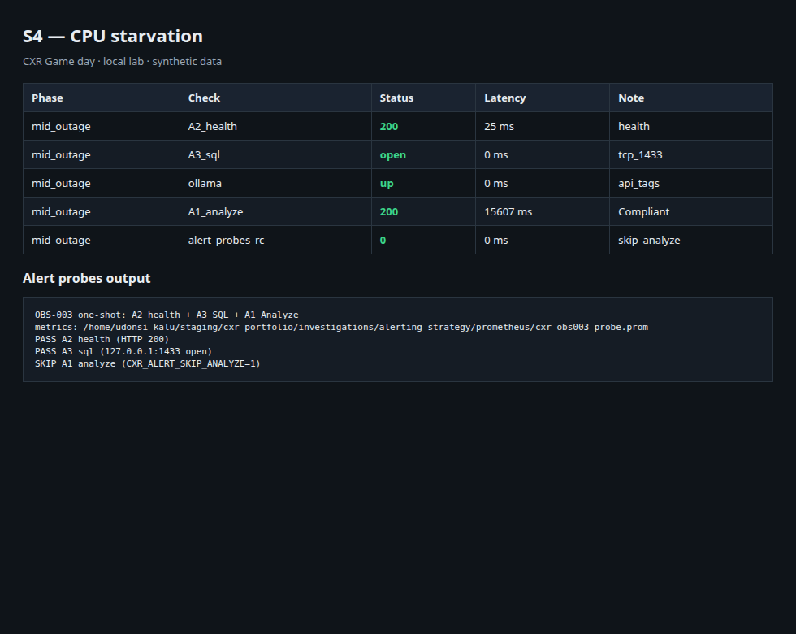
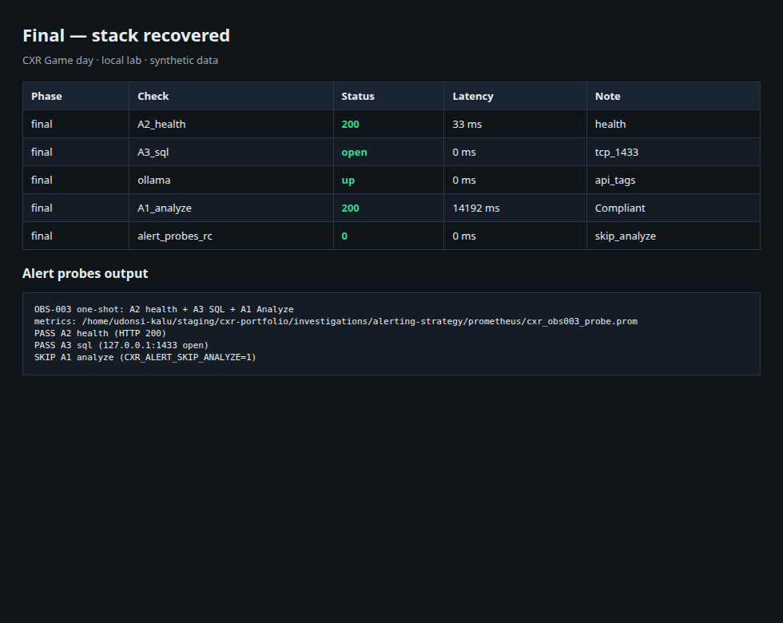

# Game day — readable overview

Issue [#18](https://github.com/UdonsiKalu/cxr-portfolio/issues/18). Formal write-up: [STUDY.md](./STUDY.md).

This study is a **controlled failure drill** on the local CXR stack. We inject one fault at a time, measure Claim Studio Analyze and dependency checks, restore service, then move to the next fault. The point is to separate **hard failures** (Analyze errors) from **soft failures** (Analyze still succeeds while something else is wrong).

---

## Scope

```text
Claim Studio UI (:8251)
  ├── Analyzer service (:8766)
  ├── SQL Server (:1433)
  └── Ollama (LLM, optional path)
```

We did not cascade all faults at once. Order: baseline → analyzer kill → SQL block → Ollama stop → CPU contention → final health check.

---

## Findings

### Baseline (S0)

Analyze succeeded (**HTTP 200**, ~15 s). Dependencies healthy.


### S1 — Analyzer process stopped

`/health` on `:8766` failed. Analyze still returned **200** (~14 s). The UI can fall back when the warm analyzer is unavailable, so end-user success alone does not prove the preferred path is up. Ops should alert on **health**, not only on Analyze HTTP codes.



### S2 — SQL unreachable

Analyze returned **HTTP 500** (~24 s). Hard dependency: without SQL, claim analysis fails. This is page-class in our alerting model.



### S3 — Ollama stopped

Analyze stayed **200** (~14 s). Soft dependency for Compliant Analyze in this lab — ticket/watch, not a full page (see REL-002).



### S4 — CPU contention

Analyze stayed **200**, slightly slower (~15.6 s). Soft degradation: latency, not availability (see CHAOS-004).



### S5 — Recovery

Stack healthy again; Analyze **200**.



---

## Summary

| Fault | Analyze | Classification |
|-------|---------|----------------|
| Analyzer down | 200 (health failed) | Soft for the request; still an ops incident |
| SQL down | **500** | **Hard** |
| Ollama down | 200 | Soft |
| CPU busy | 200, slower | Soft |

**Alerting implication:** page on SQL (and treat analyzer health seriously); ticket/watch Ollama and CPU pressure.

---

## Artifacts

| Path | Role |
|------|------|
| [STUDY.md](./STUDY.md) | Question / method / results (study format) |
| [RESULTS.md](./RESULTS.md) | Short summary |
| [screenshots/](./screenshots/) | Evidence images |
| [results/game-day-probes.csv](./results/game-day-probes.csv) | Raw timings and codes |
| [RUNBOOK.md](./RUNBOOK.md) | How to re-run |
