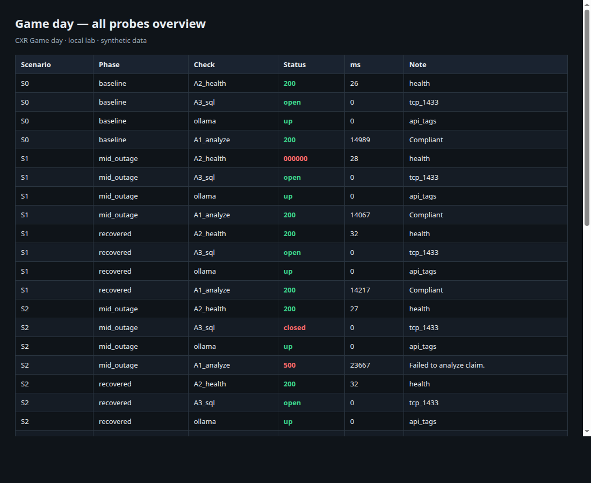

# Game day — combined failures

| | |
|---|---|
| **Status** | Complete (2026-07-12) |
| **ID** | Game day |
| **Question** | What happens when we break analyzer / SQL / Ollama / CPU one at a time and recover between each? |
| **Tools** | `run-game-day.sh`, OBS-003 alert probes, REL-004 iptables, REL-002 ollama ctl, CHAOS-004 hog |
| **Environment** | Local `cxr` — `:8251`, `:8766`, `:1433`, Ollama |
| **Issue** | [#18](https://github.com/UdonsiKalu/cxr-portfolio/issues/18) |

**Beginner (plain English):** [LEARNER.md](./LEARNER.md)  
**Study write-up:** [STUDY.md](./STUDY.md)  
**Short results:** [RESULTS.md](./RESULTS.md) · **Runbook:** [RUNBOOK.md](./RUNBOOK.md)

---

## Short story

| Scenario | Mid-outage Analyze | Hard fail? |
|----------|--------------------|------------|
| S1 Analyzer kill | **200** (fallback) | Health fail; Analyze still up |
| S2 SQL block | **500** | **Yes** |
| S3 Ollama stop | **200** | Soft |
| S4 CPU hog | **200** slower | Soft |

---

## Pictorial evidence (many screenshots)



| PNG | What |
|-----|------|
| [00-overview-matrix.png](screenshots/00-overview-matrix.png) | Full probe matrix |
| [analyze-across-scenarios.png](screenshots/analyze-across-scenarios.png) | Analyze only |
| [s1-card.png](screenshots/s1-card.png) | Analyzer down |
| [s2-card.png](screenshots/s2-card.png) | SQL down |
| [s3-card.png](screenshots/s3-card.png) | Ollama down |
| [s4-card.png](screenshots/s4-card.png) | CPU hog |
| [terminal-summary.png](screenshots/terminal-summary.png) | Summary |
| [terminal-timeline.png](screenshots/terminal-timeline.png) | Timeline |

More: [screenshots/](./screenshots/) · Raw: [results/](./results/)

---

## How to run

```bash
./investigations/game-day/run-game-day.sh
python3 ./investigations/game-day/render-game-day-screenshots.py
```

Needs passwordless sudo (iptables + ollama). Recovers after each scenario.
