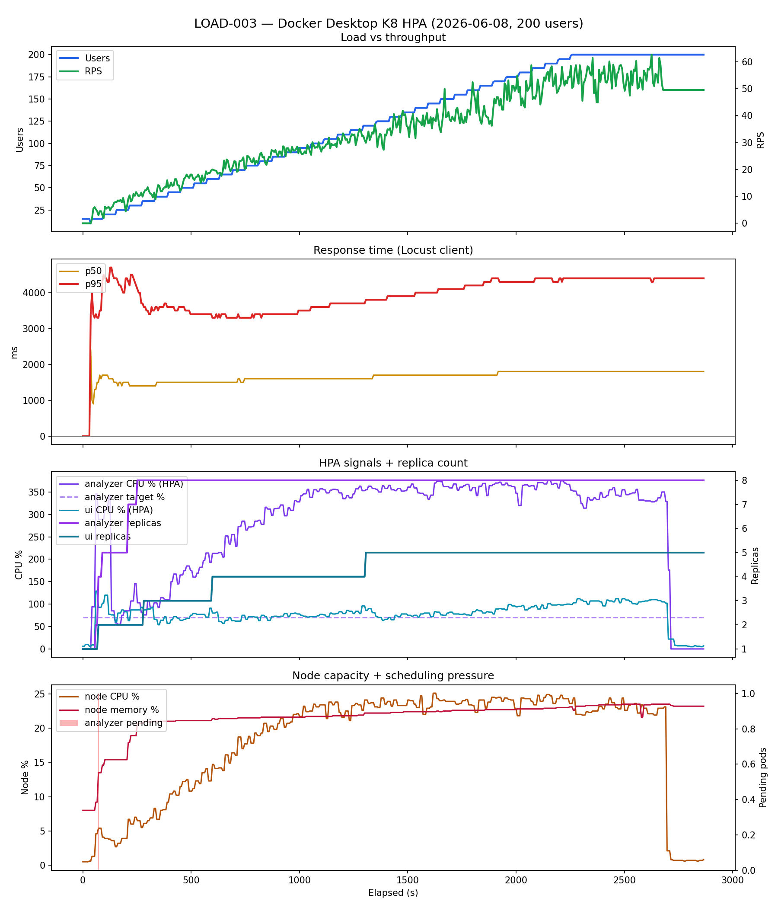
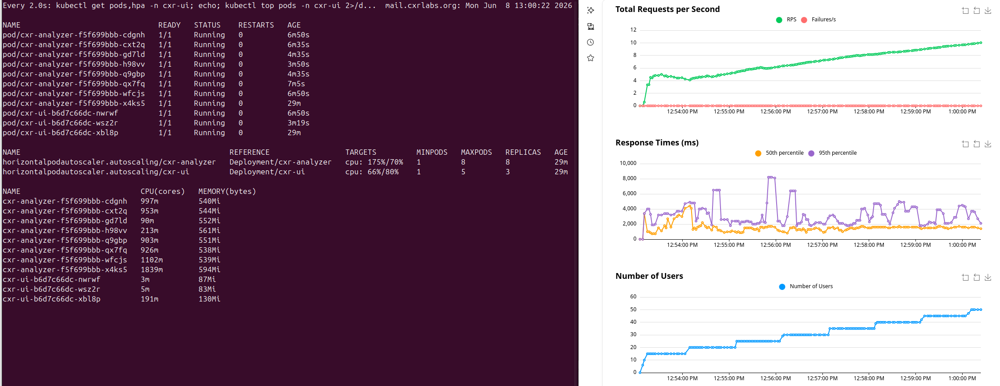
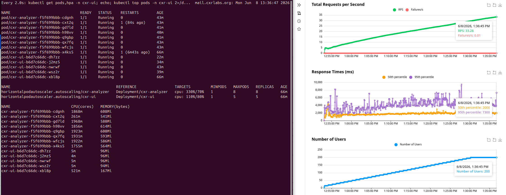

# Kubernetes analyzer saturation (LOAD-003)

| | |
|---|---|
| **Status** | Complete (initial run 2026-06-08) |
| **ID** | LOAD-003 |
| **Component** | K8 stack — `cxr-ui` + `cxr-analyzer` on **Docker Desktop K8** (or **kind**), HPA, Locust → **:8081** |
| **Builds on** | [LOAD-002 analyzer-saturation](../analyzer-saturation/) · [kubernetes-deploy](../kubernetes-deploy/) |
| **Ops scripts** | `cxr-ops-lab/scripts/collect_load_metrics.py`, `k8-load-metrics-collect.sh` |

---

## Question

Does **Kubernetes HPA** scale the CXR analyzer tier under Locust load, and does aggregate **RPS** beat the single-process **LOAD-002** ceiling (~15–16 RPS)?

## Hypothesis

HPA adds **analyzer pods** (1→4) and **UI pods** (1→3) under sustained CPU; total RPS increases before **kind single-node** limits cause Pending pods and failures.

**Outcome (kind, 2026-06-07):** ~**195 users**, **~20 RPS**, analyzer **4/4**, UI **3/3**, **309%/70%** HPA CPU, **1 Pending** + restarts — RPS **> LOAD-002**.

**Outcome (Docker Desktop K8, 2026-06-08):** **200 users**, peak **~50 RPS**, analyzer **8/8** (**330%/70%**), UI **5/5** (**110%/80%**), **0** fail/s — HPA scaled to Helm caps; node CPU still ~**25%** (pod cap, not host exhaustion).

---

## Evidence (screenshots)

### Autoscale chart (from metrics CSV)



Generated: `plot_load_test.py results/load-20260608-125236.csv -o results/charts`

### Mid-ramp — ~50 users, analyzer HPA maxing out



| Observation | Value |
|-------------|-------|
| Users | ~**50** |
| RPS | ~**10** |
| Analyzer HPA | **8/8**, **175%/70%** |
| UI HPA | **3/3**, **66%/80%** |
| Failures | **0**/s |

### Final frame — 200 users, both HPAs at max



| Observation | Value |
|-------------|-------|
| Users | **200** |
| RPS | ~**33** |
| p50 / p95 | ~**2s** / ~**7.3s** |
| Analyzer HPA | **8/8**, **330%/70%** |
| UI HPA | **5/5**, **110%/80%** |
| Failures | ~**0**/s |

More captures: [screenshots/](./screenshots/)

---

## Metrics to capture (time series)

| Column | Source |
|--------|--------|
| `timestamp_iso`, `elapsed_s` | Collector clock |
| `locust_users`, `locust_rps`, `locust_p50_ms`, `locust_p95_ms`, `locust_failures_per_s` | Locust `/stats/requests` (+ ramp env fallback) |
| `hpa_*_target_cpu_pct`, `hpa_*_current_cpu_pct` | `kubectl get hpa -o json` |
| `analyzer_replicas`, `ui_replicas` | HPA status |
| `analyzer_pending_pods`, `ui_pending_pods` | Pending pod count |
| `analyzer_pod_cpu_mcores_sum`, `ui_pod_cpu_mcores_sum` | `kubectl top pods` |
| `node_cpu_pct`, `node_memory_pct` | `kubectl top node` vs allocatable |

---

## Preflight — warm stack

```bash
cd ~/staging/cxr-ops-lab && export PATH="$PWD/bin:$PATH"
kubectl config use-context docker-desktop   # or kind-cxr-lab
./scripts/16-k8-stack-verify.sh           # analyzer warmed + :8081 HTTP 200
```

Repo: **cxr-ops-lab** (`16-k8-stack-verify.sh`, `k8-hpa-watch.sh`, `k8-load-metrics-collect.sh`).

---

## Run with CSV + charts

**Terminal A — metrics CSV (start first):**
```bash
chmod +x investigations/kubernetes-analyzer-saturation/run-k8-load-with-metrics.sh
export CXR_LOCUST_URL=http://127.0.0.1:8092   # match your Locust web port
./investigations/kubernetes-analyzer-saturation/run-k8-load-with-metrics.sh
```

**Terminal B — Locust → K8 UI:**
```bash
cd ~/staging/cxr-ops-lab && export PATH="$PWD/bin:$PATH"
./scripts/k8-ui-forward.sh check
cd ~/staging/cxr-portfolio
CXR_LOAD_URL=http://127.0.0.1:8081 \
CXR_RAMP_MAX_USERS=200 CXR_RAMP_START_USERS=15 CXR_RAMP_STEP_USERS=5 CXR_RAMP_STAGE_SECONDS=60 \
./investigations/analyzer-saturation/run-saturation-ramp-until-break-gui.sh
```

**Terminal C — watch (optional):**
```bash
./scripts/k8-hpa-watch.sh
```

**When Locust stops** — Ctrl+C Terminal A, then plot:
```bash
pip install -r investigations/kubernetes-analyzer-saturation/requirements.txt
python3 investigations/kubernetes-analyzer-saturation/plot_load_test.py \
  investigations/kubernetes-analyzer-saturation/results/load-YYYYMMDD-HHMMSS.csv \
  -o investigations/kubernetes-analyzer-saturation/results/charts
```

---

## Scaling layers (summary)

| Mechanism | Adds | Lab? |
|-----------|------|------|
| **HPA** | Pods | Yes — LOAD-003 |
| **Cluster Autoscaler / Karpenter** | Nodes | No (kind = 1 node) |
| **requests/limits** | Scheduling budget | Yes — Helm values |
| **metrics-server** | HPA input | Yes |
| **Prometheus** (optional) | Custom HPA / dashboards | `:9090` via `07-observe-up.sh` |

Full notes: [ARCHITECTURE-scaling-layers.md](./ARCHITECTURE-scaling-layers.md)

Future decision: [ADR-future-gpu-analyzer-scaling.md](./ADR-future-gpu-analyzer-scaling.md)

---

## Compare LOAD-002 vs LOAD-003

| | LOAD-002 | LOAD-003 |
|---|----------|----------|
| Target | **:8251** → **:8766** | **:8081** → in-cluster analyzer |
| Replicas | 1 | HPA **4** analyzer, **3** UI |
| Peak RPS | ~**15–16** | ~**20** (kind) · ~**50** (Desktop **8/5**) |
| Peak users | ~225 | ~**195** (kind) · **200** (Desktop) |
| Failures | 0% | ~**0%** at Desktop cap (kind: small rate at node limit) |

---

## Jaeger (optional)

**http://127.0.0.1:16686** — service **`cxr-analyzer-service`** during peak load (`07-observe-up.sh` if down).

---

## Files

| Path | Purpose |
|------|---------|
| [run-k8-load-with-metrics.sh](./run-k8-load-with-metrics.sh) | Start CSV collector |
| [plot_load_test.py](./plot_load_test.py) | Charts from CSV |
| [ARCHITECTURE-scaling-layers.md](./ARCHITECTURE-scaling-layers.md) | HPA vs CA vs metrics |
| [ADR-future-gpu-analyzer-scaling.md](./ADR-future-gpu-analyzer-scaling.md) | CPU vs GPU workers (future) |
| `cxr-ops-lab/scripts/collect_load_metrics.py` | Poll implementation |

---

## Follow-up

- **LOAD-004** — capacity-expanded autoscaling: [LOAD-004-capacity-expanded.md](./LOAD-004-capacity-expanded.md)
- LOAD-003 evidence: [evidence/load-003/](./evidence/load-003/)
- Screenshots embedded above in [screenshots/](./screenshots/)
- `git push` **cxr-ops-lab** (infra scripts still local)
- Optional: Prometheus custom metric HPA (RPS-based)
