# LOAD-003 observe run — 2026-06-17 (Grafana + Jaeger)

| | |
|---|---|
| **Date** | 2026-06-17 |
| **Stack** | Docker Desktop K8, GitOps Helm (`maxReplicas` up to ~20) |
| **Observe** | `./scripts/23-k8-load-observe-up.sh` — Grafana `cxr-hpa-load-003`, Prometheus, Jaeger **2.19.0** |
| **Load** | Locust ramp toward 200 users → K8 UI `:8081` |
| **Question** | Why is p95 high when node CPU/memory are not maxed? |

Runbook: [`cxr-ops-lab/docs/K8-LOAD-OBSERVE-RUNBOOK.md`](../../../../cxr-ops-lab/docs/K8-LOAD-OBSERVE-RUNBOOK.md)

---

## Executive summary

**The cluster is not CPU-saturated.** Latency spikes come from two compounding effects:

1. **Scale-out lag** — HPA adds analyzer replicas; each new pod pays **~15–17s** cold start (`analyzer_service.startup`) while Grafana shows **pending pods** and jagged RPS.
2. **Per-request work** — Warm `POST` traces spend **3.8–6.2s** in **`context_builder`**; LLM and retrieval spans are microseconds in these traces. Slow requests also show **~750ms queue wait** before `context_builder` starts.

**Not the bottleneck (this run):** node CPU (~10–15%), node memory (~42%), LLM `send`, retrieval.

---

## Observability stack (what we built)

| Component | Role |
|-----------|------|
| `cxr-load-exporter` (:9102) | Polls Locust + `kubectl`; exposes Prometheus metrics |
| Prometheus | Scrapes exporter + kube-state-metrics |
| Grafana `cxr-hpa-load-003` | 2×2 panels: users/RPS/latency, HPA CPU/replicas, pending pods, node % + scrape health |
| Jaeger | `cxr-analyzer-service`, `cxr-ui-k8` traces |
| `plot_load_test.py` + CSV | Optional backup charts (June 8 reference below) |

---

## Grafana — live dashboard

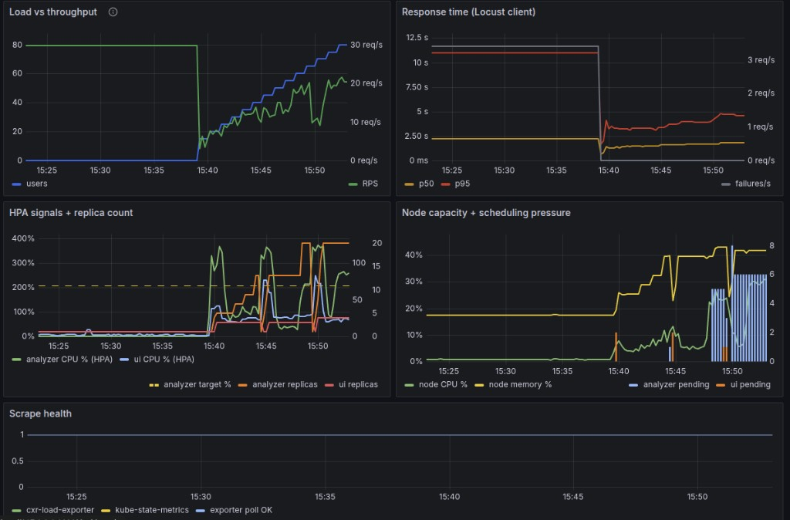

**Scrape health = 1** on all series → data trustworthy.

### Signals (~15:39 onward, ramp to ~80 users)

| Signal | Observation |
|--------|-------------|
| Users / RPS | Users climbing; RPS noisy ~10–25 |
| Latency | p50 ~**1.8s**, p95 ~**4–6s** and rising |
| Analyzer HPA | CPU **200–400%** of target; replicas **1 → ~18** |
| UI HPA | Low CPU; stayed ~**1** replica |
| Node | CPU ~**10–15%**, memory ~**42%** — not host exhaustion |
| Pending pods | Analyzer **up to ~6** — scheduling/scaling lag |

**Pre-15:39 wobble** (users=0, odd RPS): leftover Locust metrics or gap before swarm; ignore for this run.

### Prometheus targets

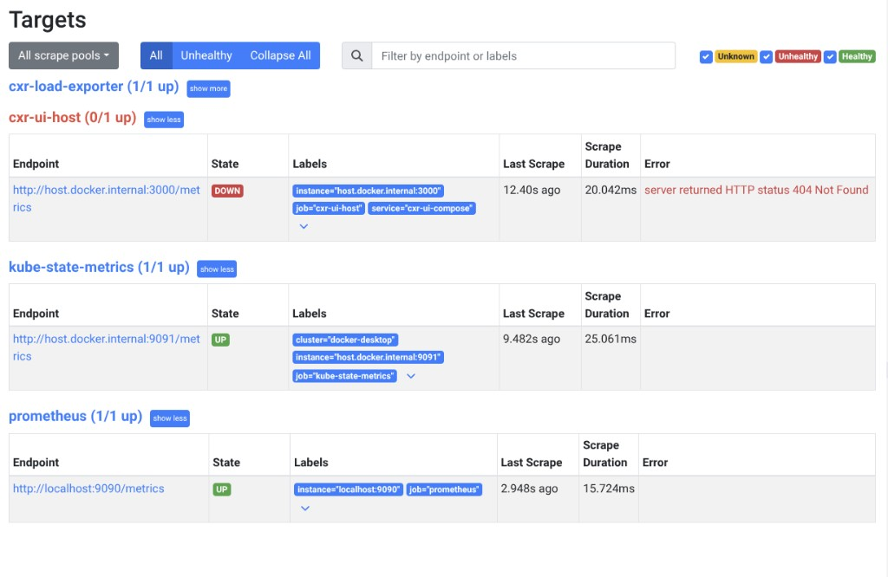

| Target | Status | Notes |
|--------|--------|-------|
| `cxr-load-exporter` | UP | Required |
| `kube-state-metrics` | UP | Required for HPA/pending panels |
| `cxr-ui-host` | DOWN (404) | Optional host scrape; safe to ignore for LOAD-003 |

---

## Jaeger — Pair 1: cold start (scaling)

**Search:** `cxr-analyzer-service` → `analyzer_service.startup` → sort longest.

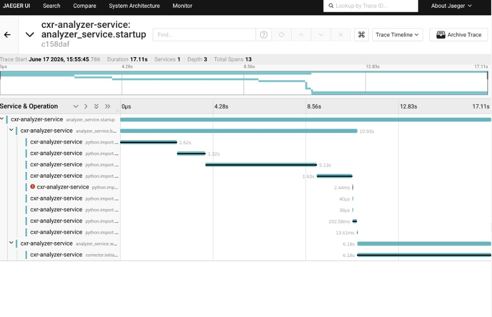

| Phase | ~Duration | Spans |
|-------|-----------|-------|
| `bootstrap_imports` | ~11s | `python.import.torch` (~5s), `transformers`, `sentence_transformers`, `qdrant_client`, … |
| `warm_corrector` | ~6s | `corrector.initialize` |

### Valid compare — two startups (same operation)

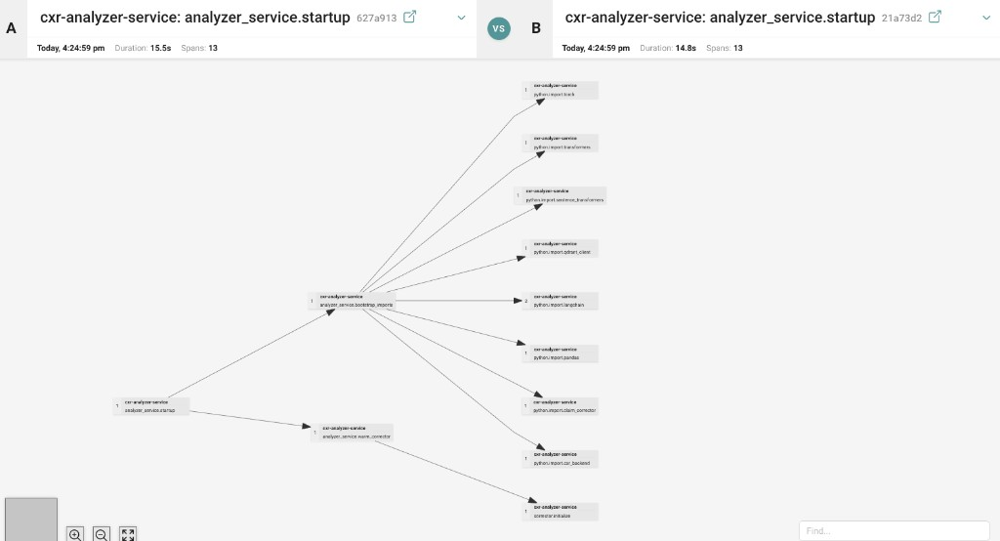

| | Trace A | Trace B |
|---|---------|---------|
| Operation | `analyzer_service.startup` | `analyzer_service.startup` |
| Duration | **15.5s** | **14.8s** |
| Spans | 13 | 13 |

**Conclusion:** Cold start is **consistent ~15–17s per new pod**, not a one-off. Explains pending pods + RPS dips during HPA scale-out.

### Startup “1 Error” badge

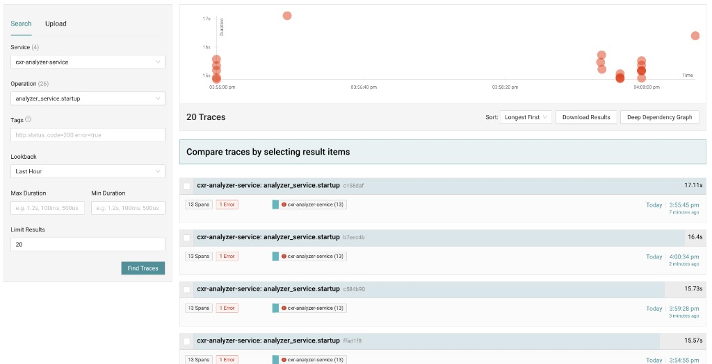

- Span: `python.import.langchain` → `ModuleNotFoundError: No module named 'langchain'`
- **Non-fatal** — startup continues; marks trace with error for tracing noise only
- Fix options: install `langchain`, skip import, or don’t mark optional imports as error

---

## Jaeger — Pair 2: steady-state requests

**Search:** `cxr-ui-k8` → `POST` → pick fast vs slow at same timestamp.

> **Note:** Searching by `cxr-analyzer-service` still shows traces whose **root** is `cxr-ui-k8: POST` — Jaeger returns traces *containing* that service, not traces that *start* there.

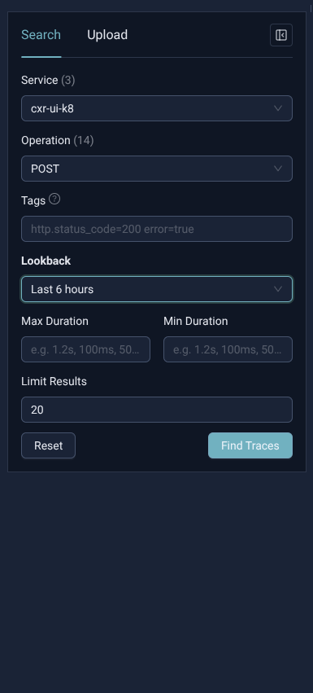

### Compare overlay (structure)

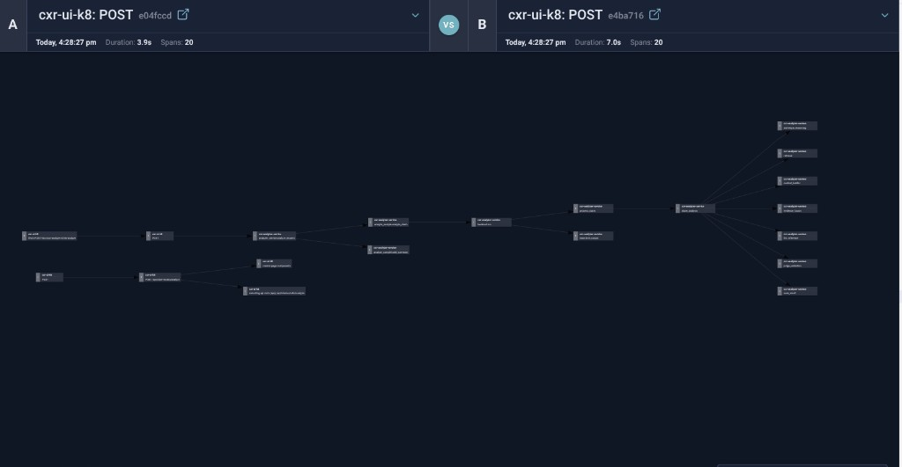

| | Trace A | Trace B |
|---|---------|---------|
| Operation | `POST` | `POST` |
| Duration | **3.9s** | **7.0s** |
| Spans | 20 | 20 |

Same pipeline shape; difference is **duration**, not missing spans.

### Waterfalls — timing detail

**Fast (3.9s):**

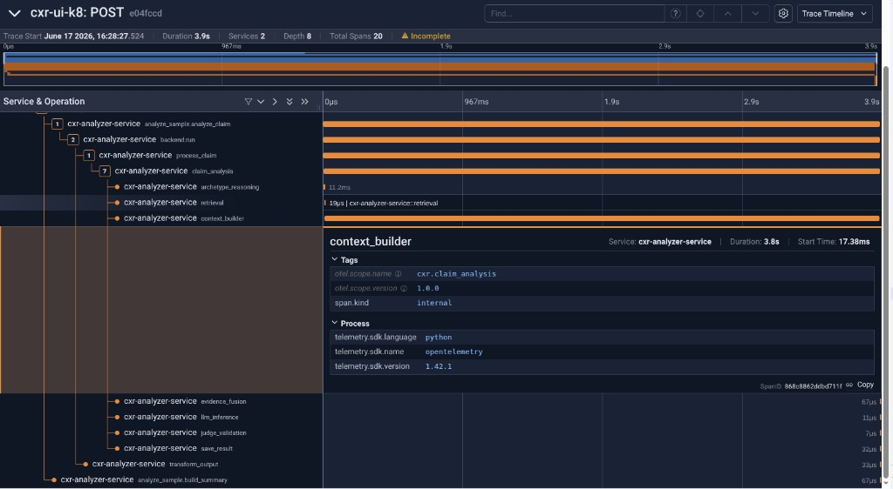

**Slow (7.0s):**

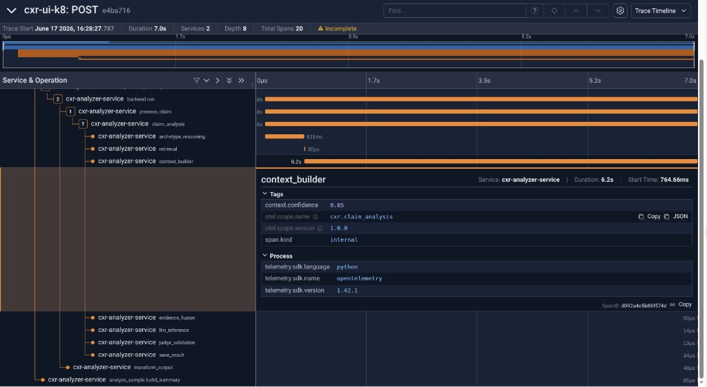

**End-to-end views:**

| Trace | Screenshot |
|-------|------------|
| ~2s POST | 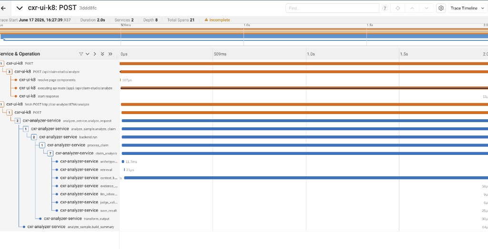 |
| ~7.6s POST (root still `cxr-ui-k8`) | 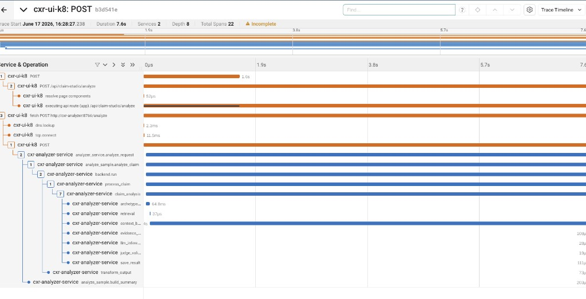 |

### Span timing table (3.9s vs 7.0s)

| Span / phase | Fast (3.9s) | Slow (7.0s) |
|--------------|-------------|-------------|
| **Total** | 3.9s | 7.0s |
| Wait before `context_builder` | ~17ms | **~765ms** |
| **`context_builder`** | **3.8s** | **6.2s** |
| `archetype_reasoning` | 11ms | **611ms** |
| `retrieval` / LLM | µs | µs |

**Conclusion:** **`context_builder`** dominates analyze latency; slow traces add **queue wait** + longer `context_builder` + higher `archetype_reasoning`.

### Analyze-request search view

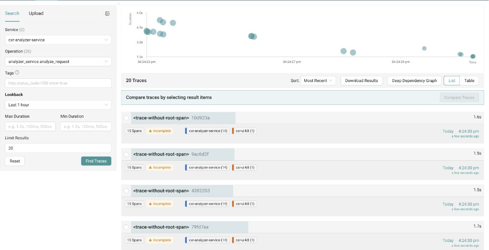

Useful for filtering analyzer-side work; open a long trace and drill into `context_builder` under `claim_analysis`.

---

## Jaeger UI lessons (this session)

### Compare pitfalls (and fixes)

| Issue | Screenshot | Fix |
|-------|------------|-----|
| Compare spinner / no data | 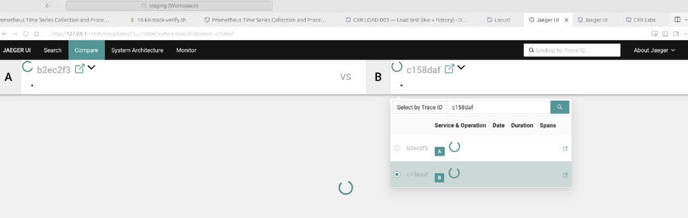 | Use **full 32-char trace ID** from URL after opening trace |
| 404 on compare | 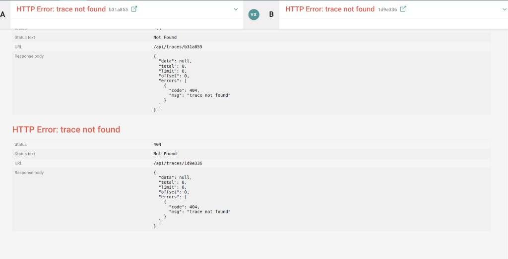 | Short IDs from list view fail; upgraded Jaeger **1.57 → 2.19.0** |
| Wrong operation mix | 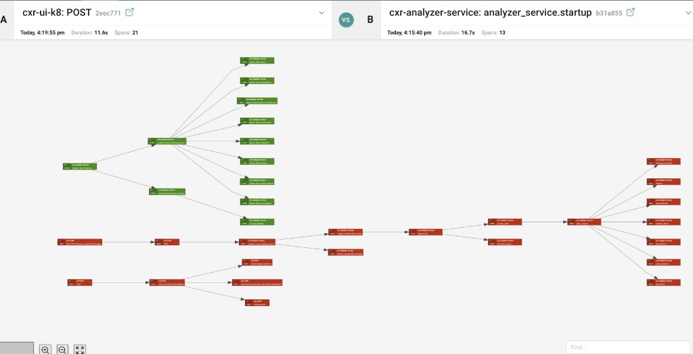 | Compare **same** service + operation only |
| startup vs POST (invalid) | 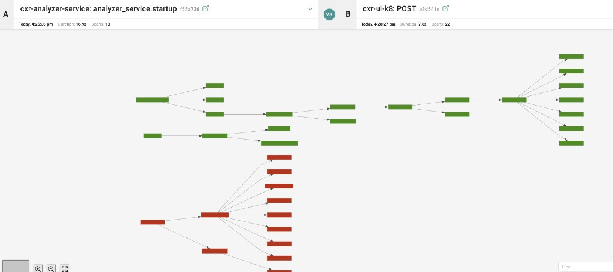 | Pair 1 = startup↔startup; Pair 2 = POST↔POST |

### Compare rules

```
Valid:   cxr-analyzer-service + analyzer_service.startup  vs  same
Valid:   cxr-ui-k8 + POST  vs  same
Invalid: analyzer_service.startup  vs  POST
```

---

## Causal chain (one diagram)

```
Locust users ↑
  → UI POST traffic
    → Analyzer HPA CPU high → scale replicas (1 → ~18)
      → New pods: analyzer_service.startup ~15–17s each
      → Pending pods (up to ~6) → RPS dips
      → Requests queue (~750ms) on busy/cold pods
        → context_builder 3.8–6.2s per request
          → Grafana p95 4–6s+ while node CPU ~10–15%
```

---

## Reference — June 8 visibility (CSV + Locust)

Pre-observe-stack charts from the original LOAD-003 Desktop run (200 users, 8/5 caps):

| Source | Screenshot |
|--------|------------|
| `plot_load_test.py` four-panel | 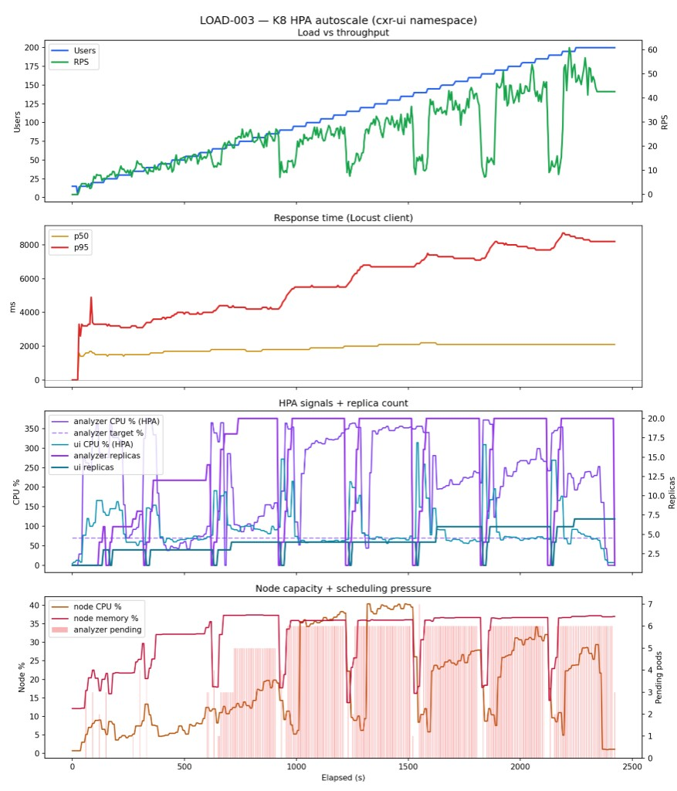 |
| Locust Charts tab | 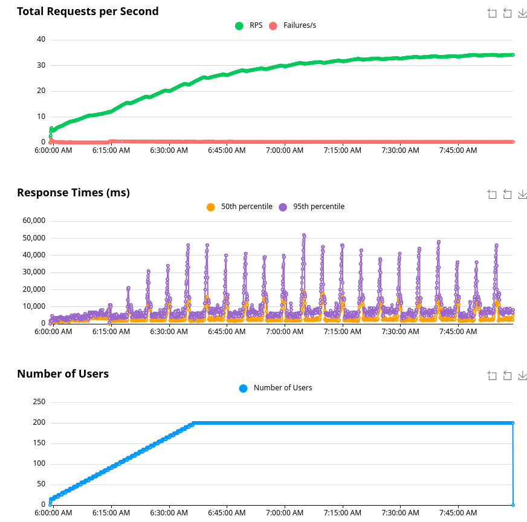 |

Grafana dashboard replaces daily Python plotting; CSV collector remains optional backup.

---

## Follow-up investigations

| Item | Command / action |
|------|------------------|
| Why pods Pending | `kubectl describe pod -n cxr-ui <pending-analyzer>` |
| Helm caps | Check `maxReplicas`, CPU requests vs limits |
| `context_builder` profile | Code path + CPU profiling on warm pod |
| Clean startup traces | Optional `langchain` import fix |
| `cxr-ui-host` scrape | Remove or fix 404 target in `prometheus.yml` |

---

## Screenshot index

| File | Description |
|------|-------------|
| `grafana-load-003-2x2-live.png` | Live 2×2 dashboard during ramp |
| `prometheus-targets.png` | Scrape target health |
| `jaeger-startup-17s-waterfall.png` | Single cold-start ~17s |
| `jaeger-startup-langchain-error.png` | Non-fatal langchain import error |
| `jaeger-compare-startup-pair.png` | Valid startup vs startup |
| `jaeger-search-post-operation.png` | POST search UI |
| `jaeger-compare-post-pair.png` | POST 3.9s vs 7.0s overlay |
| `jaeger-post-3p9s-context-builder.png` | Fast request waterfall |
| `jaeger-post-7s-context-builder.png` | Slow request waterfall |
| `jaeger-post-2s-e2e-waterfall.png` | Shorter POST trace |
| `jaeger-post-7p6s-e2e-waterfall.png` | Longer POST trace (analyzer search) |
| `jaeger-analyze-request-search.png` | `analyze_request` results |
| `jaeger-compare-spinner-stuck.png` | Compare UI stuck (short ID) |
| `jaeger-compare-404-short-trace-id.png` | Compare 404 |
| `jaeger-compare-wrong-operation-mix.png` | Invalid compare selection |
| `jaeger-compare-startup-vs-post-invalid.png` | startup vs POST mistake |
| `reference-plot-load-003-four-panel.png` | June 8 Python chart |
| `reference-locust-charts.png` | June 8 Locust charts |
