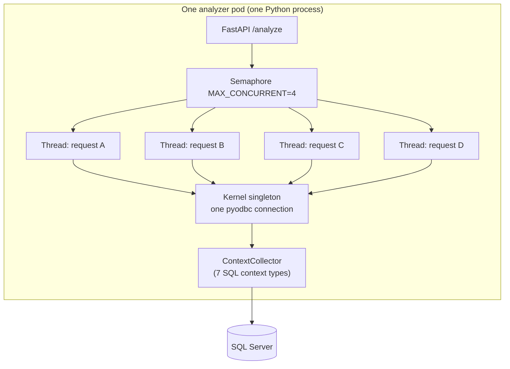

# OBS-003 — Shared SQL connection busy under concurrent `/analyze`

| | |
|---|---|
| **Status** | **Resolved** (2026-06-22) |
| **Discovered during** | [PERF-009 Jaeger tail attribution](PERF-009-jaeger-tail-latency.md) — reviewing slow traces @200 users |
| **GitHub issue** | [cxr-portfolio#33](https://github.com/UdonsiKalu/cxr-portfolio/issues/33) |
| **Ops PR** | [cxr-platform#3](https://github.com/UdonsiKalu/cxr-platform/pull/3) — branch `feature/perf009-sql-thread-safety` |
| **Lab image** | `cxr-analyzer:perf009-sql` (layers patched kernel into existing CPU base) |
| **Code change** | `ContextCollector` in `cxr_kernel_v3_2_integrated.py` — `threading.Lock` + `_db_cursor()` |

> **Naming note:** This OBS-003 (SQL concurrency) is **not** the planned [alerting-strategy](../../planned/alerting-strategy.md) doc, which reused the OBS- prefix in an early backlog. Issue **#33** and this write-up are the authoritative **OBS-003** for the saturation arc.

---

## Answer (read this first)

While load-testing the analyzer in Kubernetes, Jaeger showed **ERROR spans on `context.7_policy.sql`** even though many requests still returned **HTTP 200**.

**Root cause:** Each analyzer **pod** keeps **one warm kernel** (singleton) with **one shared `pyodbc` SQL Server connection**. FastAPI serves `/analyze` with **multiple concurrent worker threads** per pod (lab: up to **4** when `CXR_ANALYZER_MAX_CONCURRENT=4`). The old `ContextCollector` opened cursors on that shared connection **without synchronization**. pyodbc does not allow overlapping commands on one connection → `Connection is busy with results for another command`.

**Fix:** Serialize cursor use with a per-collector lock and a `_db_cursor()` context manager. Deploy via Docker layer `cxr-analyzer:perf009-sql`.

**Not the p95 tail:** This bug pollutes Jaeger and can make policy context wrong under load. It does **not** explain the ~649 ms **pre-handler wait** between UI `fetch` and `analyze_request` — see [PERF-009](PERF-009-jaeger-tail-latency.md).

---

## What went wrong (mechanism)

### Architecture that created the bug



1. **Warm singleton:** `get_or_create_corrector()` creates one `ClaimCorrectorV31Integrated` per process. That loads `CXRKernelFullContext`, which opens **one** `pyodbc.connect(...)` at init and passes it to `ContextCollector`.
2. **Concurrent handlers:** `/analyze` is a sync FastAPI route. Under load, Starlette runs multiple requests in a **thread pool**. With `CXR_ANALYZER_MAX_CONCURRENT=4`, up to four handlers can execute `gather_full_context()` at the same time.
3. **Unsafe cursor pattern (before fix):** Each context method did `cursor = self.conn.cursor()` directly on the shared connection.
4. **pyodbc rule:** A connection can have **at most one active result set / command** at a time. Thread B's `cursor.execute()` while thread A still has an open cursor → **`Connection is busy with results for another command`**.

### Timeline inside one request (where it surfaced)

During `gather_full_context()`, the kernel runs seven traced stages. Policy is stage 7:

| Stage | Jaeger span | SQL? |
|-------|-------------|------|
| 1 | `context.1_patient` | Sometimes |
| 2 | `context.2_provider` | Yes (`context.2_provider.sql`) |
| … | … | … |
| 7 | `context.7_policy` | Yes (`context.7_policy.sql`) |

Under concurrency, **any** of these SQL spans could error, but reviewers noticed **`context.7_policy`** most often because:

- It runs late in the pipeline — other threads are still mid-flight on the same connection.
- PERF-009 attribution tables highlighted policy extraction as a visible delta on some slow traces.
- Jaeger UI badges **"2 Errors"** on otherwise-200 traces, drawing attention during waterfall review.

### What users / operators saw

| Symptom | Detail |
|---------|--------|
| **Jaeger** | ERROR on `context.7_policy` / `context.7_policy.sql` |
| **Error text** | `pyodbc.Error: Connection is busy with results for another command` |
| **HTTP** | Often still **200** — context methods catch SQL failures and fall back to defaults |
| **Correctness** | Policy / provider / financial context could be **wrong or stale** when SQL failed silently |
| **Load correlation** | Errors appear when **multiple `/analyze` hit the same pod** (PERF-008/009 @100–200 users) |

### What it was *not*

| Misread | Reality |
|---------|---------|
| "Slow SQL caused p95 ~800 ms" | Analyzer work stayed ~30–60 ms; tail was **wait before handler** ([PERF-009](PERF-009-jaeger-tail-latency.md)) |
| "LLM or Qdrant failure" | Retrieval/LLM spans ≈ 0 ms in sampled traces |
| "Need a connection pool" | Lock fixes **correctness** on the existing singleton; pooling/admission is separate future work for tail latency |

---

## Before and after (code)

**Before** — any thread could collide on `self.conn`:

```python
cursor = self.conn.cursor()
cursor.execute(query, params)
row = cursor.fetchone()
cursor.close()
```

**After** — one cursor at a time per pod kernel:

```python
def __init__(self, conn):
    self.conn = conn
    self._db_lock = threading.Lock()

@contextmanager
def _db_cursor(self):
    self._db_lock.acquire()
    cursor = self.conn.cursor()
    try:
        yield cursor
    finally:
        cursor.close()
        self._db_lock.release()

# Usage in get_policy_context, get_provider_context, etc.:
with self._db_cursor() as cursor:
    cursor.execute(...)
    row = cursor.fetchone()
```

**Trade-off:** SQL reads for concurrent requests on the same pod are **serialized**. That adds a little lock wait but eliminates hard failures. Acceptable because context SQL is milliseconds; the dominant tail is elsewhere.

---

## Fix delivery (why a Docker layer, not a direct app PR)

| Layer | Location |
|-------|----------|
| **Patched source** | `cxrlabs-dev/claim_analysis_tools/.../cxr_kernel_v3_2_integrated.py` |
| **Lab packaging** | `cxr-ops-lab/Dockerfile.analyzer.perf008-layer` copies kernel into image |
| **Build** | `CXR_ANALYZER_IMAGE=cxr-analyzer:perf009-sql ./scripts/02-build-analyzer-perf008-layer.sh` |
| **Deploy** | Helm values for PERF-008/009 experiments reference the tagged image |

This keeps the portfolio/ops evidence in **cxr-platform** while the canonical Python tree stays in `claim_analysis_tools` until explicitly promoted.

---

## Verification

| Check | Result |
|-------|--------|
| Re-run load @100 users with `perf009-sql` image | **0** `context.7_policy` span errors in fresh Jaeger window |
| Pre-fix windows | Many traces showed **2 Errors** on policy SQL |
| Evidence paths | [perf009 replay dirs](../evidence/perf009/) (attribution captured pre/post fix narrative in [PERF-009](PERF-009-jaeger-tail-latency.md)) |

---

## Related PRs (cxr-platform)

These three open PRs are **one investigation arc**, split for review — see [cxr-ops-lab PR index](../../../../cxr-ops-lab/docs/investigations/README.md):

| PR | Branch | What it adds |
|----|--------|--------------|
| [#1](https://github.com/UdonsiKalu/cxr-platform/pull/1) | `feature/perf-008-queue-backpressure` | KEDA A/B harness, OBS-002 replica truth, `evidence/perf008/` |
| [#2](https://github.com/UdonsiKalu/cxr-platform/pull/2) | `feature/perf-009-jaeger-attribution` | Jaeger replay scripts, `evidence/perf009/` |
| [#3](https://github.com/UdonsiKalu/cxr-platform/pull/3) | `feature/perf009-sql-thread-safety` | **This fix** — thread-safe kernel in Docker layer |

Merge order: **#1 → #2 → #3**, or merge **#3 alone** (contains all prior work) and close #1/#2.

---

## Reproduce

```bash
cd ~/staging/cxr-ops-lab
./scripts/23-k8-load-observe-up.sh
# Pre-fix image: errors on context.7_policy.sql under @100+ users
# Post-fix:
CXR_ANALYZER_IMAGE=cxr-analyzer:perf009-sql ./scripts/02-build-analyzer-perf008-layer.sh
# redeploy analyzer helm with new image, re-run gate / Jaeger search
```

Jaeger: service `cxr-analyzer-service` or pod name, filter spans `context.7_policy*`, look for ERROR status.

---

## Related

- [PERF-009 — tail latency (separate finding)](PERF-009-jaeger-tail-latency.md)
- [PERF-008 — KEDA A/B](PERF-008-queue-depth-autoscaling.md)
- [failures/README.md — Arc 5](../../../failures/README.md)
- [CHANGELOG.md — 2026-06-22 OBS-003](../../../CHANGELOG.md)
