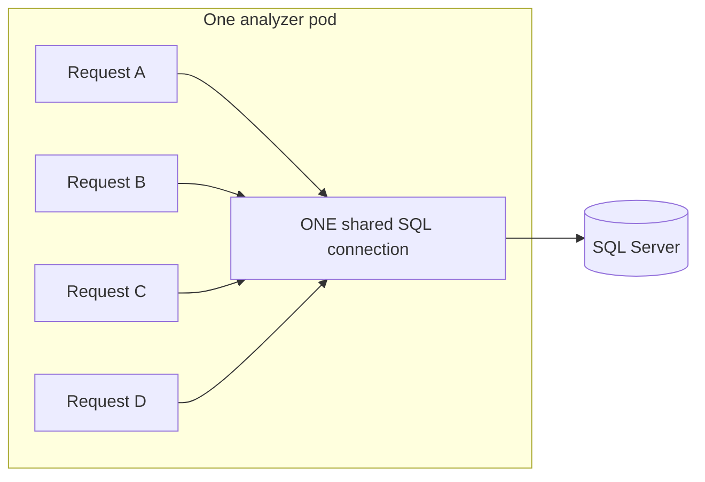

# OBS-003 — SQL context errors under load (shared connection)

| | |
|---|---|
| **Status** | Resolved — lab verified 2026-06-22; [cxr-platform PR #8](https://github.com/UdonsiKalu/cxr-platform/pull/8) merged; [issue #33](https://github.com/UdonsiKalu/cxr-portfolio/issues/33) closed |
| **In one sentence** | Several analyze requests on the same pod shared one SQL connection and stepped on each other |
| **Where we saw it** | Jaeger errors on `context.7_policy.sql` while reviewing slow traces |
| **GitHub issue** | [cxr-portfolio#33](https://github.com/UdonsiKalu/cxr-portfolio/issues/33) |
| **Code fix PR** | [cxr-platform#8](https://github.com/UdonsiKalu/cxr-platform/pull/8) |
| **Found while doing** | [PERF-009](PERF-009-jaeger-tail-latency.md) (tail latency) |

---

## The short story (start here)

We were load-testing claim analysis in Kubernetes. Most requests still returned **HTTP 200**, but Jaeger showed **red ERROR badges** on the SQL steps that build “context” for a claim — especially the **policy** step (`context.7_policy.sql`).

The error message was:

> Connection is busy with results for another command

**What that means in plain English:**  
One analyzer pod kept a **single** open database connection. Under load, **up to four** analyze requests could run at the same time on that pod. Each request needed to run SQL for context (patient, provider, policy, …). Two requests tried to use that **one** connection at once. The database driver (pyodbc) does not allow that — so one of them failed.

**Why it matters:**  
The API often still said “OK” (200), but the **policy / provider context could be wrong or empty** when SQL failed quietly. Tracing looked dirty (“2 Errors” on an otherwise successful request).

**What we did:**  
Make every SQL cursor take a **lock** so only one request talks on that connection at a time. After the fix, a load re-run showed **zero** of those policy SQL errors in Jaeger.

**What this is *not*:**  
This is **not** the main reason p95 climbed to ~800 ms. That was mostly **waiting** before the analyzer started work ([PERF-009](PERF-009-jaeger-tail-latency.md)). This bug is about **correctness and clean traces** under concurrency.

---

## Background: what “context” means here

When the analyzer runs `/analyze`, it does not only call an LLM. It first builds a **context pack** for the claim — facts pulled from SQL and related sources. That work lives in a span called **`context_builder`**.

Inside that span are seven stages (from [PERF-002](PERF-002-context-builder-bottleneck.md)):

```text
context_builder
├── context.1_patient
├── context.2_provider      (+ .sql)
├── context.3_payer
├── context.4_temporal
├── context.5_financial     (+ .sql)
├── context.6_relationship
└── context.7_policy        (+ .sql)   ← where we noticed the errors most
```

So “SQL context analysis latency / errors” here means: **the SQL that feeds those context stages**, under concurrent load — not “the whole POST is slow because of SQL.”

---

## How we found it

1. We ran load toward **100–200 users** (PERF-008 / PERF-009 style gates).  
2. In Jaeger we opened **slow** POST traces to explain p95.  
3. Many traces showed **“2 Errors”** on `context.7_policy` / `context.7_policy.sql`.  
4. The error text was always the busy-connection message above.

We noticed policy most often because it runs **late** in the seven stages — by then other threads are often still using the same connection. Any of the SQL stages could hit the same bug.

---

## Root cause (simple picture)



| Piece | What we had |
|-------|-------------|
| Per pod | One warm Python analyzer process |
| Database | **One** long-lived `pyodbc` connection for context SQL |
| Concurrency | Up to **4** `/analyze` handlers at once (`MAX_CONCURRENT=4`) |
| Bug | Each handler opened a cursor on that shared connection **with no lock** |

Database rule: **one active command per connection.** Two cursors at once → busy error.

---

## What people saw vs what was true

| You might think | What was actually going on |
|-----------------|----------------------------|
| “SQL is making p95 800 ms” | Analyzer work was still ~tens of ms; the big wait was **before** the handler ([PERF-009](PERF-009-jaeger-tail-latency.md)) |
| “The API failed” | HTTP was often **200** — failures were swallowed and context fell back |
| “LLM or Qdrant broke” | Those spans were tiny / fine in the traces we checked |
| “We must add a connection pool today” | A **lock** fixed the collision on the existing connection; pooling is a later performance option |

---

## The fix (what changed in code)

**Before:** any thread could run SQL on `self.conn` at the same time.

```python
cursor = self.conn.cursor()
cursor.execute(query, params)
row = cursor.fetchone()
cursor.close()
```

**After:** take a lock, then open a cursor; always release the lock when done.

```python
# one lock for this ContextCollector
with self._db_cursor() as cursor:
    cursor.execute(...)
    row = cursor.fetchone()
```

**Trade-off:** on one pod, concurrent SQL for context is **one-at-a-time**. That may add a little wait under heavy concurrency, but:

- context SQL is usually **milliseconds**
- wrong or empty policy context is worse than a small lock wait
- the big p95 story was elsewhere (HTTP wait)

**Lab packaging:** image tag `cxr-analyzer:perf009-sql` (kernel patch layered for K8 experiments).

---

## How we checked it worked

| Check | Result |
|-------|--------|
| Before | Many Jaeger traces with ERROR on `context.7_policy*` |
| After (`perf009-sql`) @ ~100 users | **0** of those policy SQL errors in a fresh Jaeger window |
| Evidence nearby | [evidence/perf009/](../evidence/perf009/) · story also in [PERF-009](PERF-009-jaeger-tail-latency.md) |

---

## How this fits the larger arc

| Study | Role |
|-------|------|
| [PERF-002](PERF-002-context-builder-bottleneck.md) | Made `context_builder` measurable; cache cut redundant SQL |
| [PERF-009](PERF-009-jaeger-tail-latency.md) | Explained most of the p95 **tail** (wait before analyze) |
| **OBS-003 (this doc)** | Fixed **SQL collisions** inside context under concurrent analyze |

Same area of the code (`ContextCollector` / context SQL), **different problem**: speed of the black box (PERF-002) vs **thread-safe use of one connection** (OBS-003).

---

## Status (closed)

| Item | Status |
|------|--------|
| Portfolio study (this file) | Written |
| Lab verification | Done 2026-06-22 |
| [Issue #33](https://github.com/UdonsiKalu/cxr-portfolio/issues/33) | Closed |
| [cxr-platform PR #8](https://github.com/UdonsiKalu/cxr-platform/pull/8) | Merged |

---

## How to reproduce (lab)

```bash
cd ~/staging/cxr-ops-lab
./scripts/23-k8-load-observe-up.sh
# Under load @100+ users, search Jaeger for context.7_policy* ERROR (pre-fix image)

CXR_ANALYZER_IMAGE=cxr-analyzer:perf009-sql ./scripts/02-build-analyzer-perf008-layer.sh
# Redeploy analyzer with that image, re-run load, confirm ERRORs gone
```

In Jaeger: analyzer service / pod → filter `context.7_policy*` → look for ERROR status.

---

## Related

- [PERF-009 — p95 tail attribution](PERF-009-jaeger-tail-latency.md)  
- [PERF-002 — context_builder stages](PERF-002-context-builder-bottleneck.md)  
- [failures Arc 5](../../../failures/README.md)  
- [CHANGELOG — OBS-003](../../../CHANGELOG.md)
