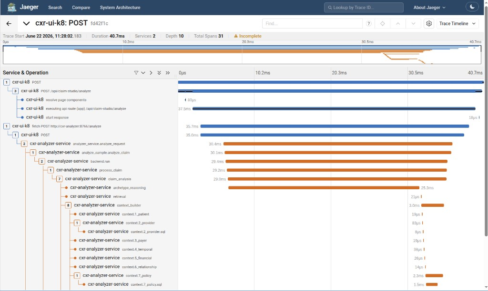
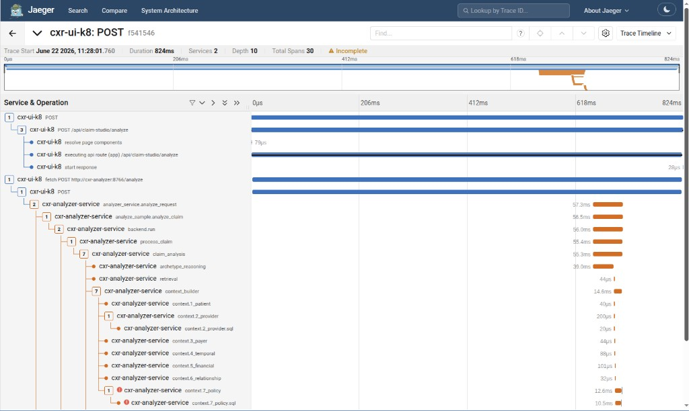

# PERF-009 — Jaeger tail latency attribution (PERF-008 A vs B)

| | |
|---|---|
| **Status** | Complete (2026-06-22) |
| **Builds on** | [PERF-008](PERF-008-queue-depth-autoscaling.md) Experiment A (p95 KEDA) and B (inflight/pod KEDA) |
| **Goal** | Attribute **p95 E2E growth** (~150 ms → ~800 ms @ 200 users) to a **span**, not change autoscaling |
| **Ops scripts** | `cxr-ops-lab/scripts/perf009-jaeger-attribution.sh`, `scripts/lib/perf009_jaeger_extract.py` |
| **Evidence** | [perf009/](../evidence/perf009/) |

---

## Question

PERF-008 showed **p50 ~100–150 ms** while **p95 climbed to ~790–820 ms** at 200 users, and rejected inflight KEDA as a scaling signal. It did **not** explain *which part of the request path widens the tail*.

PERF-009 compares **fast** (~100–200 ms) vs **slow** (~700–900 ms) `POST` traces from the same load window and asks whether Experiment B changed the slow-span pattern vs A.

---

## Time windows

Jaeger does **not** retain traces from the original PERF-008 gate runs. Attribution uses **replay** under the same Helm overlays (`values-perf008-exp-a.yaml` / `values-perf008-exp-b.yaml`), `perf008` image, and a **comparable @200-user soak** (abbreviated ramp 25→200, 45 s/tier, 4 min @200).

| Run | Window (UTC) | Duration | Gate p95 @200 | Notes |
|-----|----------------|----------|---------------|-------|
| **PERF-008 Exp A** (original) | 2026-06-21 18:44:52 → 18:46:13 | 81 s | **790 ms** | Traces not in Jaeger retention |
| **PERF-008 Exp B** (original) | 2026-06-22 03:40:10 → 03:42:11 | 121 s | **820 ms** | Traces not in Jaeger retention |
| **PERF-009 replay A** | 2026-06-22 14:23:45 → 14:33:57 | 611 s | **1000 ms** | 3 fast + 3 slow traces extracted |
| **PERF-009 replay B** | 2026-06-22 14:36:29 → 14:46:41 | 611 s | **900 ms** | 3 fast + 3 slow traces extracted |

Original PERF-008 evidence: `cxr-ops-lab/evidence/perf008/exp-a-20260621-184452/`, `exp-b-20260622-034010/`.  
PERF-009 replay evidence: `cxr-ops-lab/evidence/perf009/exp-a-20260622-092152/`, `exp-b-20260622-093426/`.

---

## Method

1. Service: **`cxr-ui-k8`**, operation **`POST`** (E2E Locust path — same as Grafana p95).
2. **Fast bucket:** 80–250 ms E2E; pick 3 traces nearest **150 ms**.
3. **Slow bucket:** 600–1200 ms E2E; pick 3 traces nearest **800 ms**.
4. Span breakdown per trace (median across 3):

| Span | Source |
|------|--------|
| UI POST (root) | Longest `POST` / `POST /api/claim-studio/analyze` span |
| UI route | `executing api route` |
| UI → analyzer HTTP | `fetch POST http://cxr-analyzer` |
| **HTTP/client wait** | `fetch` duration − `analyzer_service.analyze_request` |
| `analyze_request` | Analyzer handler entry |
| `context_builder`, `archetype_reasoning`, `retrieval`, `save_result` | Kernel `trace_stage` names |
| Policy extraction | `context.7_policy*` sub-spans |
| LLM / Ollama | `llm_inference*`, `llm.model_request*` |

Compare uses **full 32-char trace IDs** in Jaeger 2.19.0 ([OBS-001 lesson](../evidence/load-observe/RUN-2026-06-17.md)).

---

## Experiment A — fast vs slow (symptom KEDA: p95 + CPU)

**Representative traces** (replay A; open in lab Jaeger with trace ID):

| Class | Trace ID | E2E (ms) | Jaeger (local lab) |
|-------|----------|----------|-------------------|
| Fast | `3d11d4847b117c20359447a64fdf0802` | 148 | `http://127.0.0.1:16686/trace/3d11d4847b117c20359447a64fdf0802` |
| Fast | `9cbe002e33bf57f06c419d8627f5e8f0` | 153 | …/trace/9cbe002e33bf57f06c419d8627f5e8f0 |
| Fast | `1be230468cb9f4df44b9bfa775a06d7b` | 146 | …/trace/1be230468cb9f4df44b9bfa775a06d7b |
| Slow | `557390ac4a4b2323329f145b139754d6` | 794 | …/trace/557390ac4a4b2323329f145b139754d6 |
| Slow | `93b84623af877ee2247cb830e0625ad7` | 794 | …/trace/93b84623af877ee2247cb830e0625ad7 |
| Slow | `10efc4868b2ee1648123fa359fcfc32b` | 792 | …/trace/10efc4868b2ee1648123fa359fcfc32b |

### Span table — Experiment A (median of 3 traces)

| Span | Fast (median ms) | Slow (median ms) | Δ slow − fast |
|------|------------------|------------------|---------------|
| UI POST (E2E) | **148** | **794** | **+646** |
| UI → analyzer HTTP (fetch) | 144 | 790 | +646 |
| **HTTP/client wait** | **48** | **665** | **+617** |
| `analyze_request` | 93 | 121 | +28 |
| `claim_analysis` | 91 | 116 | +25 |
| `context_builder` | 27 | 59 | +32 |
| Policy extraction (`context.7_policy`) | 25 | 58 | +33 |
| `archetype_reasoning` | 23 | 59 | +36 |
| `retrieval` | 0 | 0 | 0 |
| LLM / Ollama | 0 | 0 | 0 |
| `save_result` | 0 | 0 | 0 |

**Slow trace shape (A):** Two patterns in the sample set — (1) **wait-heavy:** ~700 ms HTTP wait, ~90 ms analyzer work; (2) **analyzer-heavy:** ~665 ms wait plus ~170 ms `analyze_request` with longer `context_builder` / `archetype_reasoning`. Both still E2E ~790 ms.

---

## Experiment B — fast vs slow (inflight/pod KEDA + CPU)

| Class | Trace ID | E2E (ms) |
|-------|----------|----------|
| Fast | `7b3613882ef5231127f6e8e4d5046db8` | 148 |
| Fast | `7de47e276e9eb81fc8ab73b7f09d74ad` | 208 |
| Fast | `3ddbc871a6688e46494a2ba5e4a93017` | 138 |
| Slow | `ae51eecaf61e6e7f9672719cdfac6f7f` | 629 |
| Slow | `ff08d38c3fa1cda7ef10f008c4104a29` | 1022 |
| Slow | `c2bf65935b00615902280f3794f9039b` | 591 |

Full URLs in [exp-b-jaeger-attribution.json](../evidence/perf009/exp-b-jaeger-attribution.json).

### Span table — Experiment B (median of 3 traces)

| Span | Fast (median ms) | Slow (median ms) | Δ slow − fast |
|------|------------------|------------------|---------------|
| UI POST (E2E) | **148** | **792** | **+644** |
| UI → analyzer HTTP (fetch) | 135 | 626 | +491 |
| **HTTP/client wait** | **109** | **674** | **+565** |
| `analyze_request` | 30 | 103 | +73 |
| `context_builder` | 4 | 39 | +35 |
| Policy extraction | 2 | 37 | +35 |
| `archetype_reasoning` | 22 | 58 | +36 |
| `retrieval` / LLM / `save_result` | ~0 | ~0 | 0 |

**Outlier:** trace `ff08d38c…` at **1022 ms** shows **analyzer-internal** tail (`context_builder` **247 ms**, policy **233 ms**) with **669 ms** HTTP wait — mixed wait + compute, not a different pipeline.

---

## A vs B — slow-trace comparison (median)

| Span | Exp A slow | Exp B slow | B − A |
|------|------------|------------|-------|
| UI POST (E2E) | 794 ms | 792 ms | −2 |
| HTTP/client wait | **665 ms** | **674 ms** | +9 |
| `analyze_request` | 121 ms | 103 ms | −18 |
| `context_builder` | 59 ms | 39 ms | −20 |
| `archetype_reasoning` | 59 ms | 58 ms | −1 |

**Experiment B did not change the tail attribution pattern.** Slow requests in both runs are dominated by **HTTP/client wait** (UI waiting on the analyzer HTTP call). Analyzer-internal spans grow modestly on slow traces but are not the primary p95 driver at @200 users.

---

## Visual evidence — canonical fast vs slow pair (reviewer walkthrough)

During manual Jaeger review (same load window, **2026-06-22 ~11:28 local**), a **side-by-side Compare** of one fast and one slow `POST` trace makes the tail mechanism obvious without aggregating medians.

| | Fast (p50-ish) | Slow (p95-ish) |
|---|----------------|----------------|
| **Trace ID** | `fd42f1c` (Jaeger UI prefix; search in lab) | `f541546` (Jaeger UI prefix; search in lab) |
| **E2E** | **40.7 ms** | **824 ms** |
| **`fetch POST http://cxr-analyzer`** | ~36 ms (aligned with handler) | **818 ms** (starts ~3 ms into E2E) |
| **`analyze_request`** | ~30 ms | **~57 ms**, starts **~652 ms** after trace start |
| **Pre-handler gap** | ~0 ms | **~649 ms** (`fetch` open before analyzer work begins) |

**Jaeger Compare** (Search → select two traces → **Compare**) is useful interactively but does not export well to a readable static image — the table compresses span names and durations. For documentation we use **individual trace waterfalls** below and the gap table above. In the lab UI: search service `cxr-ui-k8`, operation `POST`, find traces `fd42f1c` and `f541546` (~2026-06-22 11:28), or open each waterfall directly when the observe stack is up.

**Fast trace** — `fetch` and `analyze_request` overlap; almost all E2E is real analyzer work:



**Slow trace** — E2E is almost entirely **waiting on the open HTTP client**; handler work stays short once it starts:




**Takeaways from this pair:**

1. **Tail = minority of requests** where the UI keeps `fetch` open while the analyzer **starts the handler late** — not a uniform slowdown of kernel stages.
2. **Analyzer work stays ~30–60 ms** even on the 824 ms trace; the **~649 ms gap** is client-visible queue/wait before `analyze_request`.
3. **OBS-003 policy SQL errors** (when present) occur **inside** the short analyzer window — they pollute trace badges but **do not explain** the pre-handler wait gap. Treat SQL concurrency and fetch-wait tail as **separate** findings.

Screenshots: [evidence/perf009/](../evidence/perf009/).

---

## Attribution verdict

| Hypothesis | Result |
|------------|--------|
| Analyzer internal work (`context_builder`, policy, archetype) | **Secondary** — +30–40 ms typical; occasional **200+ ms** `context_builder` on outliers |
| UI/client layer | **Primary** — E2E tail matches `fetch POST http://cxr-analyzer` duration |
| Downstream dependency (Qdrant, SQL, Ollama) | **Not implicated** — `retrieval` and `llm_inference` ≈ 0 ms in sampled traces |
| Network/HTTP wait | **Primary** — **~550–665 ms** median added wait on slow vs fast traces |
| Missing instrumentation | **No gap** — UI fetch, analyzer handler, and kernel stages present; wait appears *between* fetch wall time and handler work |

**Interpretation:** Under load, the UI spends most of the tail **waiting for an analyzer slot/connection** (`MAX_CONCURRENT=4` per pod × N pods), not executing LLM or retrieval. Prometheus `queue_wait` histogram on the analyzer stayed ~1 ms p95 in PERF-008 — that metric measures **post-accept handler queue**, not **client-side wait before the request is accepted**. The Jaeger gap (`fetch` − `analyze_request`) captures the client-visible queue.

This explains why **inflight/pod KEDA (B)** scaled replicas but did **not** fix p95 or failures: scaling added capacity, but the **dominant tail** is connection/handoff wait at the UI→analyzer boundary, not a signal KEDA was tuned to reduce.

---

## Conclusions

1. **Tail latency at 200 users is primarily HTTP/client wait** on the UI→analyzer `POST`, not LLM or retrieval.
2. **Secondary contributor:** longer `context_builder` + policy + `archetype_reasoning` on some slow traces (~30–60 ms median delta; outliers higher).
3. **Experiment B vs A:** Same slow-span fingerprint — B does not shift tail attribution.
4. **PERF-008 decision stands:** Keep p95+CPU KEDA; use inflight/wait for diagnosis. Next optimization work belongs under **connection pooling / analyzer admission** and **context_builder** profiling — not another autoscaling signal swap.

---

## Jaeger trace errors (SQL concurrency)

While attributing tail latency, many slow `POST` traces showed **“2 Errors”** and **Incomplete** badges. These were **not** LLM failures or missing instrumentation.

| Span | Error |
|------|--------|
| `context.7_policy.sql` | `pyodbc.Error: Connection is busy with results for another command` |
| `context.7_policy` | Same (parent of SQL span) |

**Cause:** `ContextCollector` used a **single shared `pyodbc` connection** on the per-pod kernel singleton while **up to 4 concurrent** `/analyze` handlers ran (`CXR_ANALYZER_MAX_CONCURRENT=4`). pyodbc connections are not thread-safe.

**Impact:** HTTP responses often still **200** (v4 catches context errors and falls back), but Jaeger traces were misleading and policy SQL could fail under load.

**Fix ([OBS-003](https://github.com/UdonsiKalu/cxr-portfolio/issues/33)):** `threading.Lock` + `_db_cursor()` in `cxr_kernel_v3_2_integrated.py`; ops image layer `cxr-analyzer:perf009-sql`. After lab deploy, **0** `context.7_policy*` errors in a fresh 100-user Jaeger window.

**Reviewer tip:** Jaeger lookback **Last 1 hour** mixes pre-fix traces — use a **short custom window** after load, or search traces from the last few minutes only.

---

## Reproduce

```bash
cd ~/staging/cxr-ops-lab
./scripts/23-k8-load-observe-up.sh
./scripts/perf009-jaeger-attribution.sh a   # then b
# JSON → evidence/perf009/exp-{a,b}-*/
python3 scripts/lib/perf009_jaeger_extract.py --experiment A --stamp <STAMP> \
  --start-us "$(cat evidence/perf009/exp-a-*/window-start-us.txt)" \
  --end-us "$(cat evidence/perf009/exp-a-*/window-end-us.txt)" \
  --out evidence/perf009/exp-a-*/jaeger-attribution.json
```

---

## Related

- [PERF-008](PERF-008-queue-depth-autoscaling.md) — KEDA A/B decision
- [OBS-001 Jaeger run](../evidence/load-observe/RUN-2026-06-17.md) — earlier `context_builder` dominance at higher HPA caps
- [context-builder optimization (planned)](../../planned/context-builder-optimization.md)
