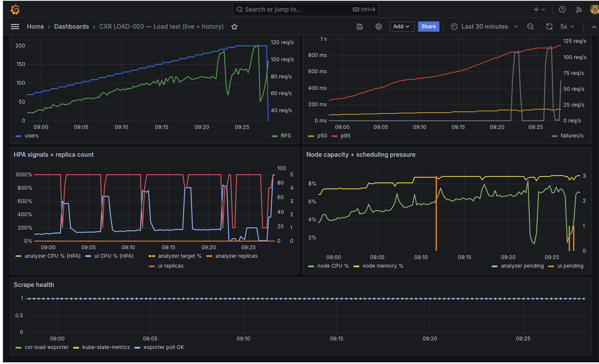
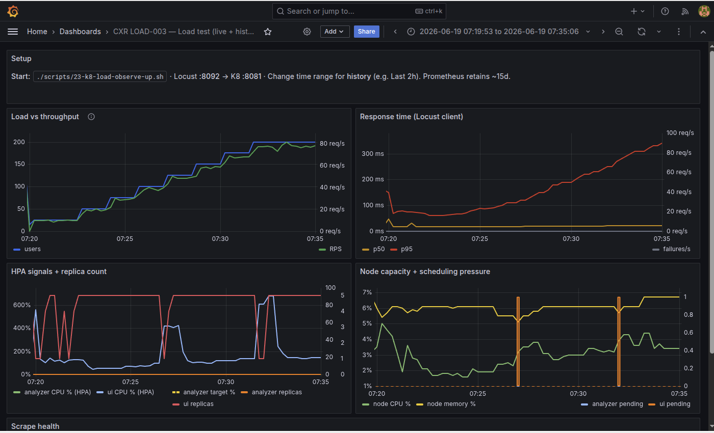

# SCALE-003 — UI bottleneck at peak load

| | |
|---|---|
| **Status** | Documented from existing evidence (2026-07-11) — no new load run required |
| **In one sentence** | At peak load the **UI path** (Next.js → analyzer) runs out of room before the analyzer brain does |
| **GitHub issue** | [cxr-portfolio#23](https://github.com/UdonsiKalu/cxr-portfolio/issues/23) |
| **Offshoot of** | [GATE-002](GATE-002-keda-helm-grid-study.md) → [PERF-008](PERF-008-queue-depth-autoscaling.md) → [PERF-009](PERF-009-jaeger-tail-latency.md) |
| **Evidence** | [evidence/scale003/](../evidence/scale003/) |

---

## Where this came from (parent chain)

SCALE-003 is **not** a brand-new experiment. It names a pattern we kept seeing while doing other studies:

```text
LOAD-003 / OBS-001     “latency high, node CPU low”
        ↓
GATE-002               12 Helm recipes; one failed — UI max 5
        ↓
PERF-008               A/B KEDA signals; Exp B failed with UI thrash
        ↓
PERF-009               Jaeger: ~649 ms wait before analyzer starts
        ↓
SCALE-003 (this doc)   Put the pieces together: “UI path is the bottleneck”
```

| Parent | What it contributed |
|--------|---------------------|
| **GATE-002 c1** | Only grid failure @200 users: UI capped at **5**, analyzer stayed flat, **116 failures/s** |
| **PERF-008 Exp B** | Same UI thrash shape when we tried a different KEDA signal |
| **PERF-009** | Proof the p95 tail is **wait on UI→analyzer `fetch`**, not slow LLM/SQL kernel work |
| **OBS-003** | Separate bug (SQL busy) found in the same Jaeger window — **not** this bottleneck |

**GIT-001** then locked the safe cap (**UI max 4**) into Git so Argo wouldn’t put **5** back.

---

## The short story (start here)

We expected the **analyzer** to be the thing that breaks first under load. Often it wasn’t.

1. **Grafana:** UI replica count slammed into its ceiling and thrashed; analyzer replicas stayed calm; failures spiked.  
2. **Jaeger:** A slow request spent most of its time with the UI’s `fetch` to the analyzer open, while the analyzer’s real work started hundreds of milliseconds late and finished in ~50–60 ms.

So “peak load hurts” was often **queueing / handoff on the UI→analyzer path**, not “the claim kernel got slow.”

That is why GATE-002’s winner capped **UI at 4**, not 5 — and why PERF-009 said “don’t blame `context_builder` for the 800 ms p95.”

---

## Evidence 1 — GATE-002: UI max 5 fails

Candidate 1 (UI `maxReplicas=5`, analyzer min 1) was the **only** recipe that failed the 200-user gate.





**Read:** failures climb while the analyzer tier is not the one saturating. Full grid: [GATE-002 study](GATE-002-keda-helm-grid-study.md).

---

## Evidence 2 — PERF-008 Experiment B: same UI shape

When we tried inflight/pod KEDA, the gate failed again with **UI thrash** and a failure spike near peak users — even though analyzer replicas scaled.


**Read:** changing the **analyzer** autoscaling signal did not remove the UI-path failure mode. Detail: [PERF-008](PERF-008-queue-depth-autoscaling.md).

---

## Evidence 3 — PERF-009: the wait is before the analyzer

Same second, same `POST`:

| | Fast | Slow |
|---|------|------|
| E2E | ~41 ms | ~824 ms |
| Analyzer work | starts early, short | starts ~652 ms late, ~57 ms long |
| Dominant span | aligned `fetch` + handler | UI `fetch` open ~818 ms |


**Read:** p95 is mostly **client-visible wait** on the UI→analyzer hop. Detail: [PERF-009](PERF-009-jaeger-tail-latency.md).

---

## What we already did about it

| Action | Result |
|--------|--------|
| Cap UI `maxReplicas` at **4** (GATE-002 winner) | Stable gate pass @200 in lab |
| Keep that cap in **Git** ([GIT-001](https://github.com/UdonsiKalu/cxr-portfolio/issues/24) / platform PR #11) | Argo won’t silently restore UI max 5 |
| Prefer p95+CPU KEDA for analyzer (PERF-008 A) | Don’t “fix” UI thrash by changing analyzer scale signal alone |

---

## What is still open (honest)

SCALE-003 **names and evidences** the bottleneck. It does **not** yet ship a deep UI-tier fix such as:

- more UI capacity with a safer HPA recipe  
- connection pool / keep-alive tuning on `fetch` to analyzer  
- queueing / concurrency limits at the UI API route  
- separating Locust→UI load from UI→analyzer saturation in a dedicated experiment

Those are follow-ups if you want a **code or Helm change** beyond the cap we already chose.

---

## Not this problem

| Finding | Why it’s different |
|---------|-------------------|
| [OBS-003](OBS-003-shared-sql-connection.md) | SQL threads sharing one connection — correctness / dirty Jaeger, not the 649 ms wait |
| Analyzer cold start (~7–15 s) | New pods only — not steady-state p95 |
| Subprocess import era | Fixed by warm analyzer (ADR-004) long before this |

---

## Reproduce (lab)

```bash
# GATE-002 style: UI max 5 vs 4 under the same gate
# (winner recipes live in cxr-platform helm values after GIT-001)

cd ~/staging/cxr-ops-lab
./scripts/23-k8-load-observe-up.sh
./scripts/k8-load-gate.sh          # or tuner grid historically used for GATE-002

# PERF-009 attribution (fast vs slow fetch wait)
./scripts/perf009-jaeger-attribution.sh a
```

Screenshots catalog: [evidence/scale003/](../evidence/scale003/).
