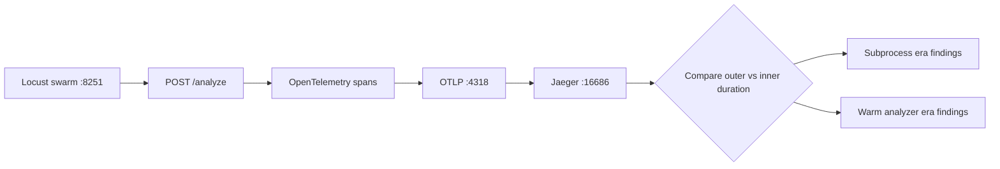
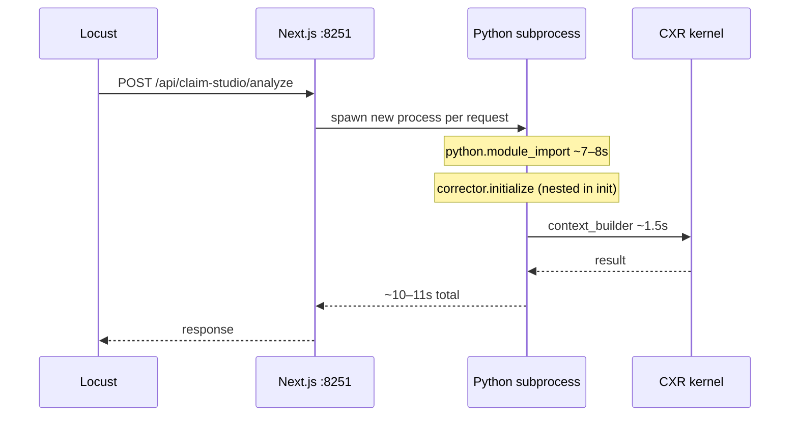
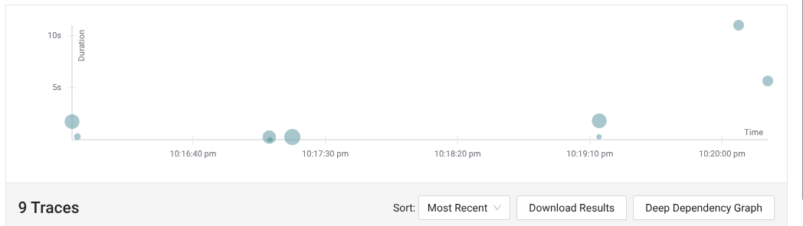
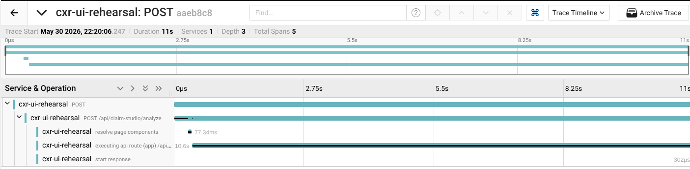
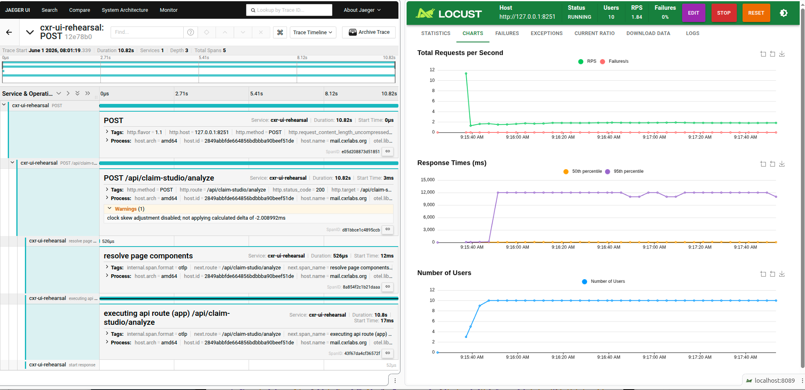
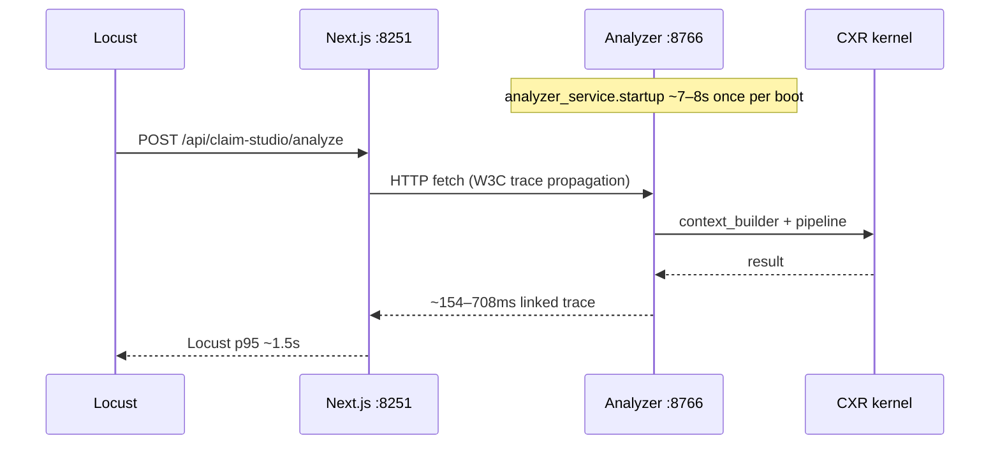
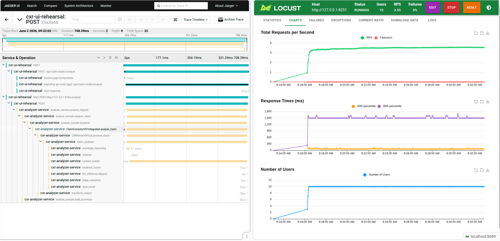
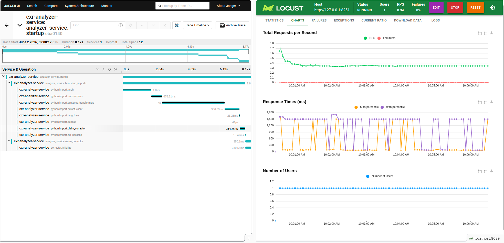

# Performance Investigation — Claim Analysis Latency

| | |
|---|---|
| **Status** | Resolved |
| **Component** | `POST /api/claim-studio/analyze` |
| **Tools** | Locust · OpenTelemetry · Jaeger |
| **Environment** | Local dev stack (`cxr up`) |
| **Outcome** | Subprocess-per-request → long-running analyzer on **:8766** |

---

## Executive summary

Claim analysis felt broken under load: **~10–12 seconds** per request in Locust while kernel logs suggested only **~1.5s** of real work. OpenTelemetry and Jaeger showed the gap was not a slow algorithm — it was **process architecture**. Each HTTP request spawned a new Python subprocess and re-paid **~7–8 seconds** of module imports before useful kernel spans ran.

Moving the analyzer to a **long-running FastAPI service** shifted that cost to **one-time startup** (~7–8s per boot) and changed steady-state behavior to a warm-service model: **~154–708ms** on individual Jaeger traces and **~1.5s** Locust p95 after the fix.

---

## 1. Symptom

Locust reported **~10–12s** p95 for `POST /api/claim-studio/analyze`. Developers saw **`context_builder`** around **~1.5s** in logs. Without tracing, that mismatch looks like a mystery. With tracing, it becomes a measurable engineering problem.

**Load-test view (before):** 10 users, POST analyze median **11,000 ms**, 0% failures.

---

## 2. Investigation method

1. Run Locust against `http://127.0.0.1:8251` with realistic think times.
2. Export traces via OpenTelemetry (`OTEL_EXPORTER_OTLP_ENDPOINT=http://127.0.0.1:4318`).
3. Compare **outer** HTTP span duration vs **inner** `claim_analysis` / `context_builder` spans.
4. Repeat after architectural change (warm analyzer on **8766**).

> **Two metrics, two lenses:** Locust reports aggregate client-side latency (median/p95 under load). Jaeger reports duration for **individual linked traces**. A single warm trace at ~154ms is not the same measurement as Locust p95 (~1.5s after the fix).

---

## 3. Architecture — before (subprocess per request)

### Jaeger — scatter view

Slow POST operations cluster around **~5.6s** and **~11s** in the search view:

### Jaeger — trace waterfall (11s, 5 spans)

The outer **`executing api route`** span dominates at **~10.6s**. Only **5 spans** visible — subprocess blind spots before full Python instrumentation:

### Correlating Locust and Jaeger

Side-by-side view: Jaeger linked trace **~10.8s**, Locust p95 **~12s** — same story from two lenses:

---

## 4. Root cause

| Layer | Typical duration | Visible in Jaeger? | Notes |
|-------|------------------|-------------------|-------|
| Node `executing api route` | ~10–11s | Yes | Outer HTTP span (Locust-aligned) |
| `python.module_import` | ~7–8s | Yes (after Python OTel added) | Dominant cold-path cost |
| `corrector.initialize` (SQL + embed + Qdrant) | Nested in init | Yes | Overlaps import/startup — **not additive** on top of ~7–8s imports |
| `context_builder` inside kernel | ~1.5s | Yes | Analyze work once runtime is loaded |
| `llm_inference` when Compliant | ~µs (skipped) | Yes | **Not** model time |

**Root cause:** per-request **new Python process** re-paid imports and kernel construction.

### Span evidence — import dominates

After Python OpenTelemetry was added, **`python.module_import`** alone consumed **~7.66s**; **`context_builder`** was only **~1.5s**:

---

## 5. Fix — long-running analyzer (:8766)

- Deployed **FastAPI analyzer** on port **8766** with startup warm-up.
- Next.js uses `ANALYZER_URL` + W3C trace propagation.
- Default dev stack (`cxr up`) uses the warm path.

Decision record: [ADR-004](../../archive/decisions/adrs/ADR-004-long-running-analyzer.md)

---

## 6. Results — after

| Layer | Typical duration | Notes |
|-------|------------------|-------|
| Jaeger linked request trace | ~154–708ms observed | Warm service path |
| Locust p95 | ~1.5s observed | Client/load-test perspective |
| `analyzer_service.analyze_request` | Similar to linked trace | Main warm request span |
| `analyzer_service.startup` | ~7–8s once per boot | Separate startup trace, not per request |

### Warm path — ~154ms, 22 spans

UI → **:8766** analyzer; full nested span tree visible (**22 spans** vs 5 in subprocess era):

### Warm path — ~708ms

Kernel spans (`context_builder`, retrieval, etc.) under the analyzer service:

### Startup cost — paid once, not per request

Import and initialization moved to **`analyzer_service.startup`** (~8.2s) — a **separate trace** on service boot:

### Before / after at a glance

| Metric | Before (subprocess) | After (warm analyzer) |
|--------|---------------------|------------------------|
| Locust p95 | ~10–12s | **~1.5s** |
| Jaeger linked trace | ~10–11s | **~154–708ms** |
| Spans per warm POST | ~5 / blind spot | **~21–22** |
| Import cost | Every request | Once per boot (~7–8s) |

---

## 7. Conclusion

The dominant source of latency was the **request execution model**, not the claim-analysis kernel itself.

In the original design, each request launched a new Python process and repeatedly paid startup, import, and initialization costs. OpenTelemetry spans showed that Python module imports alone consumed approximately **7–8 seconds** on the slow path.

Moving the analyzer into a long-running service shifted this cost to service startup and removed it from the per-request path. This changed the performance profile from repeated cold-start latency to a warm-service request model.

Optimizing `context_builder` alone would not have fixed Locust p95 while subprocesses remained.

### Trace profile note

A **`minimal`** trace profile was tried to reduce Jaeger “Operations” clutter; it **reduced** useful span detail (~7 spans vs ~21). Default restored to **`detailed`**. See [trace profiles](../README.md#trace-profiles).
