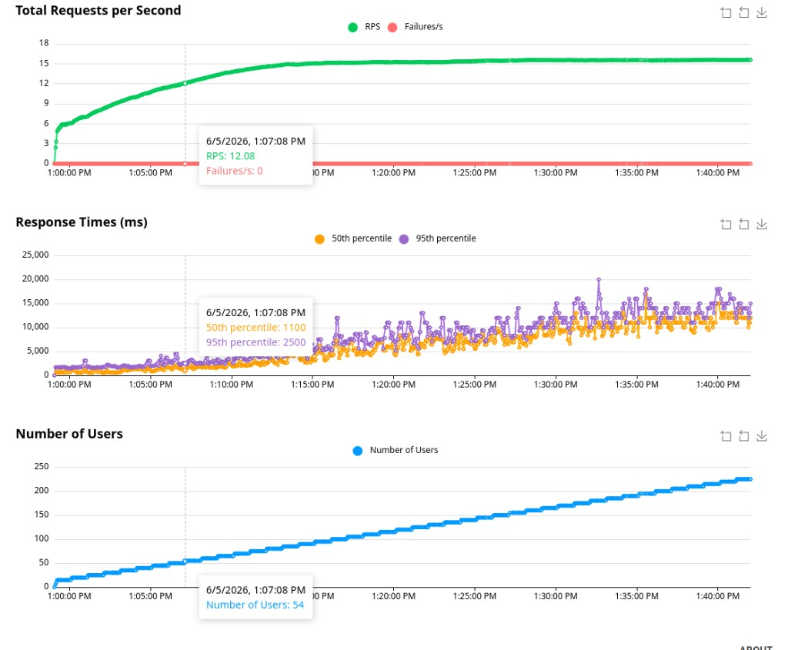
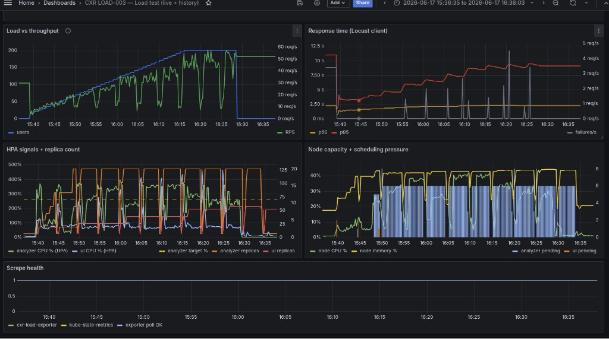

# Load testing — Locust capacity program

| | |
|---|---|
| **Status** | Complete (baseline → single-process saturation); K8 load continues under LOAD-003 |
| **IDs** | PERF-001 baseline · **LOAD-001** · **LOAD-002** · → **LOAD-003** |
| **Tools** | Locust · Jaeger · (later) Grafana / HPA |
| **Target** | `POST /api/claim-studio/analyze` on **:8251** → warm analyzer **:8766** |
| **Environment** | Local lab (`cxr up`), synthetic data |

This folder is the **Locust load story** — same role as [latency-investigation](../latency-investigation/) for the subprocess→warm fix. Detailed scripts and CSVs for LOAD-001/002 live in archive; key screenshots and the narrative live here.

---

## Executive summary

We used Locust to answer a sequence of capacity questions after the warm analyzer landed:

1. **Baseline** — subprocess-era POST analyze was **~10–12s** p95 (Locust).  
2. **LOAD-001** — one warm analyzer: staged ramp **1→15** users, **0% failures**, p95 ~**1.5–1.6s**.  
3. **LOAD-002** — push past 15: soft knee **~30–35** users; continuous ramp to **~225** users showed **RPS plateau ~15–16** with **0% failures** and **p95 runaway** (graceful saturation, not a hard crash).  
4. **LOAD-003** — move the same discipline onto **Kubernetes HPA** (separate investigation): latency without node CPU saturation, then GATE/PERF studies.

Jaeger stays the “where did time go?” lens; Locust stays the “how does the system behave under concurrent clients?” lens. Don’t mix the two numbers.

---

## 1. Baseline — Locust before the warm analyzer (PERF-001)

**Question:** What does client-side latency look like when every analyze pays subprocess import?

**Result:** 10 users, POST analyze median **~11s**, 0% failures — dominated by cold Python path (see [latency-investigation](../latency-investigation/)).

**Setup (still valid):**

| Setting | Value |
|---------|-------|
| Tool | Locust (`cxr-ops-lab/load/locust`) |
| Target | `http://127.0.0.1:8251` (`CXR_LOAD_URL`) |
| UI | `http://127.0.0.1:8089` |
| Start | `cxr up` or `cxr-ops-lab/scripts/22-load-locust.sh` |

---

## 2. LOAD-001 — Single warm analyzer capacity (1→15)

**Question:** With one warm `:8766` process, how do p50/p95 and RPS change as users ramp **1 → 15**?

**Hypothesis:** Stay near the warm analyze budget (~1.5–2s p95); do **not** fall back to 10–12s subprocess behavior.

**Method:** staged `LoadTestShape` (GUI one-click or headless CSV). Scripts + full guide:

- [archive/old-investigations/single-analyzer-capacity/](../../archive/old-investigations/single-analyzer-capacity/)  
- PDF: [LOAD-001-capacity-testing-guide.pdf](../../archive/old-investigations/single-analyzer-capacity/LOAD-001-capacity-testing-guide.pdf)

### Headless sweep (2026-06-05)

| Users | Requests | Failures | Median (ms) | p95 (ms) | RPS |
|------:|---------:|---------:|------------:|---------:|----:|
| 1 | 19 | 0 | 1500 | 1700 | 0.33 |
| 3 | 65 | 0 | 1300 | 1500 | 1.12 |
| 5 | 111 | 0 | 1100 | 1500 | 1.88 |
| 10 | 241 | 0 | 620 | 1500 | 4.13 |
| 15 | 327 | 0 | 990 | 1600 | 5.64 |

Raw CSV: [capacity-sweep.csv](../../archive/old-investigations/single-analyzer-capacity/results/capacity-sweep.csv)

### Staged GUI evidence

| Observation | Value |
|-------------|-------|
| Ramp | 1 → 3 → 5 → 10 → 15 (automatic) |
| Failures | **0%** |
| p95 | ~**1.5–1.6s** at 10 users |
| Peak RPS | ~**2.8** (GUI run) |

**Jaeger at peak** — linked E2E analyze ~**1.38s** (aligns with Locust p95, not the old 11s median):

**Finding:** Warm single instance handled 15 analyze-only users. **No knee at 15** on this hardware → escalate concurrency in LOAD-002.

---

## 3. LOAD-002 — Saturation past 15 users

**Question:** At what concurrency does one warm analyzer **saturate** (p95 jump, failures, or RPS stop scaling)?

**Outcome:** Soft knee by **~30–35** users (staged). Continuous ramp to **~225** users: throughput ceilings ~**15–16 RPS**, **0% failures**, tail latency runs away — graceful degradation.

Full write-up + scripts: [archive/old-investigations/analyzer-saturation/](../../archive/old-investigations/analyzer-saturation/)

### Continuous ramp (primary evidence, 2026-06-05)

| Phase | Users (approx) | RPS | Failures | Notes |
|-------|----------------:|----:|---------:|-------|
| Early | ~54 | ~12 | 0 | p95 still modest |
| Saturation | ~100+ | **~15–16** plateau | 0 | RPS stops scaling with users |
| Deep ramp | → ~225 | flat | 0 | p95 runaway — still no hard fail |

**Decision:** One process has a clear concurrency ceiling. Next: **Kubernetes / HPA** (LOAD-003) — same Locust discipline, new failure modes (scheduling, cold starts, pending pods).

---

## 4. LOAD-003 — Kubernetes (pointer)

Same load questions on Docker Desktop K8 + HPA. **Not duplicated here** — full evidence and studies:

| | |
|---|---|
| Arc home | [kubernetes-analyzer-saturation/](../kubernetes-analyzer-saturation/) |
| OBS-001 run | [evidence/load-observe/RUN-2026-06-17.md](../kubernetes-analyzer-saturation/evidence/load-observe/RUN-2026-06-17.md) |
| Studies | [PERF-002](../kubernetes-analyzer-saturation/studies/PERF-002-context-builder-bottleneck.md), GATE-002, PERF-008/009, OBS-003 |

Hero signal from OBS-001 — p95 climbs while **node CPU stays low**:

---

## How to read Locust with Jaeger

1. Start swarm (or staged shape) against `:8251` with warm `:8766`.  
2. Jaeger: service/operation for analyze — Last 15–60 minutes.  
3. Compare **Locust p95** (aggregate) vs **one waterfall** (single request).  
4. Filter out GET navigation noise if the locustfile mixes page loads.

> Locust p95 ≠ Jaeger span duration. Report both.

---

## Related

| Doc | Role |
|-----|------|
| [latency-investigation](../latency-investigation/) | Why baseline was 10–12s (subprocess / import) |
| [cold-vs-warm-analyzer](../cold-vs-warm-analyzer/) | PERF-004 cold vs warm |
| [LOAD-001 archive](../../archive/old-investigations/single-analyzer-capacity/) | Scripts, CSV, PDF guide |
| [LOAD-002 archive](../../archive/old-investigations/analyzer-saturation/) | Saturation scripts + full notes |
| [kubernetes-analyzer-saturation](../kubernetes-analyzer-saturation/) | LOAD-003+ |
| [failures/README.md](../../failures/README.md) | Arc narrative |
| [scripts/README.md](../../scripts/README.md) | Script registry (paths → archive) |

---

## Honest limits

- Local Docker Desktop / lab hardware — not a published production SLO.  
- LOAD-001/002 = **one** analyzer process; LOAD-003 = cluster scheduling and HPA on top.  
- Screenshots here are the portfolio evidence pack; re-run scripts from archive to regenerate CSVs.
