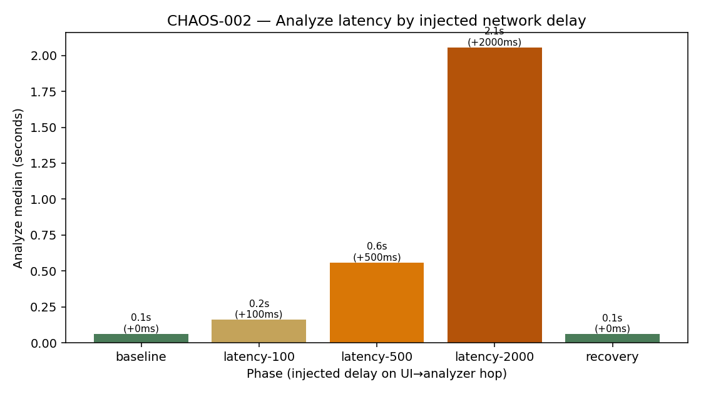

# CHAOS-002 — Network latency injection

| | |
|---|---|
| **Status** | Complete (2026-07-15) |
| **ID** | CHAOS-002 |
| **Question** | How does added delay on the warm analyzer HTTP hop change Analyze wall time and success? |
| **Tools** | `delay_proxy.py` (:8767→:8766) · `run-network-latency-check.sh` |
| **Environment** | Local warm analyzer `:8766` |
| **Issue** | [#15](https://github.com/UdonsiKalu/cxr-portfolio/issues/15) |
| **Related** | [CHAOS-004 CPU](../cpu-starvation/) · [CHAOS-003 packet loss](../planned/packet-loss-injection.md) · [OBS-003 alerting](../alerting-strategy/) |

**Plain English story:** [RESULTS.md](./RESULTS.md) · **Runbook:** [RUNBOOK.md](./RUNBOOK.md)

---

## Short story

| Phase | Injected delay | Median Analyze | HTTP |
|-------|----------------|----------------|------|
| Baseline | 0 ms | ~64 ms | 200 |
| latency-100 | 100 ms | ~163 ms | 200 |
| latency-500 | 500 ms | ~560 ms | 200 |
| latency-2000 | 2000 ms | ~2055 ms | 200 |
| Recovery | 0 ms | ~63 ms | 200 |

Delay adds nearly **1:1** to wall clock. Always **200** — soft slowdown, not a hard fail.

---

## Pictorial evidence



---

## Folder layout

```text
network-latency-injection/
├── README.md / RESULTS.md / RUNBOOK.md
├── delay_proxy.py · run-network-latency-check.sh · plot_latency.py
├── results/
└── screenshots/
```

---

## How to run

```bash
# Warm analyzer on :8766, then:
./investigations/network-latency-injection/run-network-latency-check.sh
python3 ./investigations/network-latency-injection/plot_latency.py
```

Locust is **not** required. Probes `POST` the warm FastAPI `/analyze` through the proxy.

---

## Evidence

- [results/network-latency-summary.txt](./results/network-latency-summary.txt)
- [results/network-latency-probes.csv](./results/network-latency-probes.csv)
- [screenshots/latency-by-tier.png](./screenshots/latency-by-tier.png)
