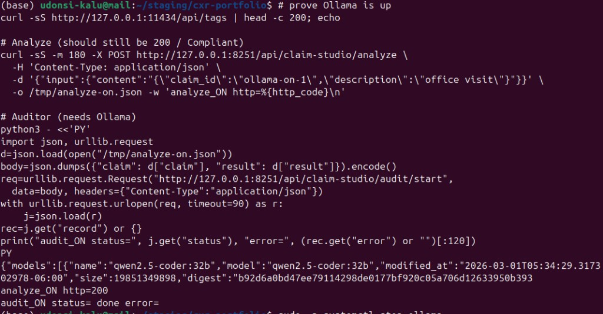
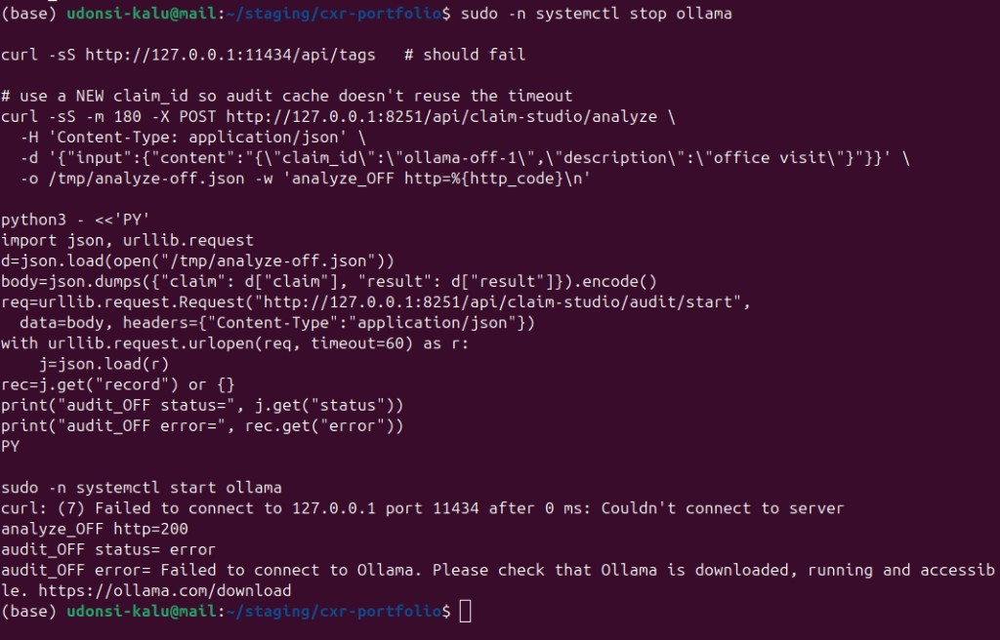
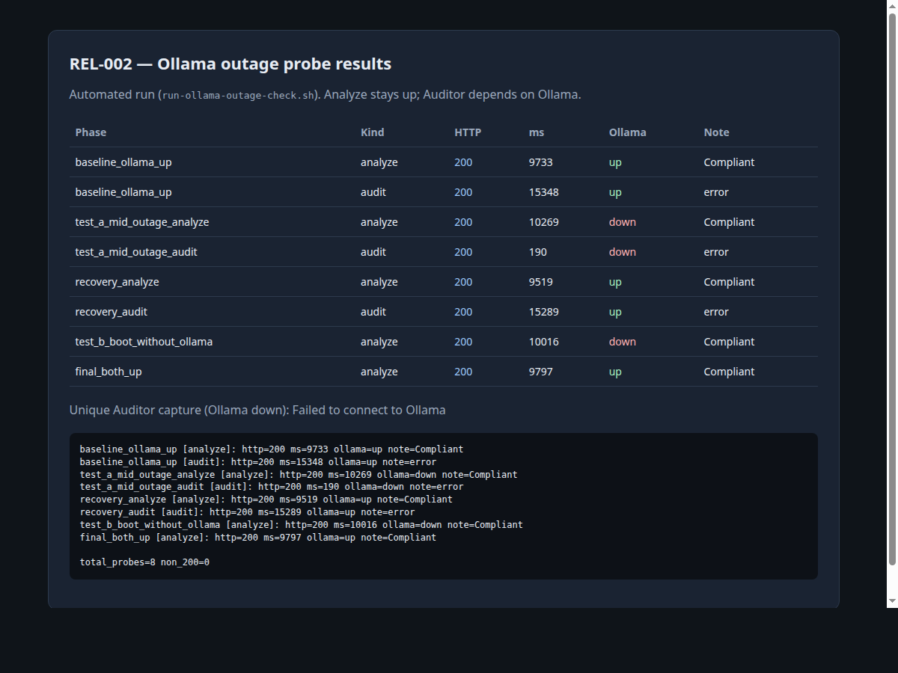
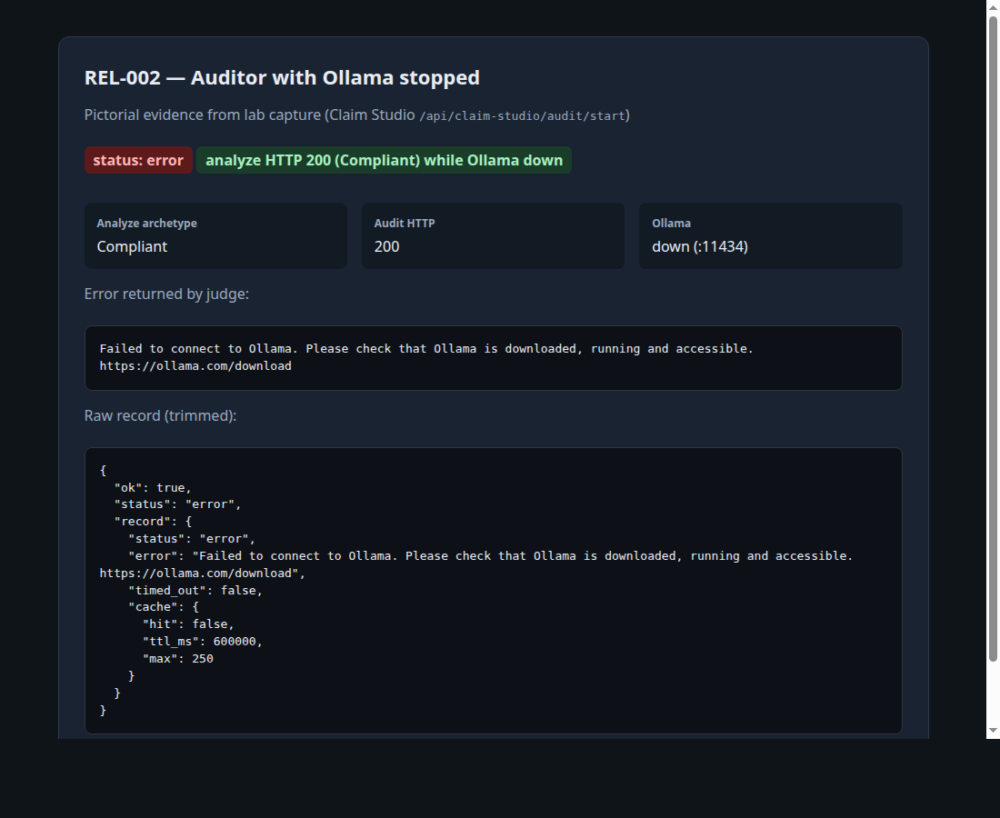
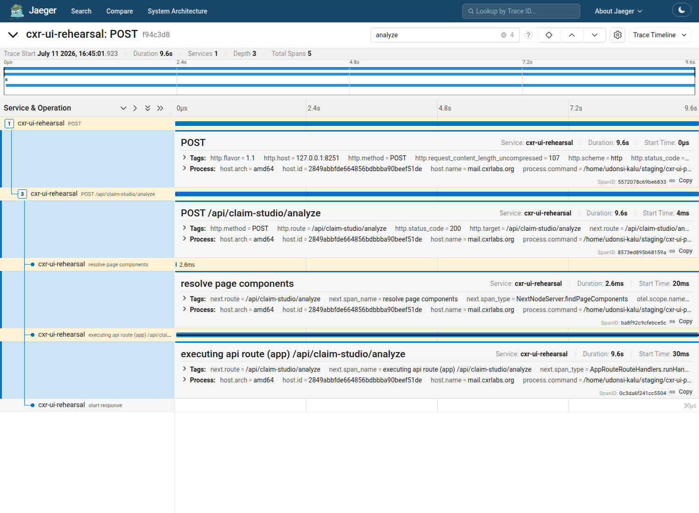

# REL-002 — Ollama outage

| | |
|---|---|
| **Status** | Complete (2026-07-11; terminal evidence refreshed 2026-07-12) |
| **ID** | REL-002 |
| **Question** | What happens when Ollama (LLM) is down? |
| **Tools** | `curl`, `systemctl` (stop/start ollama), Claim Studio Auditor, Jaeger optional |
| **Environment** | Local `cxr` stack — UI `:8251`, analyzer `:8766`, Ollama `:11434` |
| **Issue** | [#13](https://github.com/UdonsiKalu/cxr-portfolio/issues/13) (closed) · Kanban **@cxr-devops** → **Done** |
| **Related** | [Qdrant outage (DEP-001)](../archive/old-investigations/qdrant-outage/) |

---

## Short story

Two different paths talk to Ollama:

1. **Analyze** (`POST /api/claim-studio/analyze`) — on **Compliant** lab claims the LLM is **skipped**. Stopping Ollama does **not** break Analyze (still HTTP **200**).
2. **Auditor** (`POST /api/claim-studio/audit/start`) — always needs Ollama. When down: `status=error` and *Failed to connect to Ollama…*. When up (warm model + enough judge budget): `status=done`.

**Ollama = soft dependency for Analyze (Compliant traffic), hard dependency for Auditor.**

---

## Pictorial evidence (primary)

### ON — Ollama up



- `/api/tags` returns models
- Analyze → **http=200**
- Auditor → **`status=done`**, empty error

### OFF — Ollama stopped



- `curl :11434` → connection refused
- Analyze → still **http=200**
- Auditor → **`status=error`** · *Failed to connect to Ollama…*
- Then `systemctl start ollama` to recover

### Supporting







Index: [screenshots/](screenshots/).

---

## What you can watch live

| App | Useful? | What to look at |
|-----|---------|-----------------|
| **Claim Studio** `:8251` | Yes | Analyze still returns; Auditor fails when Ollama is down |
| **Jaeger** `:16686` | Optional | Compliant path shows **`llm_inference.skipped`** (why Analyze stays up) |
| **Locust** `:8089` | No | Single probes, not a swarm |

---

## Method

```bash
# One-time passwordless stop/start (optional)
./investigations/ollama-outage/setup-passwordless-ollama-ctl.sh

# Automated phases
./investigations/ollama-outage/run-ollama-outage-check.sh
```

Or manual (as in the terminal screenshots):

```bash
# ON baseline
curl -sS http://127.0.0.1:11434/api/tags | head -c 200; echo
# … analyze + audit/start → expect done

# OFF
sudo -n systemctl stop ollama
curl -sS http://127.0.0.1:11434/api/tags   # should fail
# … analyze → 200; audit → Failed to connect to Ollama
sudo -n systemctl start ollama
```

**Note:** Auditor judge budget is **120s** on rehearsal (`CLAIM_STUDIO_AUDIT_TIMEOUT_MS`). Client `urlopen` should be **≥150s**. Warm the model once if the first ON audit is slow.

---

## Results

| Phase | Kind | Ollama | HTTP | Note |
|-------|------|--------|-----:|------|
| **ON baseline** | analyze | up | **200** | Compliant |
| **ON baseline** | audit | up | 200 | **`status=done`** (warm model; ~5–13s) |
| **OFF** | analyze | **down** | **200** | still Compliant — soft dependency |
| **OFF** | audit | **down** | 200 | **`Failed to connect to Ollama`** — hard dependency |
| recovery | — | up | — | `systemctl start ollama` |

Earlier automated run also covered boot-without-Ollama and digest cache quirks — raw: [results/](./results/).

---

## Findings

1. **Analyze stays up** when Ollama is stopped (Compliant lab claims; LLM skipped).
2. **Auditor hard-depends on Ollama** — clear connection error when down.
3. **When Ollama is up**, Auditor can still **timeout** if the judge budget is too short or the model is cold — separate from outage (lab fixed with **120s** timeout + warm).
4. **Audit caches by digest** — use a new `claim_id` when retesting OFF after an ON run.

---

## Decision

- Treat Ollama as **optional for Analyze** on Compliant traffic; **required for Auditor**.
- Production: health-check Ollama for audit features; do not block Analyze readiness on Ollama if Compliant-only is acceptable.
- Pair with [Qdrant outage](../archive/old-investigations/qdrant-outage/) as soft vs hard dependency contrast.

---

## Follow-up (optional)

- Force a **non-Compliant** claim with policy docs so Analyze hits `llm.model_request.send`, then repeat the outage.
- No Kanban move needed — issue **#13** closed, board status **Done**.
