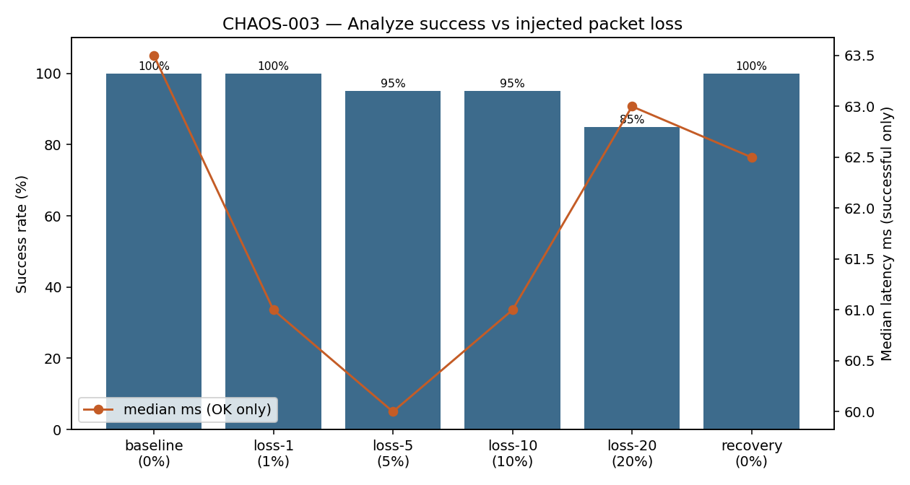

# CHAOS-003 — Packet loss injection

| | |
|---|---|
| **Status** | Complete (2026-07-18) |
| **ID** | CHAOS-003 |
| **Question** | How does packet loss on the warm analyzer HTTP hop affect Analyze success rate? |
| **Tools** | Shared `delay_proxy.py` (loss %) · `run-packet-loss-check.sh` |
| **Environment** | Local warm analyzer `:8766` via proxy `:8767` |
| **Issue** | [#16](https://github.com/UdonsiKalu/cxr-portfolio/issues/16) |
| **Related** | [CHAOS-002 network latency](../network-latency-injection/) |

**Plain English story:** [RESULTS.md](./RESULTS.md) · **Runbook:** [RUNBOOK.md](./RUNBOOK.md)

---

## Short story

| Phase | Loss % | Success (n=20) | Median ms (OK) |
|-------|--------|----------------|----------------|
| Baseline | 0 | **100%** | ~64 |
| loss-1 | 1 | **100%** | ~61 |
| loss-5 | 5 | **95%** | ~60 |
| loss-10 | 10 | **95%** | ~61 |
| loss-20 | 20 | **85%** | ~63 |
| Recovery | 0 | **100%** | ~62 |

Low loss rarely bites at n=20; **20%** loss clearly drops success. Successful calls stay ~60 ms — loss fails requests, it does not stretch them.

---

## Pictorial evidence



---

## How to run

```bash
CXR_NET_PROBES=20 ./investigations/packet-loss-injection/run-packet-loss-check.sh
python3 ./investigations/packet-loss-injection/plot_success.py
```

Reuses [../network-latency-injection/delay_proxy.py](../network-latency-injection/delay_proxy.py).
