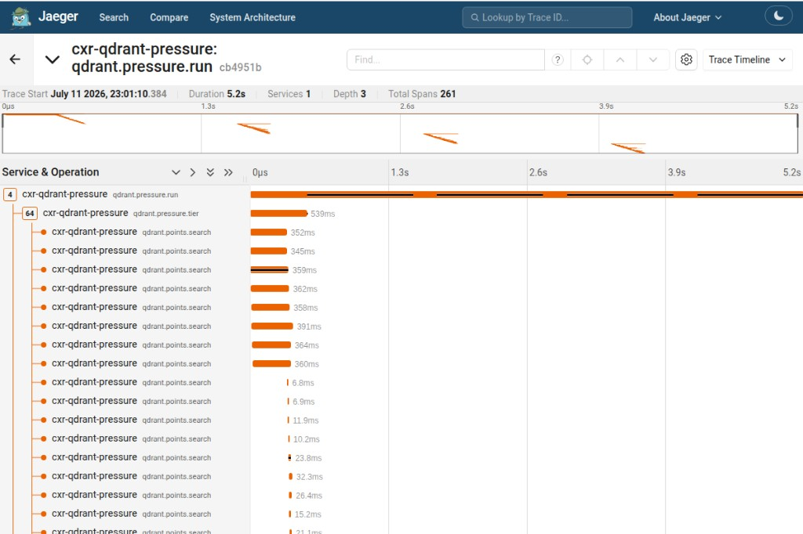
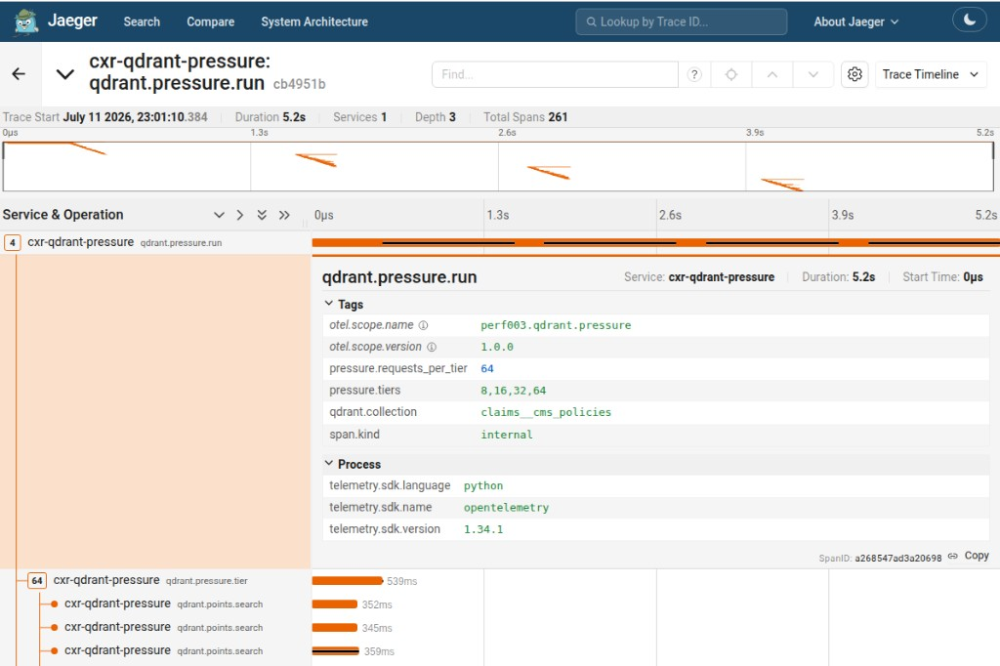
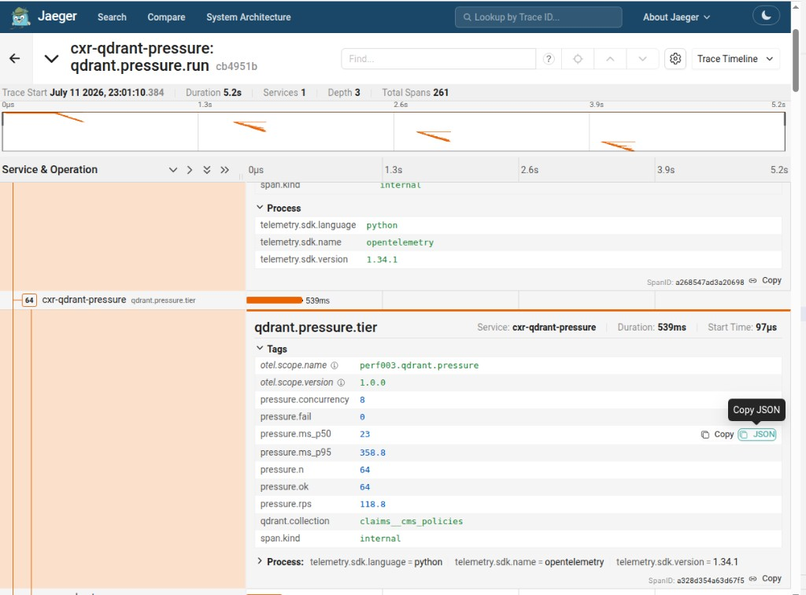
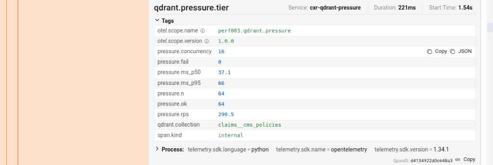
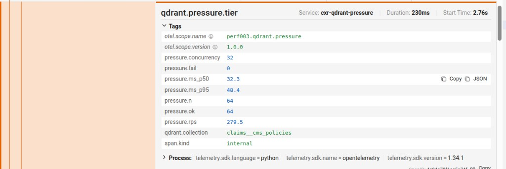
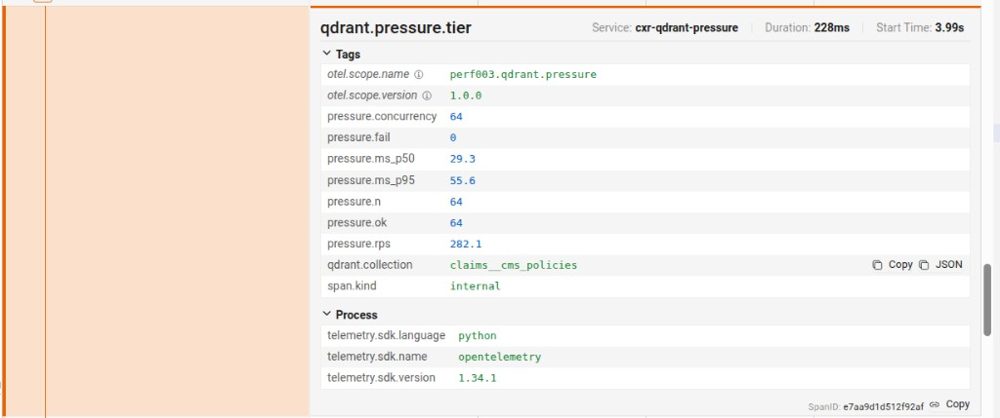
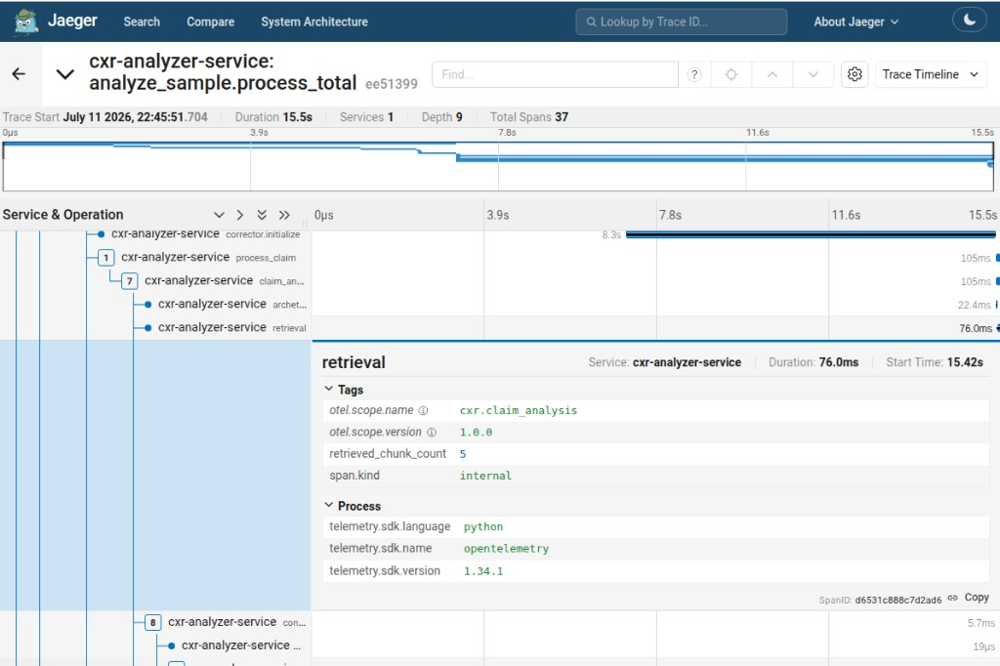
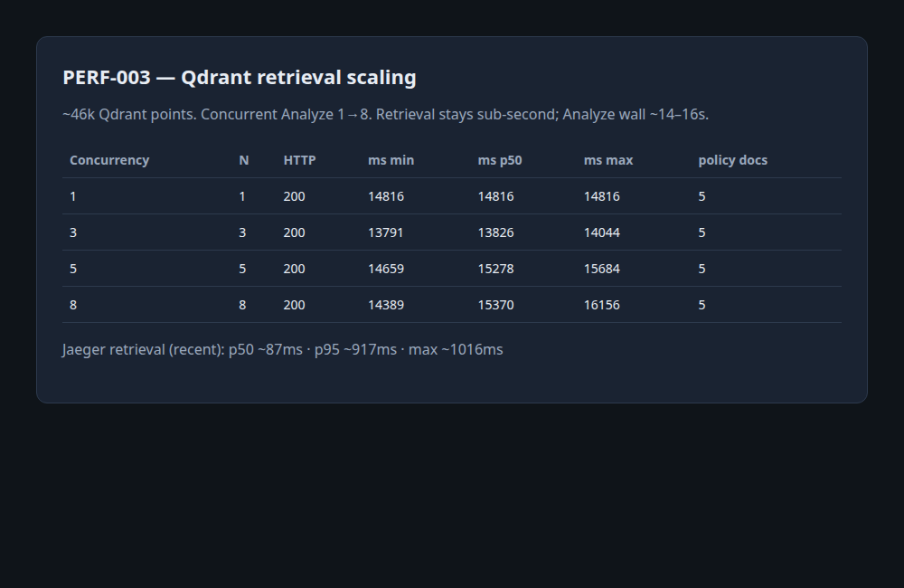

# What happened — PERF-003 in plain language

**Question:** When we ramp concurrent Qdrant searches, what happens to retrieval latency / throughput?

**Folder:** [`investigations/qdrant-retrieval-scaling/`](./) · Issue [#7](https://github.com/UdonsiKalu/cxr-portfolio/issues/7)

---

## One-sentence answer

**The ramp is measured** (CSV + Jaeger). Under **64** concurrent direct searches we saw **real impact** (latency up, RPS plateau) but **no failures**, and search stayed in the **tens of ms**.

---

## Important: do *not* say “64 concurrent = no impact”

| Concurrency | p50 | p95 | RPS | Failures |
|------------:|----:|----:|----:|---------:|
| 8 | 23 ms | 359 ms* | 119 | 0 |
| 16 | 37 ms | 66 ms | 291 | 0 |
| 32 | 32 ms | 48 ms | 280 | 0 |
| 64 | 29 ms | 56 ms | 282 | 0 |

\*c=8 p95 includes **warmup**; steady tiers ~**50–66 ms** p95.

| What we measured | Change |
|------------------|--------|
| p50 latency | ~**23 → ~30 ms** as concurrency rose |
| Throughput | Climbed then **plateaued ~280 RPS** (16→64 almost flat) |
| Failures | **Still 0** |

**Correct claim:** small but real cost under load; no error cliff.  
**Incorrect claim:** “no impact.”

Numbers above match the **instrumented** re-run visible in Jaeger (and [`results/qdrant-direct-pressure-summary.txt`](./results/qdrant-direct-pressure-summary.txt)).

---

## Pictorial evidence

### 1. Full pressure run (one Jaeger trace)

Service **`cxr-qdrant-pressure`**, op **`qdrant.pressure.run`** — four bumps = tiers 8 / 16 / 32 / 64.

Root tags: `pressure.tiers=8,16,32,64`, `requests_per_tier=64`, collection `claims__cms_policies`.

### 2. Compare tiers (Tags on `qdrant.pressure.tier`)

**c=8** — warmup p95, lower RPS:

**c=16** — RPS jumps ~290:

**c=32** — plateau:

**c=64** — still ~282 RPS, p50 ~29 ms, 0 fails:

### 3. Analyzer path (not the hard ramp)

Analyze still calls Qdrant: Jaeger **`retrieval` ~76 ms**, **`retrieved_chunk_count=5`** inside a ~15 s Analyze — Qdrant is active but not the wall-clock bottleneck.

### 4. Light Analyze concurrency table

---

## What we did

1. Started Qdrant with real policy data (~**46k** points).
2. Warm analyzer connected to Qdrant.
3. **Light pressure:** Analyze at **1, 3, 5, 8** concurrent.
4. **Hard pressure:** direct concurrent searches **8 → 64** on `claims__cms_policies` (bypass Analyze).
5. **Instrumented** the pressure client with OpenTelemetry → Jaeger service **`cxr-qdrant-pressure`**.
6. Compared tier Tags in Jaeger (`pressure.concurrency`, `pressure.ms_p50`, `pressure.rps`).

---

## How this differs from “Qdrant outage”

| Study | Question |
|-------|----------|
| **DEP-001** | Qdrant **off** — soft fallback for Analyze |
| **PERF-003** | Qdrant **on** and busier — **measure** p50/p95/RPS vs concurrency |

---

## Bottom line

- Ramp-up **is measured** (CSV + Jaeger), not guessed.
- Impact **exists** (latency + RPS plateau); **no** search failures at 64 concurrent in this lab.
- Do **not** look for the hard ramp under analyzer **`retrieval`** — use service **`cxr-qdrant-pressure`**.
- Scripts: [`run-retrieval-scaling-check.sh`](./run-retrieval-scaling-check.sh) · [`run-qdrant-direct-pressure.py`](./run-qdrant-direct-pressure.py)  
- Technical write-up: [`README.md`](./README.md)
