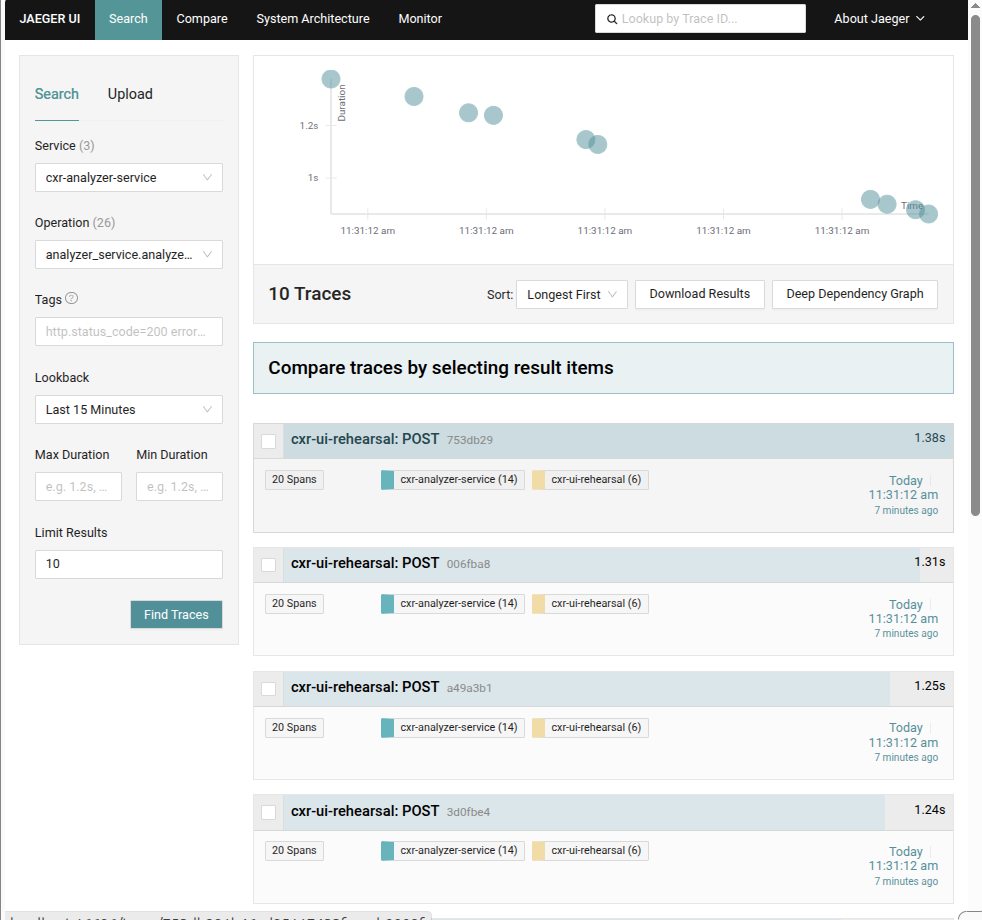

# Single analyzer capacity (LOAD-001)

| | |
|---|---|
| **Status** | Complete |
| **ID** | LOAD-001 |
| **Component** | One warm FastAPI analyzer `:8766` |
| **Tools** | Locust (staged GUI + headless) · Jaeger |
| **Environment** | Local dev (`cxr up`, `ANALYZER_URL` → `:8766`) |
| **Related** | [PERF-004 cold vs warm](../cold-vs-warm-analyzer/) · [load-testing](../load-testing/) · [ADR-004](../../archive/decisions/adrs/ADR-004-long-running-analyzer.md) |

**PDF guide (full template + code + evidence):** [LOAD-001-capacity-testing-guide.pdf](./LOAD-001-capacity-testing-guide.pdf) · [Markdown source](./LOAD-001-capacity-testing-guide.md)

---

## Why this template is different

Standard Locust usage: pick one user count, click Start, manually stop and retest. Default CXR locustfile also mixes **GET** pages with **POST** analyze.

This investigation adds a **reusable staged-capacity template**:

| Piece | What it does |
|-------|----------------|
| [`locustfile-staged-gui.py`](./locustfile-staged-gui.py) | `LoadTestShape` — auto ramp **1 → 3 → 5 → 10 → 15** users |
| [`run-capacity-locust-gui.sh`](./run-capacity-locust-gui.sh) | Opens Locust UI — **one Start click** runs the whole ramp |
| [`run-capacity-sweep.sh`](./run-capacity-sweep.sh) | Same tiers headless → `results/capacity-sweep.csv` |
| [`locustfile-analyze-only.py`](./locustfile-analyze-only.py) | POST analyze only (no GET noise) |

Override tiers without editing code: `CXR_CAPACITY_USERS="1 5 10 20" CXR_CAPACITY_STAGE_SECONDS=90`

---

## Question

With one warm analyzer instance, how does client-side latency (Locust p50/p95) and throughput change as concurrent users ramp from **1 → 15**?

## Hypothesis

A single warmed `:8766` process should sustain moderate concurrency without returning to subprocess-era **~10–12s** p95. p95 should stay near the warm analyze budget (**~1.5–2s**) until CPU, GIL, or serial kernel work becomes the bottleneck.

## Method

1. `cxr up` — `curl http://127.0.0.1:8766/health` → `"warmed":"true"`.
2. **GUI path:** [`run-capacity-locust-gui.sh`](./run-capacity-locust-gui.sh) → Start once → Charts + Jaeger.
3. **Headless path:** [`run-capacity-sweep.sh`](./run-capacity-sweep.sh) → CSV table.
4. Jaeger: `cxr-analyzer-service` → `analyzer_service.analyze_request` during 10–15 user tier.

> **Locust ≠ Jaeger:** Locust = aggregate client wait under load. Jaeger = single-trace duration. Report both ([investigations README](../README.md)).

---

## Results

### Headless sweep (2026-06-05)

| Users | Requests | Failures | Median (ms) | p95 (ms) | RPS |
|------:|---------:|---------:|------------:|---------:|----:|
| 1 | 19 | 0 | 1500 | 1700 | 0.33 |
| 3 | 65 | 0 | 1300 | 1500 | 1.12 |
| 5 | 111 | 0 | 1100 | 1500 | 1.88 |
| 10 | 241 | 0 | 620 | 1500 | 4.13 |
| 15 | 327 | 0 | 990 | 1600 | 5.64 |

Raw: [`results/capacity-sweep.csv`](./results/capacity-sweep.csv)

### Staged GUI run (2026-06-05) — evidence


| Observation | Value |
|-------------|-------|
| Ramp | 1 → 3 → 5 → 10 → 15 users (automatic) |
| Failures | **0%** |
| p95 | ~**1.5–1.6s** at 10 users; ~**2.5s** brief spike at 15 |
| Peak RPS | ~**2.8** |

**Jaeger at peak load** — 10 traces @ 11:31:12, **1.24–1.38s**:



**E2E linked trace** — `753db29`, **1.38s**, 20 spans:


### Reading p50 vs p95

| Percentile | Meaning in this run |
|------------|---------------------|
| **50th (median)** | Typical client wait — noisy when users overlap |
| **95th** | Slow tail — **use this for capacity** (~1.5s ≈ warm analyze + hop) |

Jaeger single traces ~**1.3s** align with Locust p95 ~**1.6s**.

---

## Findings

1. **Warm single instance** handled 15 analyze-only users — **0% failures**, p95 ~**1.6s**.
2. **Not re-import** — p95 would be **7s+** if cold subprocess path returned.
3. **No knee at 15 users** on local hardware — see [analyzer-saturation](../analyzer-saturation/).
4. **Locust + Jaeger together** — aggregate load metrics match single-trace kernel time.

## Decision

Keep one warm analyzer as default dev topology. Reuse this staged template to re-baseline after kernel or hardware changes.

## Follow-up

- [analyzer-saturation/](../analyzer-saturation/) — ramp **15 → 30+** users
- [kill-analyzer-under-traffic/](../kill-analyzer-under-traffic/)

---

## Reproduce

### GUI — one Start, auto ramp (recommended for screenshots)

```bash
cxr up
curl -s http://127.0.0.1:8766/health

CXR_LOCUST_WEB_PORT=8090 \
  ./investigations/single-analyzer-capacity/run-capacity-locust-gui.sh
```

Open http://127.0.0.1:8090 → **Start swarming** once → **Charts** tab.

Jaeger: http://127.0.0.1:16686 → `cxr-analyzer-service` → `analyzer_service.analyze_request`

### Headless — CSV

```bash
./investigations/single-analyzer-capacity/run-capacity-sweep.sh
```

### Core code — `LoadTestShape`

```python
class CapacityRampShape(LoadTestShape):
    stages = _build_stages()  # 1,3,5,10,15 users × 60s from env

    def tick(self):
        run_time = self.get_run_time()
        for stage in self.stages:
            if run_time < stage["duration"]:
                return (stage["users"], stage["spawn_rate"])
        return None
```

Full walkthrough: [LOAD-001-capacity-testing-guide.pdf](./LOAD-001-capacity-testing-guide.pdf)
