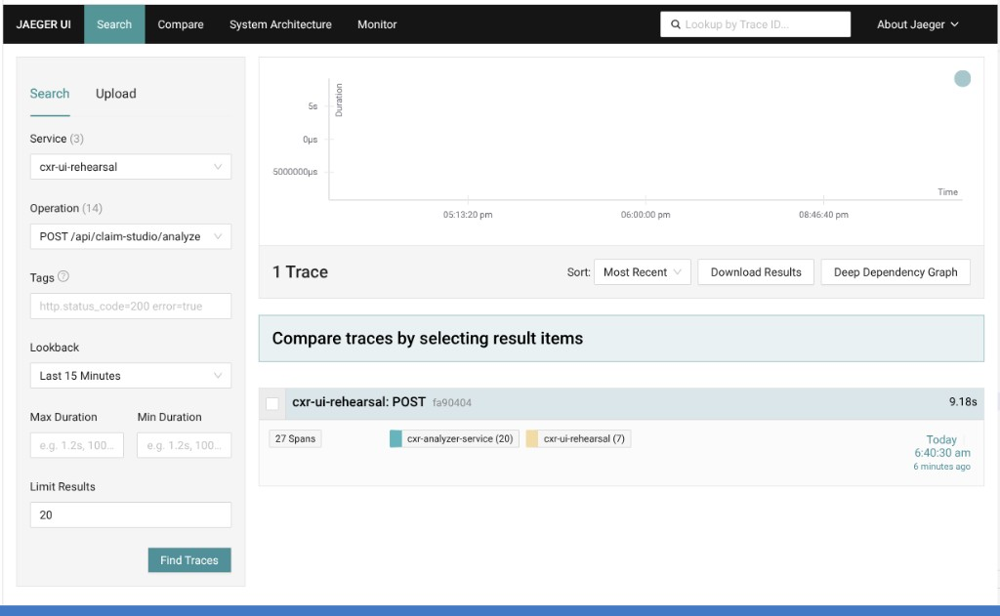
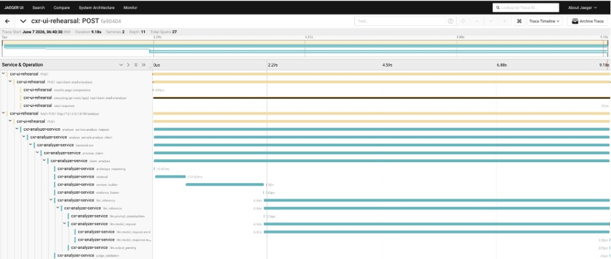

# End-to-end trace propagation (OTEL-001)

| | |
|---|---|
| **Status** | Complete |
| **ID** | OTEL-001 |
| **Component** | Rehearsal `:8251` → analyzer `:8766` via W3C **`traceparent`** |
| **Tools** | Claim Studio (GUI) · Jaeger UI `:16686` · OpenTelemetry `:4318` |
| **Environment** | Local dev (`cxr up`, `ANALYZER_URL` → `:8766`, `OTEL_*` in `.env.local`) |
| **Related** | [missing-spans/](../missing-spans/) · [latency-investigation/](../latency-investigation/) · [DEP-001 qdrant-outage](../qdrant-outage/) |

---

## Question

Does a single Claim Studio analyze produce **one linked distributed trace** in Jaeger — rehearsal **`cxr-ui-rehearsal`** and analyzer **`cxr-analyzer-service`** — not two unrelated traces?

## Hypothesis

Rehearsal injects **`traceparent`** on the HTTP call to **`POST http://127.0.0.1:8766/analyze`**. Jaeger shows a **single trace** with spans on both services and a visible **`fetch POST :8766/analyze`** child span.

## Method (GUI — no Locust)

1. `cxr up` — analyzer warmed, observe stack up (Jaeger **:16686**, OTLP **:4318**).
2. Open **Claim Studio** → http://127.0.0.1:8251/claim-studio → **Run Analysis** once.
3. Open **Jaeger** → http://127.0.0.1:16686
4. **Search:** Service **`cxr-ui-rehearsal`** · Operation **`POST /api/claim-studio/analyze`** · Lookback **15 min** → **Find Traces**.
5. Open the latest trace → expand waterfall: rehearsal root → **`fetch POST :8766/analyze`** → analyzer **`analyzer_service.analyze_request`** → kernel spans.

Rehearsal must export traces (`OTEL_EXPORTER_OTLP_ENDPOINT=http://127.0.0.1:4318` in `cxr-ui/.env.local`). See [demo/walkthrough/trace-request.md](../../demo/walkthrough/trace-request.md).

---

## Results (2026-06-07)

Trace ID prefix: **`fa90404…`**

| Metric | Value |
|--------|------:|
| **Total duration** | **9.18s** |
| **Services** | **2** (`cxr-ui-rehearsal`, `cxr-analyzer-service`) |
| **Spans** | **27** (rehearsal **7**, analyzer **20**) |
| **Depth** | **11** |
| **Linked hop** | **`fetch POST http://127.0.0.1:8766/analyze`** (present) |

### Jaeger search

### Linked waterfall

### Notable spans (analyzer side)

| Span | ~Duration | Notes |
|------|----------:|-------|
| `analyzer_service.analyze_request` | (root on :8766) | Analyzer received propagated context |
| `retrieval` | ~513ms | Qdrant / semantic path |
| `context_builder` | ~1.56s | Kernel context |
| `llm_generation` | **~6.94s** | Dominates this run (Ollama/LLM) |
| `evidence_fusion` | ~1.24s | Fusion step |

> **Latency note:** This trace is **~9s** because **`llm_generation`** was slow on this run. Propagation investigations care about **trace linkage**, not sub-2s warm latency. Compare to [LOAD-001](../single-analyzer-capacity/) / [PERF-004](../cold-vs-warm-analyzer/) for typical warm **~1.5–2s** analyze traces.

---

## Findings

1. **Propagation works** — one trace ID ties **`cxr-ui-rehearsal`** and **`cxr-analyzer-service`**; **`traceparent`** forwarded on the analyze HTTP call.
2. **27 spans / depth 11** with **`CXR_TRACE_PROFILE=detailed`** — sufficient for E2E debugging (see [missing-spans/](../missing-spans/) for why minimal was rejected).
3. **GUI-only evidence** — Claim Studio + Jaeger; no Locust required for this investigation.
4. **LLM variance** — wall-clock on a single trace can exceed aggregate Locust p95 when Ollama is cold or busy; report Jaeger and Locust separately.

---

## Decision

- Keep **`traceparent`** injection in `app/api/claim-studio/analyze/route.ts` for all HTTP analyzer calls.
- Use this search pattern in Jaeger for portfolio demos: **`cxr-ui-rehearsal`** + **`POST /api/claim-studio/analyze`**.
- Default **`CXR_TRACE_PROFILE=detailed`** for local/dev evidence.

---

## Follow-up

- [planned/platform-bootstrap.md](../planned/platform-bootstrap.md) (Phase 1 #2)
- **SW.3 K8** / **SW.6–7 CI** in `cxr-ops-lab` (deploy + pipeline evidence)
- Optional: compare same trace on **`cxr-analyzer-service`** service filter in Jaeger
